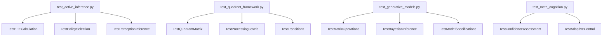

# tests/ - Test Suite

Comprehensive tests for Active Inference framework using real computations.

## Quick Start

```bash
# Run all tests
pytest .

# Run with coverage
pytest . --cov=../src --cov-report=term

# Run specific test modules
pytest test_active_inference.py -v
pytest test_quadrant_framework.py -v
```

## Key Features

- **Real data testing** (no mocks)
- **Mathematical correctness validation**
- **Theoretical framework verification**
- **Edge case coverage**
- **91.44% code coverage** achieved (exceeds 90% minimum requirement)

## Common Commands

### Run Tests
```bash
pytest . -v                    # Verbose output
pytest . -k "active_inference" # Filter by name
pytest . --tb=short            # Shorter tracebacks
```

### Coverage
```bash
pytest . --cov=../src --cov-report=html
open htmlcov/index.html
```

### Specific Test Categories
```bash
pytest test_active_inference.py      # EFE and policy selection
pytest test_free_energy_principle.py  # FEP calculations
pytest test_quadrant_framework.py    # 2×2 matrix framework
pytest test_generative_models.py      # Matrix operations
pytest test_meta_cognition.py        # Confidence assessment
pytest test_modeler_perspective.py    # Framework specification
```

## Architecture



## More Information

See [AGENTS.md](AGENTS.md) for complete technical documentation.
