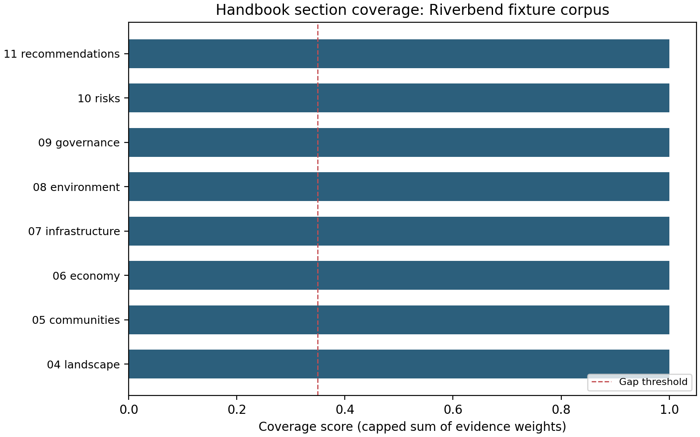

# Manuscript syntax (area handbook)

## Citations

Use Pandoc bracket cites with keys from `references.bib`:

```markdown
See [@bowker2005; @template2026] for context.
```

## Figures

Analysis writes PNGs under `../output/figures/`. Reference from markdown:

```markdown
{#fig:coverage width=85%}

{#fig:bytheme width=80%}

{#fig:gapstatus width=85%}
```

Run `scripts/02_generate_handbook_figure.py` via the pipeline before rendering (also refreshes `output/figures/figure_registry.json`).

## Section files

Numbered prefixes `01_`–`14_` and `03a`–`03d` sort in the main manuscript group. This file lives in the **other** discovery bucket (name does not start with a digit or `S01_` pattern) and is ordered lexicographically among other non-main files—keep the filename stable so build logs stay predictable.
