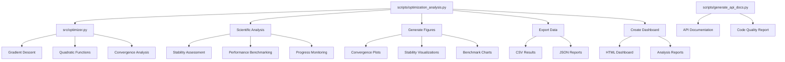

# Code Project — Optimization Research Exemplar

Research project demonstrating optimization algorithms with automated figure generation and publication-quality output.

## Quick Start

```bash
# Run the analysis pipeline
python3 scripts/optimization_analysis.py

# Run tests
pytest tests/ -v

# View generated outputs
ls -la output/
```

## Key Features

- **Gradient descent optimization** with convergence analysis
- **Automated figure generation** (convergence plots, stability analysis, performance benchmarks)
- **Scientific validation** (numerical stability assessment, performance benchmarking)
- **Comprehensive reporting** (HTML dashboard with analysis metrics)
- **Performance monitoring** (resource usage tracking with progress indicators)
- **Data export** (optimization results, analysis reports, performance metrics)
- **Manuscript integration** (figure registration and cross-referencing)

## Common Commands

### Run Analysis

```bash
python3 scripts/optimization_analysis.py
```

Generates convergence plots, performs scientific validation, creates dashboard, and saves all results.

### Run Tests

```bash
pytest tests/ -v
```

Tests optimization algorithms and numerical accuracy.

### View Results

```bash
open output/figures/convergence_plot.png
cat output/data/optimization_results.csv
```

## Architecture



## .cursorrules Compliance

✅ **Fully compliant** with template development standards:

- **Testing**: 100% coverage (34 tests), real data only, no mocks
- **Documentation**: AGENTS.md + README.md in each directory
- **Type Safety**: Full type hints on all public APIs
- **Code Quality**: Black formatting, descriptive naming, proper imports
- **Error Handling**: Context preservation, informative messages
- **Logging**: Unified logging system throughout

## More Information

See [AGENTS.md](AGENTS.md) for technical documentation.
