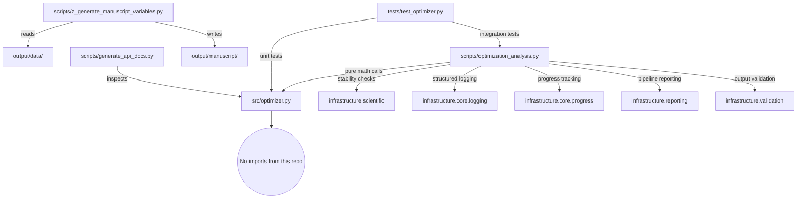

# Architecture: The Thin Orchestrator Flow

The `code_project` exemplar is designed around a strict separation of concerns across three operational layers. Understanding this architecture before modifying any file prevents the most common errors: math appearing in scripts, infrastructure imports appearing in `src/`, and mocks appearing in tests.

## Layer Reference

| Layer | Primary File | Public API | Invariants | Testability |
|---|---|---|---|---|
| **`src/` — Pure Logic** | `src/optimizer.py` (254 lines) | `OptimizationResult`, `quadratic_function`, `compute_gradient`, `gradient_descent`, `make_quadratic_problem`, `simulate_trajectory` | No `infrastructure.*` imports; no file I/O; stdlib `logging.getLogger` only | 40 zero-mock tests; all functions deterministic |
| **`scripts/` — Orchestrators** | `scripts/optimization_analysis.py` (1720 lines), `scripts/generate_api_docs.py` (247 lines), `scripts/z_generate_manuscript_variables.py` (405 lines) | Run experiment loops, generate figures, write CSV/JSON, render dashboard | No reimplementation of gradient update rule; no math not in `src/` | Integration tests with `INFRASTRUCTURE_AVAILABLE` guard |
| **`infrastructure/` — Cross-Cutting** | `infrastructure/scientific/`, `infrastructure/reporting/`, `infrastructure/rendering/`, `infrastructure/core/`, `infrastructure/validation/` | Stability checks, benchmarking, PDF rendering, structured logging, progress bars | Used only from `scripts/`; never from `src/` | Covered by separate `tests/infra_tests/` suite |

## Strict Dependency Direction

```
scripts/ ──→ src/           (imports and calls pure functions)
scripts/ ──→ infrastructure/ (delegates side-effects and cross-cutting concerns)
tests/   ──→ src/           (direct unit testing of pure functions)
tests/   ──→ scripts/       (integration testing when INFRASTRUCTURE_AVAILABLE)
src/     ──→ [nothing from this repo]
```

No arrows go upward. `src/` has zero imports from anywhere in the repository.



## Infrastructure Modules Used by This Project

| Module | Imported From | Used For |
|---|---|---|
| `infrastructure.scientific.stability` | `scripts/optimization_analysis.py` | `check_numerical_stability()` across starting-point / step-size grid |
| `infrastructure.scientific.benchmarking` | `scripts/optimization_analysis.py` | `benchmark_function()` across problem dimensions |
| `infrastructure.core.logging.utils` | `scripts/*.py` | `get_logger(__name__)` for structured log output |
| `infrastructure.core.progress` | `scripts/optimization_analysis.py` | `PipelineProgress` progress bars for long-running loops |
| `infrastructure.reporting` | `scripts/optimization_analysis.py` | HTML dashboard generation, pipeline metrics |
| `infrastructure.validation` | `scripts/optimization_analysis.py` | Output integrity checks on generated figures and CSV |

## Forbidden Patterns

| Pattern | Why It Is Forbidden | Correct Alternative |
|---|---|---|
| Math inside `scripts/` (e.g., gradient update step) | Cannot be unit-tested without running the full script | Move to `src/`, add a test in `TestGradientDescent` |
| `from infrastructure import ...` in `src/optimizer.py` | Breaks layer purity; makes `src/` dependent on the pipeline | Use `logging.getLogger(__name__)` from stdlib; call infrastructure from `scripts/` |
| `print()` inside `scripts/` | Bypasses structured logging; lost in CI output | Use `get_logger(__name__).info(...)` |
| Hardcoded absolute output paths in `src/` | `src/` must be I/O-free | Pass output paths as arguments from `scripts/` |
| `unittest.mock`, `MagicMock`, `@patch` in `tests/` | Zero-mock policy | Compute real results with real numpy arrays |
| Hardcoded step-size constants in `scripts/` | Configuration drift vs `manuscript/config.yaml` | Read from config; `config.yaml` is the single source of truth for experiment parameters |

## How to Add a New Algorithm

Follow these five steps in order:

1. **Add the function to `src/optimizer.py`** — Pure math only; no I/O; add type hints and a Google-style docstring; export from `__init__.py`.

2. **Write a test class in `tests/test_optimizer.py`** — Follow the zero-mock pattern; use fixed numpy arrays; assert mathematical properties; run `uv run pytest projects/code_project/tests/ --cov=projects/code_project/src --cov-fail-under=90`.

3. **Add an orchestration call in `scripts/optimization_analysis.py`** — Import the new function from `src/`; run it inside the existing experiment loop or add a new loop; write results to `projects/code_project/output/data/` or `output/figures/`.

4. **Update `output/` paths in the regeneration sequence** — Document the new output file in `output/AGENTS.md` and `output/README.md`.

5. **Update manuscript section** — Edit `manuscript/02_methodology.md` with the algorithm description using concrete file paths (e.g., `projects/code_project/src/optimizer.py::new_function()`); add any result variables to `scripts/z_generate_manuscript_variables.py`; reference figures with `\ref{fig:label}`.
