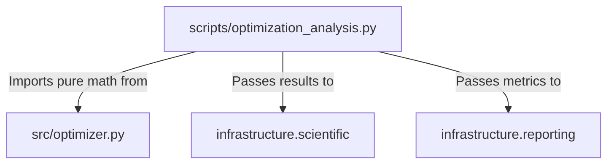

# Architecture: The Thin Orchestrator Flow

The `code_project` exemplar is designed around a strict separation of concerns, divided into three main operational layers:

1. **`src/` (Pure Scientific Logic)**: Contains deterministic, zero-mock testable mathematical algorithms. No I/O, no side-effects.
2. **`scripts/` (Thin Orchestrators)**: Scripts coordinate experiments and visualization. They import the optimization algorithm(s) from `src/` and use `infrastructure/` modules for cross-cutting concerns (logging, validation, benchmarking, figure registration). Scripts may contain *experiment loops* and *plotting*, but they must not re-implement the optimization algorithm update rule.
3. **`infrastructure/` (Core Operations)**: Handles all side-effects: logging, PDF rendering, metric generation, and validation.

## Target Flow Model

## Infrastructure Boundaries

In this architecture, scientists write business logic in `src/`, and AI/Automated systems manage the `infrastructure/`. The `scripts/` directory serves as the sole bridge between these domains. Dependency direction strictly goes from `scripts/` inwards to `src/` and downwards to `infrastructure/`. `src/` modules should never import from `scripts/` or `infrastructure/`.
