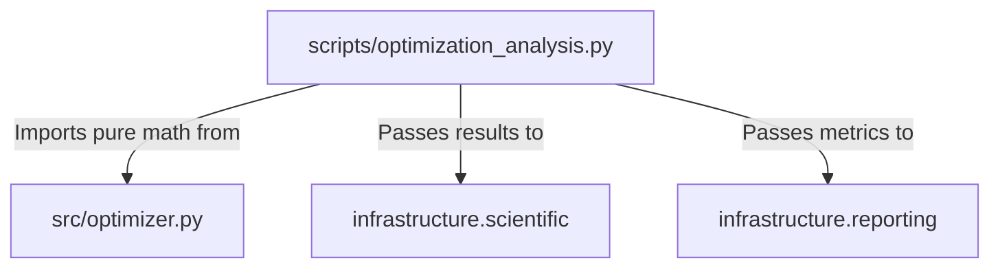

# Architecture: The Thin Orchestrator Flow

The `code_project` exemplar is designed around a strict separation of concerns, divided into three main operational layers:

1. **`src/` (Pure Scientific Logic)**: Contains deterministic, zero-mock testable mathematical algorithms. No I/O, no side-effects.
2. **`scripts/` (Thin Orchestrators)**: Scripts coordinate the flow of data. They import from `src/`, compute results, and immediately pass those results to the `infrastructure/` layer. They do not contain math.
3. **`infrastructure/` (Core Operations)**: Handles all side-effects: logging, PDF rendering, metric generation, and validation.

