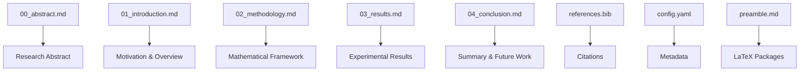

# manuscript/ - Research Manuscript

Research manuscript sections in markdown format for PDF generation.

## Manuscript Structure

This project includes the following sections:

### Main Sections

- `00_abstract.md` (~1.5 KB) - Research abstract with key contributions
- `01_introduction.md` (~2 KB) - Introduction and motivation
- `02_methodology.md` (~6 KB) - Mathematical methods and algorithms
- `03_results.md` (~8 KB) - Experimental results with figures and tables
- `04_conclusion.md` (~3 KB) - Conclusions and future work

### Supporting Files

- `references.bib` - Bibliography entries in BibTeX format
- `config.yaml` - Manuscript metadata and rendering configuration
- `config.yaml.example` - Configuration template for new projects
- `preamble.md` - LaTeX preamble with package imports

## Rendering Process

The manuscript is rendered through these stages:

1. **Discovery**: All `.md` files are discovered and categorized
2. **Individual Rendering**: Each section rendered to PDF separately
3. **Combination**: All sections combined into single manuscript PDF
4. **Output**: Generated files placed in `../../output/pdf/`

View detailed rendering logs to see which sections were included.

## Quick Start

```bash
# Edit manuscript sections
vim 02_methodology.md

# Generate PDF
python3 ../../scripts/03_render_pdf.py

# View result
open ../../output/pdf/project_combined.pdf
```

## Key Features

- **Academic paper structure** (abstract, methods, results, conclusion)
- **LaTeX mathematical notation**
- **Cross-references** to figures and equations
- **BibTeX bibliography**

## Common Commands

### Edit Sections

```bash
vim 00_abstract.md        # Research summary
vim 02_methodology.md    # Mathematical methods
vim 03_results.md        # Experimental results
vim 04_conclusion.md     # Summary and conclusions
```

### Generate PDF

```bash
python3 ../../scripts/03_render_pdf.py
```

### Validate Content

```bash
python3 -m infrastructure.validation.cli markdown .
```

## Architecture



## More Information

See [AGENTS.md](AGENTS.md) for technical documentation.
