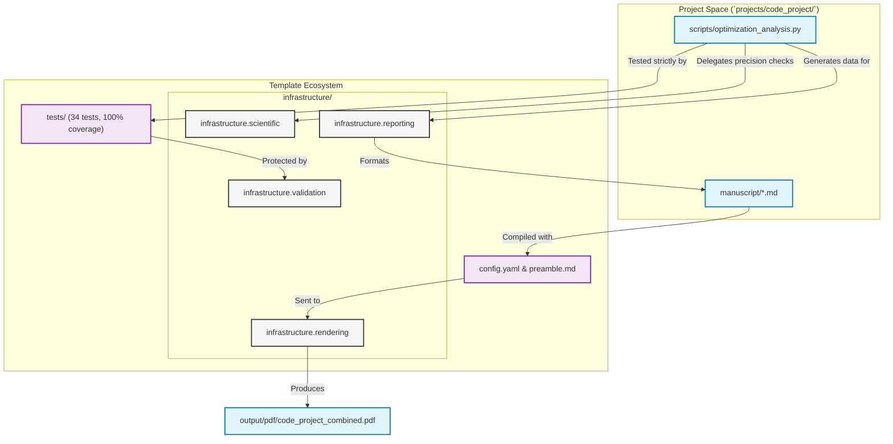

# `code_project` - The Repository Exemplar

This is the **master exemplar** for the Generalized Research Template. It is a fully-tested numerical optimization implementation securely bracketed by rigorous infrastructure, hermetic testing, and extensive documentation architectures.

It demonstrates the complete research pipeline from algorithm implementation through strict validation to multi-format result visualization.

## Template Architecture

This project is explicitly designed to showcase the repository's three foundational pillars:

1. **`infrastructure/` Layer**: The code delegates all tracking, performance benchmarking, stability validation, and PDF rendering to the 9-module infrastructure cluster (located at the repository root).
2. **`tests/` Integrity**: An uncompromising zero-mock testing policy validated by a 34-test CI suite (`projects/code_project/tests/`) operating at 100% statement and branch coverage.
3. **`docs/` Orchestration**: Adherence to the Rigorous Agentic Scientific Protocol (RASP) ensuring total documentation-to-code parity (`projects/code_project/docs/`).

## Manuscript Structure

The `manuscript/` directory contains the raw markdown files that the renderer (`infrastructure/rendering/pdf_renderer.py`) transforms into the final academic PDF. These files are designed as a meta-narrative to demonstrate exactly how the repository executes:

- `00_abstract.md`: Overview of the 34-test exemplar strategy.
- `01_introduction.md`: Introduction of the infrastructure pillars bridging to CI/CD files.
- `02_methodology.md`: Mathematical methods mapping to specific python script execution lines.
- `03_results.md`: Convergence analysis built via `infrastructure.reporting`, pointing back at itself.
- `04_conclusion.md`: Summary of the seamless template automation asserting the PDF itself as final proof.

## Architecture

The project acts as a bridge between custom mathematical logic and the repository's core:



## Quick Start

Experience the automated pipeline directly:

```bash
# Execute the algorithm and generate all results/visualizations
python3 scripts/optimization_analysis.py

# Render the manuscript locally (utilizes infrastructure.rendering)
python3 scripts/03_render_pdf.py

# View the generated result
open ../output/pdf/code_project_combined.pdf
```

## AI Agent Directives

If you are an AI agent operating in this repository, you **MUST** read [`AGENTS.md`](AGENTS.md) before executing any code modifications. It defines the zero-mock testing constraints and infrastructure coupling rules.
