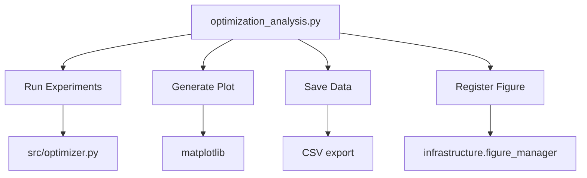

# scripts/ - Analysis Scripts

Thin orchestrators that demonstrate proper integration with `src/` modules.

## Quick Start

```bash
# Run analysis pipeline
python3 scripts/optimization_analysis.py

# View generated outputs
ls -la ../output/
```

## Key Features

- **analysis pipeline** (experiments + visualization)
- **Automated figure generation** (convergence plots)
- **Data export** (optimization results to CSV)
- **Manuscript integration** (figure registration)

## Common Commands

### Run Analysis
```bash
python3 optimization_analysis.py
```
Executes optimization experiments and generates all outputs.

### Check Outputs
```bash
ls -la ../output/figures/
ls -la ../output/data/
```

## Architecture



## More Information

See [AGENTS.md](AGENTS.md) for technical documentation.