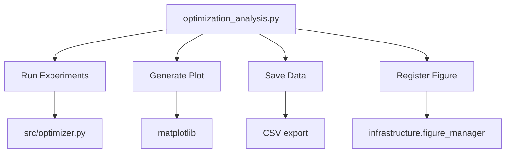

# scripts/ - Analysis Scripts

**Thin Orchestrators** demonstrating strict integration patterns. As per the Generalized Research Template policy, these scripts *do not contain core logic*. They only import from the `src/` directory and bridge results into the `infrastructure/` components for logging, rendering, and reporting.

## Quick Start

```bash
# Run analysis pipeline
python3 scripts/optimization_analysis.py

# View generated outputs
ls -la ../output/
```

## Key Features

- **analysis pipeline** (experiments + visualization)
- **Automated figure generation** (convergence plots)
- **Data export** (optimization results to CSV)
- **Manuscript integration** (figure registration)

## Common Commands

### Run Analysis

```bash
python3 optimization_analysis.py
```

Executes optimization experiments and generates all outputs.

### Check Outputs

```bash
ls -la ../output/figures/
ls -la ../output/data/
```

## Architecture


```mermaid
graph TD
    A[optimization_analysis.py] --> B[Run Experiments]
    A --> C[Generate Plot]
    A --> D[Save Data]
    A --> E[Register Figure]

    B --> F[src/optimizer.py]
    C --> G[matplotlib]
    D --> H[CSV export]
    E --> I[infrastructure.figure_manager]
```

## More Information

See [AGENTS.md](AGENTS.md) for technical documentation.
