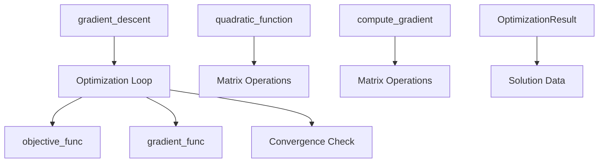

# src/ - Core Optimization Algorithms

Mathematical optimization algorithms with reproducible results.

## Quick Start

```python
from optimizer import gradient_descent, quadratic_function

# Simple optimization example
result = gradient_descent(
    initial_point=np.array([0.0]),
    objective_func=lambda x: quadratic_function(x),
    gradient_func=lambda x: x - 1,  # Gradient of f(x) = 0.5*x^2 - x
    step_size=0.1
)

print(f"Optimal solution: {result.solution}")
```

## Key Features

- **Gradient descent** optimization algorithm
- **Quadratic function** evaluation and gradients
- **Reproducible results** with deterministic behavior
- **Type-safe** with type hints

## Common Commands

### Import and Use
```python
from optimizer import (
    gradient_descent,
    quadratic_function,
    compute_gradient,
    OptimizationResult
)
```

### Run Tests
```python
pytest ../tests/ -v
```

## Architecture



## More Information

See [AGENTS.md](AGENTS.md) for technical documentation.