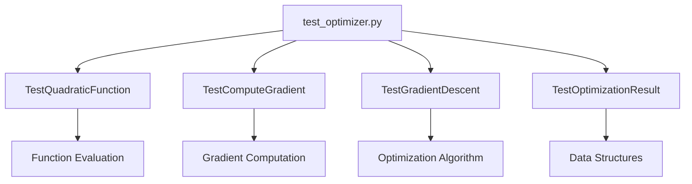

# tests/ - Test Suite

tests for optimization algorithms using computations.

## Quick Start

```bash
# Run all tests
pytest .

# Run with coverage
pytest . --cov=../src --cov-report=term

# Run specific tests
pytest -k "TestGradientDescent" -v
```

## Key Features

- **Real data testing** (no mocks)
- **Numerical accuracy validation**
- **Edge case coverage**
- **Deterministic results**

## Common Commands

### Run Tests

```bash
pytest . -v              # Verbose output
pytest . -k "gradient"   # Filter by name
pytest . --tb=short      # Shorter tracebacks
```

### Coverage

```bash
pytest . --cov=../src --cov-report=html
open htmlcov/index.html
```

## Architecture



## More Information

See [AGENTS.md](AGENTS.md) for technical documentation.
