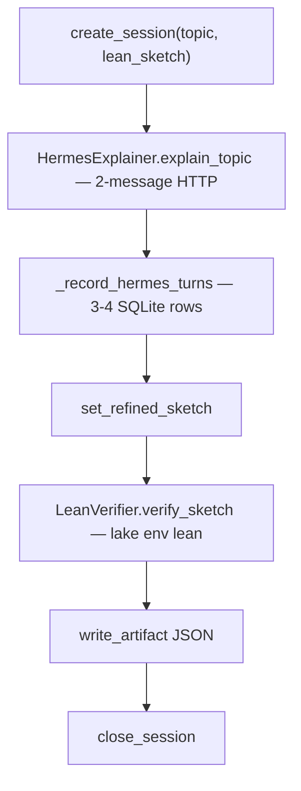

## The Hermes AI Agent and LLM-Assisted Formalization {#sec:the_hermes_ai_agent_and_llm_assisted_formalization}

### Architecture Overview {#sec:architecture_overview}

`HermesExplainer` (defined in `src/llm/hermes.py`) produces natural-language explanations and refined Lean 4 sketches for the curated catalogue entries in `config/topics.yaml`. Those catalogue bodies originate in `scripts/catalogue_sketches.py` (`SKETCHES`) and are regenerated into YAML by `scripts/_maint_build_topics_catalogue.py`. `HermesExplainer` never authors sketches or updates the catalogue — it reviews whatever the YAML supplies. Current pipeline status is tracked in `docs/_generated/canonical_facts.md`.

Under the hood, `HermesExplainer` uses stdlib HTTP (`urllib.request`) to call OpenRouter or any compatible endpoint, with a worker-thread guard in `_make_request` that enforces `timeout_s` (or `reasoning_timeout_s`) as a hard wall-clock deadline rather than `urllib`'s per-socket-op timeout. The default model set in `config/settings.yaml` is `moonshotai/kimi-k2.6`. The fallback chain and retry logic (controlled by `HERMES_429_MAX_RETRIES` and `HERMES_NETWORK_MAX_RETRIES`) live in `_FREE_MODEL_CHAIN` and `explain_topic`. When `HermesConfig.enabled=False` or no API key is present, `explain_topic` short-circuits before `_call_api` and returns a stub `HermesResult` — see §\ref{sec:model_fallback_chain_and_degradation}.

### Gauss Session Protocol {#sec:gauss_session_protocol}

For each of the 50 catalogue topics, `GaussRunner.run_topic` executes a linear pipeline and records the interaction as an OpenGauss session in SQLite. The protocol has two layers: the HTTP call (a single request carrying two chat messages) and the persisted turn record (up to four rows in the `turns` table).

**Pipeline order per topic:**

1. `create_session(topic_id, area, lean_sketch)` — opens the session row; the catalogue sketch is stored on the session itself.
2. `HermesExplainer.explain_topic(topic)` — issues a two-message HTTP request (system + user) against the OpenRouter endpoint.
3. `_record_hermes_turns` — writes the dialogue turns to SQLite (schema in the table below).
4. `set_refined_sketch(session_id, refined_sketch)` — stores the refined Lean body returned by the LLM.
5. `LeanVerifier.verify_sketch(topic_id, refined_sketch)` — runs native `lake env lean` compilation.
6. `write_artifact(session_id, payload)` — writes a JSON artifact containing Hermes output and the `VerifyResult`.
7. `close_session(session_id, status, hermes_success, lean_compiles)` — finalizes the session row.

**Persisted turns** (SQLite `turns` table, written by `_record_hermes_turns`):

| Turn index | Role | Content | Always present? |
|---------|------|-----------|-----------------|
| 0 | `system` | FEP-domain system prompt (`_FEP_SYSTEM_PROMPT`) | Yes |
| 1 | `user` | Theorem block: title, area, NL statement, Mathlib4 hint, current Lean sketch | Yes |
| 2 | `assistant` | Explanation text + refined Lean sketch (or `[ERROR] …` on failure) | Yes |
| 3 | `assistant_reasoning` | Model reasoning / chain-of-thought (from `<think>` tags) | Only if model emits reasoning |

Compiler traces — `stdout`, `stderr`, and the full `VerifyResult` fields — are stored in the JSON artifact and summarized on the closed session row (`hermes_success`, `lean_compiles`, `duration_s`); they are not written back as additional chat turns.

### FEP-Domain System Prompt {#sec:fep_domain_system_prompt}

The agent uses a tightly constrained system prompt designed to suppress hallucination.

> **System prompt (abridged; see `_FEP_SYSTEM_PROMPT` at `src/llm/hermes.py:56-94`).** The live prompt identifies Hermes as a formalization expert for FEP / Active Inference and Mathlib4, and requires (1) a 2–4 sentence explanation of the proof strategy and (2) a refined Lean 4 theorem sketch in a fenced `lean` code block. It enumerates the existing Mathlib4 module families (`MeasureTheory`, `Probability`, `Analysis`) and explicitly instructs the model not to invent non-existent lemmas. It asks for minimal `sorry` use (only for genuinely open sub-goals) and for explicit hypothesis naming. The CRITICAL PRESERVATION RULES (block A–D) require: (A) verbatim copy of every original `import Mathlib.*` line at the top of the refined sketch; (B) preservation of the `namespace FEPxxx … end FEPxxx` wrapper; (C) preservation of explicit tactic hint lists (e.g. `nlinarith [sq_nonneg x, …]`, `simp [lemma1, lemma2]`); and (D) no introduction of `sorry` if the original sketch had none. Finally, the prompt closes with a mandatory schema for the refined `lean` block: imports → namespace → optional `-- [proof strategy: …]` comment → theorem with preserved tactic proof → matching `end FEPxxx`.

This constraint pattern keeps `HermesExplainer` firmly in a reviewer role relative to the YAML sketches rather than letting it drift into authorship.

### Hermes vs native Lean (compilation diagnostics) {#sec:hermes_vs_native_lean_diagnostics}

Hermes API success and `lake env lean` outcomes are orthogonal: the commentary can succeed while compilation fails, and vice versa. The headline native compile rate is `50/50` (§\ref{sec:quantitative_execution_metrics}), injected from measured verifier output. §\ref{sec:native_lean_4_compilation_and_zero_mock_verification} summarizes the verifier architecture; per-topic failures, when they occur, are classified via `VerifyResult.failure_kind` and recorded in `verification_manifest.json`.

### Compiler output and `VerifyResult` {#sec:compiler_driven_error_loop}

[`LeanVerifier.verify_sketch`](../src/verification/lean_verifier.py) returns a `VerifyResult` dataclass with fields for `compiles`, `has_sorry`, `errors`, `warnings`, `stdout` / `stderr`, `duration_s`, an optional `skip_reason`, and a `failure_kind` classified by `classify_failure_kind`. The `.status` property aggregates the outcome into one of `compiles_clean`, `compiles_with_sorry`, `compile_error`, or `skipped (…)`. Raw compiler lines are split into `errors` and `warnings` by regex over `lake env lean` output; the classification is diagnostic only. The pipeline does not re-invoke Hermes or swap models based on compiler errors.

| Typical situation | `VerifyResult` | `.status` |
|---------------------|----------------|-----------|
| Typecheck succeeds, no `sorry` in sketch | `compiles=True`, `has_sorry=False` | `compiles_clean` |
| Typecheck succeeds but sketch text contains `sorry` | `compiles=True`, `has_sorry=True` | `compiles_with_sorry` |
| Compiler failure | `compiles=False` | `compile_error` |
| Subprocess timeout | `compiles=False`, `skip_reason` set | `skipped (timeout after Ns)` (via `FEP_LEAN_VERIFY_TIMEOUT`, default 300 s) |
| Verification skipped (for example missing toolchain) | `skip_reason` non-empty | `skipped (…)` |

`VerifyResult.as_dict()` serializes these fields for manifests and session metadata. Catalogue *maturity* counts (`50 real, 0 partial, 0 aspirational`) still come from `mathlib_status` in YAML, not from `VerifyResult`.

### Token Usage and Cost Profile {#sec:token_usage_and_cost_profile}

The numbers below are illustrative of a representative GLM-5.1-primary batch; actual counts vary with model, prompt size, and rate limits.

- **Prompt tokens.** Roughly 10⁴ – 10⁵ across all 50 topics — a dense system prompt plus Lean context per call. Per-call requests are bounded by `HermesConfig.max_tokens` (default **16384**) and the reasoning-model variant `reasoning_max_tokens` (default **65536**).
- **Completion tokens.** On the order of tens of thousands total; the explanation-plus-refined-sketch format caps verbosity per topic.
- **Wall clock.** Dominated by provider latency. Per-request HTTP calls time out at `HermesConfig.timeout_s` (default **150 s**, or **300 s** for reasoning-model paths). Treat per-topic averages as order-of-magnitude unless copied from a specific `reports/` run manifest.
- **Hermes live vs stub.** With a valid API key and `hermes.enabled: true`, `HermesExplainer.is_live` evaluates to `True` and topics receive genuine model output. Otherwise the code returns a `HermesResult` stub and the pipeline still completes the OpenGauss session and artifact export.

Exact per-topic token counts, latency measurements, and model usage are recorded in `output/reports/run_*/summary.json` for every pipeline run; those figures are authoritative for audit purposes.

### Model Fallback Chain and Degradation {#sec:model_fallback_chain_and_degradation}

`HermesExplainer.explain_topic` builds the model chain via `_build_model_chain()`: the configured primary (default `moonshotai/kimi-k2.6`) is placed first, and each entry from `_FREE_MODEL_CHAIN` is appended only if it is not already present (deduplication). The shipped chain has eight entries:

1. `moonshotai/kimi-k2.6` (primary / default — Moonshot Kimi K2.6, 262K context, member of `_REASONING_MODELS`)
2. `moonshotai/kimi-k2-thinking`
3. `qwen/qwen3-next-80b-a3b-instruct:free`
4. `z-ai/glm-5.1` (demoted from primary after a 10+ minute empty-content stall regressed the previous batch)
5. `openai/gpt-oss-120b:free`
6. `nvidia/nemotron-3-super-120b-a12b:free`
3. `qwen/qwen3-next-80b-a3b-instruct:free`
4. `openai/gpt-oss-120b:free`
5. `nousresearch/hermes-3-llama-3.1-405b:free`
6. `arcee-ai/trinity-large-preview:free`

For each model in the chain, the explainer retries on HTTP 429 (rate limit) up to `HERMES_429_MAX_RETRIES` times (default `2`) and on transient network errors such as `IncompleteRead` or `URLError` up to `HERMES_NETWORK_MAX_RETRIES` times (default `2`), with exponential backoff capped at 60 s. Unrecoverable 4xx errors other than 429 disable Hermes for the remainder of the pipeline run. `HERMES_MAX_MODEL_ATTEMPTS` caps the number of models from the chain that the runner will try before giving up.

When `HermesConfig.enabled` is `False` or no API key is set, `explain_topic` returns a stub `HermesResult` (with `success=False` and a descriptive error string) without making any network calls. This stub mode lets the full pipeline — including OpenGauss session recording and artifact export — run without network access, and it is the basis for every unit test that exercises the Hermes code path.
