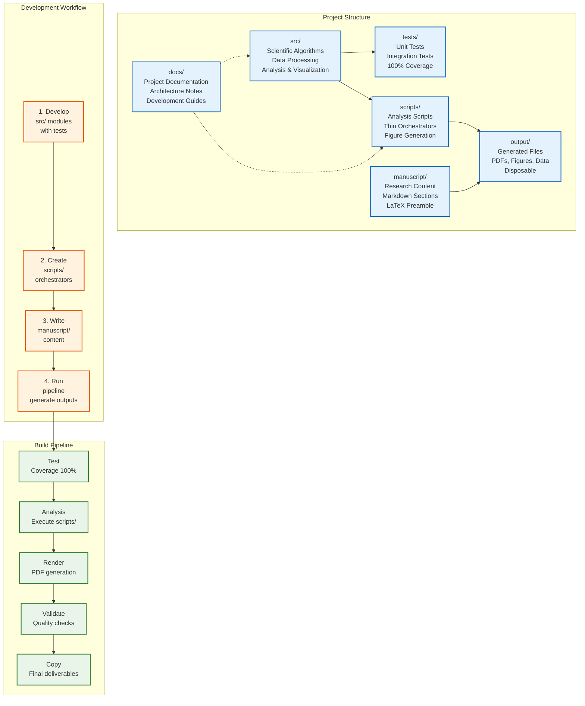

# Research Project

Complete, self-contained scientific research project with integrated testing, manuscript generation, and visualization.

## Structure

```
project/
├── src/                    # Scientific code (models, analysis, utilities)
├── tests/                  # Test suite (comprehensive coverage)
├── scripts/                # Analysis scripts (thin orchestrators)
├── manuscript/             # Research manuscript sections
├── docs/                   # Project-specific documentation
└── output/                 # Generated outputs (figures, data, PDFs)
```

## Quick Start

### Install Dependencies
```bash
cd project
pip install -e .
# or with uv:
uv sync
```

### Run Tests
```bash
pytest tests/ --cov=src
```

### Run Analysis Scripts
```bash
python3 project/scripts/example_figure.py
python3 scripts/analysis_pipeline.py
```

### Build Manuscript
```bash
cd ..
python3 scripts/03_render_pdf.py
```

## Refactor & Extension Quickstart
- Read `project/docs/refactor_playbook.md` for the safe-change checklist.
- See `project/docs/refactor_hotspots.md` for current dependency hotspots.
- Use script CLIs with `--dry-run` to verify wiring (`scripts/analysis_pipeline.py`, `scripts/generate_scientific_figures.py`).
- Run `project/scripts/manuscript_preflight.py --strict` before rendering PDFs to catch missing assets.
- Add new logic in `src/`, keep `scripts/` thin, and extend tests alongside changes.

## Features

- **Test coverage** - All scientific code tested with data (100% - perfect coverage!)
- **Modular design** - Clean separation of concerns
- **Reproducible** - Deterministic computation with seeded randomness
- **Documented** - Comprehensive documentation and docstrings
- **Portable** - Complete project in one folder, copy to use elsewhere

## Project Architecture



## Project Layout

### src/
Scientific code implementing algorithms, data processing, analysis, and visualization.

- `example.py` - Basic operations
- `simulation.py` - Core simulation framework
- `statistics.py` - Statistical analysis
- `data_generator.py` - Synthetic data generation
- ... and more

### tests/
Test suite with coverage of src/ modules (100% - perfect coverage!).

- Real data testing (no mocks)
- Integration tests
- Performance validation

### scripts/
Thin orchestrators that use src/ modules.

- Import from src/
- Orchestrate workflows
- Generate outputs

### manuscript/
Research manuscript in Markdown format.

- Individual sections
- References and bibliography
- Configuration files

## Development

### Adding New Features

1. **Implement in src/**
   - Add module to `src/`
   - Add comprehensive tests
   - Ensure coverage requirements met

2. **Use in scripts/**
   - Import from src/
   - Orchestrate analysis
   - Generate figures/tables

3. **Document in manuscript/**
   - Update manuscript sections
   - Add figures and results
   - Update configuration

### Running Quality Checks

```bash
# Full test suite with coverage
pytest tests/ --cov=src --cov-report=html

# View coverage report
open htmlcov/index.html
```

### Quality Validation

- Preflight: `python3 project/scripts/manuscript_preflight.py --strict`
- Quality report: `python3 project/scripts/quality_report.py`
- Markdown/PDF: `python3 -m infrastructure.validation.cli markdown project/manuscript/ --strict` and `python3 -m infrastructure.validation.cli pdf project/output/pdf/`
- Outputs: `python3 - <<'PY'\nfrom infrastructure.validation import verify_output_integrity\nfrom pathlib import Path\nverify_output_integrity(Path('output'))\nPY`

## Deployment

### Standalone Use
Copy `project/` to any location to use independently:

```bash
cp -r project/ /path/to/my_research
cd /path/to/my_research
pytest tests/ --cov=src
```

### Integration with Template
This project is designed to work with the template infrastructure:

```bash
cd /path/to/template
python3 scripts/03_render_pdf.py  # Builds manuscript PDFs
```

## Dependencies

- Python 3.10+
- NumPy, SciPy, Matplotlib, Pandas
- pytest, pytest-cov

See `pyproject.toml` for complete dependencies.

## Documentation

- `AGENTS.md` - Architecture and module documentation
- `docs/` - Additional project-specific documentation
- Docstrings in source code

## See Also

- [`AGENTS.md`](AGENTS.md) - Complete project documentation
- [`src/README.md`](src/README.md) - Scientific code overview
- [`scripts/README.md`](scripts/README.md) - Analysis scripts guide
- [`tests/README.md`](tests/README.md) - Test suite overview
- [`manuscript/README.md`](manuscript/README.md) - Manuscript guide
- [`../../AGENTS.md`](../../AGENTS.md) - Complete system documentation
- [`../../infrastructure/README.md`](../../infrastructure/README.md) - Infrastructure layer

## License

See LICENSE file in template root.


