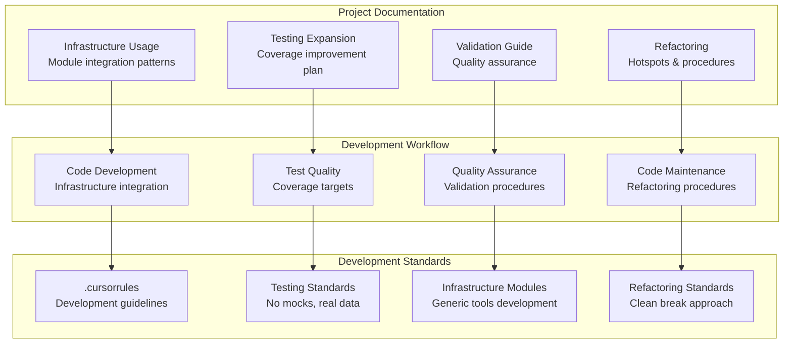

# docs/ - Project Documentation

Reference materials and guides for the default template project.

## Overview

This directory contains documentation specific to the default template project, including usage guides, development notes, and reference materials that complement the generic template infrastructure.

## Key Documents

- **[AGENTS.md](AGENTS.md)** - Technical documentation for project docs
- **[infrastructure_usage.md](infrastructure_usage.md)** - How to use template infrastructure modules
- **[manuscript_style_guide.md](manuscript_style_guide.md)** - Manuscript style features and examples
- **[refactor_hotspots.md](refactor_hotspots.md)** - Code areas needing improvement
- **[refactor_playbook.md](refactor_playbook.md)** - Refactoring procedures and best practices
- **[testing_expansion_plan.md](testing_expansion_plan.md)** - Test coverage improvement roadmap
- **[validation_guide.md](validation_guide.md)** - Quality assurance procedures

## Quick Access

### Development
```bash
# View infrastructure usage guide
cat infrastructure_usage.md

# Check refactoring priorities
cat refactor_hotspots.md

# See testing expansion plan
cat testing_expansion_plan.md
```

### Quality Assurance
```bash
# Read validation procedures
cat validation_guide.md

# View refactoring best practices
cat refactor_playbook.md
```

## Architecture



## Usage Examples

### Using Infrastructure Modules

```python
# From infrastructure_usage.md
from infrastructure.core import get_logger, TemplateError
from infrastructure.validation import validate_markdown

logger = get_logger(__name__)
# ... infrastructure usage patterns
```

### Quality Validation

```python
# From validation_guide.md
from infrastructure.validation import validate_pdf_rendering

report = validate_pdf_rendering(pdf_path)
if not report['summary']['has_issues']:
    print("PDF validation passed")
```

## See Also

**Development Standards:**
- [`.cursorrules/README.md`](../../../.cursorrules/README.md) - Quick reference for development standards
- [`.cursorrules/infrastructure_modules.md`](../../../.cursorrules/infrastructure_modules.md) - Infrastructure module development standards
- [`.cursorrules/testing_standards.md`](../../../.cursorrules/testing_standards.md) - Testing patterns and coverage standards
- [`.cursorrules/refactoring.md`](../../../.cursorrules/refactoring.md) - Refactoring standards and clean break approach

**Project Documentation:**
- [`AGENTS.md`](AGENTS.md) - Complete technical documentation of all documents in this directory
- [`README.md`](README.md) - This quick reference guide

**Template Documentation:**
- [`../../docs/core/AGENTS.md`](../../docs/core/AGENTS.md) - Core template documentation
- [`../../infrastructure/AGENTS.md`](../../infrastructure/AGENTS.md) - Infrastructure layer documentation

## More Information

See [AGENTS.md](AGENTS.md) for complete technical documentation of all documents in this directory.