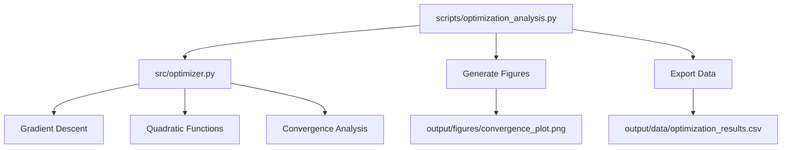

# Small Code Project - Quick Reference

Minimal research project demonstrating optimization algorithms with automated figure generation.

## Quick Start

```bash
# Run the complete analysis pipeline
python3 scripts/optimization_analysis.py

# Run tests
pytest tests/ -v

# View generated outputs
ls -la output/
```

## Key Features

- **Gradient descent optimization** with convergence analysis
- **Automated figure generation** (convergence plots)
- **Data export** (optimization results to CSV)
- **Manuscript integration** (figure registration)

## Common Commands

### Run Analysis
```bash
python3 scripts/optimization_analysis.py
```
Generates convergence plots and saves optimization results.

### Run Tests
```bash
pytest tests/ -v
```
Tests optimization algorithms and numerical accuracy.

### View Results
```bash
open output/figures/convergence_plot.png
cat output/data/optimization_results.csv
```

## Architecture



## More Information

See [AGENTS.md](AGENTS.md) for complete technical documentation.