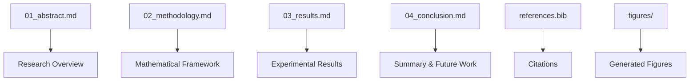

# manuscript/ - Research Manuscript

Research manuscript sections in markdown format for PDF generation.

## Quick Start

```bash
# Edit manuscript sections
vim 02_methodology.md

# Generate PDF
python3 ../../scripts/03_render_pdf.py

# View result
open ../../output/pdf/project_combined.pdf
```

## Key Features

- **Academic paper structure** (abstract, methods, results, conclusion)
- **LaTeX mathematical notation**
- **Cross-references** to figures and equations
- **BibTeX bibliography**

## Common Commands

### Edit Sections
```bash
vim 01_abstract.md       # Research summary
vim 02_methodology.md    # Mathematical methods
vim 03_results.md        # Experimental results
vim 04_conclusion.md     # Summary and conclusions
```

### Generate PDF
```bash
python3 ../../scripts/03_render_pdf.py
```

### Validate Content
```bash
python3 -m infrastructure.validation.cli markdown .
```

## Architecture



## More Information

See [AGENTS.md](AGENTS.md) for complete technical documentation.