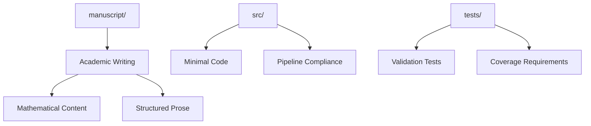

# Small Prose Project - Quick Reference

Minimal prose-focused research project demonstrating manuscript capabilities.

## Quick Start

```bash
# Edit manuscript
vim manuscript/01_introduction.md

# Run tests
pytest tests/ -v

# Generate PDF
python3 ../../scripts/03_render_pdf.py
```

## Key Features

- **Academic prose** with mathematical notation
- **Minimal computation** for pipeline compliance
- **LaTeX equations** and derivations
- **Structured argumentation**

## Common Commands

### Edit Content
```bash
vim manuscript/01_introduction.md
vim manuscript/02_methodology.md
```

### Run Tests
```bash
pytest tests/ -v
```

### Generate Output
```bash
python3 ../../scripts/03_render_pdf.py
open ../../output/pdf/project_combined.pdf
```

## Architecture



## More Information

See [AGENTS.md](AGENTS.md) for complete technical documentation.