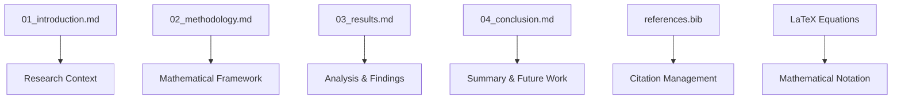

# manuscript/ - Research Manuscript

Academic prose with mathematical notation for professional PDF generation.

## Quick Start

```bash
# Edit sections
vim 01_introduction.md
vim 02_methodology.md

# Generate PDF
python3 ../../scripts/03_render_pdf.py

# View result
open ../../output/pdf/project_combined.pdf
```

## Key Features

- **Mathematical notation** using LaTeX equations
- **Academic prose** with structured argumentation
- **Cross-references** between sections and equations
- **BibTeX bibliography** for citations

## Common Commands

### Edit Content
```bash
vim 01_introduction.md     # Research context
vim 02_methodology.md      # Mathematical methods
vim 03_results.md          # Findings and analysis
vim 04_conclusion.md       # Summary and conclusions
```

### Generate PDF
```bash
python3 ../../scripts/03_render_pdf.py
```

### Validate Content
```bash
python3 -m infrastructure.validation.cli markdown .
```

## Architecture



## More Information

See [AGENTS.md](AGENTS.md) for complete technical documentation.