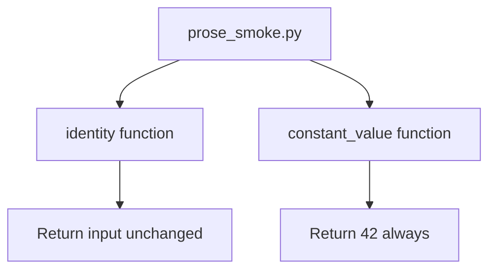

# src/ - Minimal Source Code

Simple utility functions for pipeline compliance and test coverage.

## Quick Start

```python
from prose_smoke import identity, constant_value

result = identity("test")
value = constant_value()
```

## Key Features

- **Identity function** - returns input unchanged
- **Constant value** - returns fixed value for testing
- **100% test coverage** - designed for complete validation
- **Type safety** - comprehensive type hints

## Common Commands

### Import and Use
```python
from prose_smoke import identity, constant_value
```

### Run Tests
```python
pytest ../tests/ -v
```

## Architecture



## More Information

See [AGENTS.md](AGENTS.md) for complete technical documentation.