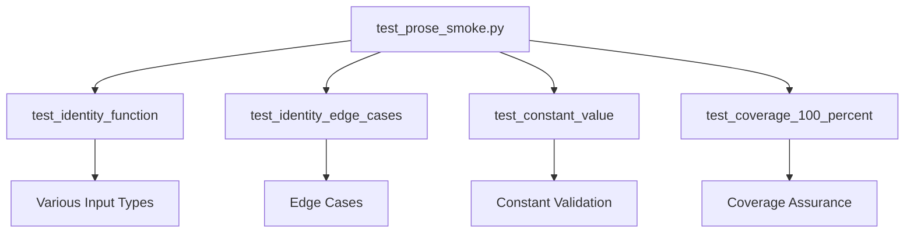

# tests/ - Test Suite

Comprehensive tests achieving 100% coverage for pipeline compliance.

## Quick Start

```bash
# Run all tests
pytest .

# With coverage report
pytest . --cov=../src --cov-report=term

# Verbose output
pytest . -v
```

## Key Features

- **100% test coverage** requirement
- **Edge case testing** for all functions
- **Type validation** across different inputs
- **Deterministic results**

## Common Commands

### Run Tests
```bash
pytest . -v              # Verbose output
pytest . -k "identity"   # Filter by function
pytest . --tb=short      # Shorter tracebacks
```

### Coverage
```bash
pytest . --cov=../src --cov-report=html
```

## Architecture



## More Information

See [AGENTS.md](AGENTS.md) for complete technical documentation.