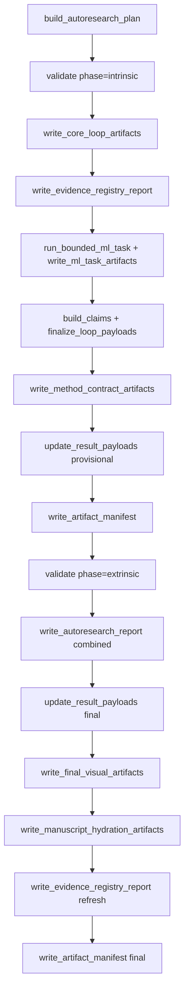

# template_autoresearch_project

Public exemplar for a deterministic bounded AutoResearch workflow over a small
local machine-learning task.

This project demonstrates a file-backed AutoResearch loop that runs inside the
normal template pipeline. The case study uses a local balanced MNIST subset, a
nearest-centroid baseline, and a bounded set of numpy-only neural-network
candidates: softmax regression, a small MLP, and a tiny patch-attention
classifier.

```bash
./run.sh --pipeline --project template_autoresearch_project --core-only --skip-infra
```

The analysis stage runs two thin scripts:

- `scripts/run_autoresearch_loop.py` builds the ML-loop result, plan, claims,
  stage matrix, review packet, method ledgers, benchmark scores, final figures,
  evidence registry snapshot, artifact manifest, readiness report, and
  manuscript-hydration sidecars through `src.loop.run_autoresearch_loop`.
- `scripts/z_generate_manuscript_variables.py` hydrates manuscript variables
  into `output/manuscript/` for rendering and fails when strict run-derived
  manuscript values are not tokenized.

Reusable behavior lives under `src/` (`loop`, `ml_task`, `models`, `config`,
`writers`, `reports`, `figures`, `manuscript_variables`). No network calls, LLM
calls, runtime dataset downloads, generated-code execution, or autonomous
approval loops are used.

The manuscript frames the exemplar as a bounded research-object analogue:
machine-readable ledgers, artifact manifests, figure registry metadata,
variable provenance, and deferred review gates make the research process itself
inspectable without claiming autonomous discovery.
Each registered figure carries a source artifact, generation method, validation
hook, alt text, caption, and claim boundary; manuscript figure blocks and the
figure-method table are hydrated from that registry.

Loop stages are recorded as **declared** (configured intent). Claims are
**supported** only when their evidence file exists locally.
Accepted seed ideas require evidence links, candidate edits are bounded by
`edit_allowlist`, and configured review gates are recorded as human-review
inputs rather than self-approval. The generated review decisions are `deferred`
so a human reviewer still owns publication approval.

## Loop orchestration



Project-specific docs live in [`docs/`](docs/).

## Outputs

- `output/data/autoresearch_plan.json`
- `output/data/autoresearch_loop.json`
- `output/data/autoresearch_claims.json`
- `output/data/autoresearch_stage_matrix.csv`
- `output/data/autoresearch_review_packet.json`
- `output/data/research_program.json`
- `output/data/idea_ledger.json`
- `output/data/run_ledger.json`
- `output/data/review_decisions.json`
- `output/data/benchmark_scores.json`
- `output/data/mnist_task_config.json`
- `output/data/ml_task_results.json`
- `output/data/ml_candidate_ledger.json`
- `output/data/ml_confusion_matrix.csv`
- `output/data/ml_training_history.csv`
- `output/data/ml_error_examples.json`
- `output/data/ml_prediction_records.json`
- `output/data/ml_classification_diagnostics.json`
- `output/data/ml_candidate_intervals.json`
- `output/data/ml_class_balance.json`
- `output/data/ml_calibration_report.json`
- `output/data/ml_robustness_report.json`
- `output/data/ml_probability_diagnostics.json`
- `output/data/ml_bootstrap_intervals.json`
- `output/data/ml_paired_comparison.json`
- `output/data/ml_statistical_summary.json`
- `output/data/ml_training_diagnostics.json`
- `output/data/manuscript_variables.json`
- `output/data/manuscript_variable_provenance.json`
- `output/data/manuscript_figure_blocks.json`
- `output/figures/autoresearch_stage_matrix.png`
- `output/figures/ml_candidate_scores.png`
- `output/figures/ml_confusion_matrix.png`
- `output/figures/ml_per_class_accuracy.png`
- `output/figures/ml_learning_curves.png`
- `output/figures/ml_complexity_accuracy.png`
- `output/figures/mnist_error_examples.png`
- `output/figures/ml_calibration_reliability.png`
- `output/figures/ml_classification_metrics_heatmap.png`
- `output/figures/ml_confusion_pairs.png`
- `output/figures/ml_generalization_gap.png`
- `output/figures/ml_robustness_matrix.png`
- `output/figures/ml_probability_margin_distribution.png`
- `output/figures/ml_bootstrap_intervals.png`
- `output/figures/ml_paired_correctness.png`
- `output/figures/ml_selective_accuracy.png`
- `output/figures/ml_probability_quality.png`
- `output/figures/ml_training_dynamics.png`
- `output/figures/autoresearch_candidate_lifecycle.png`
- `output/figures/mnist_class_balance.png`
- `output/figures/mnist_subset_contact_sheet.png`
- `output/figures/autoresearch_closure_flow.png`
- `output/figures/figure_registry.json`
- `output/reports/autoresearch_loop.json`
- `output/reports/autoresearch_loop.md`
- `output/reports/autoresearch_review_packet.md`
- `output/reports/autoresearch_summary.md`
- `output/reports/ml_experiment_report.md`
- `output/reports/ml_benchmark_score.json`
- `output/reports/autoresearch_readiness.json`
- `output/reports/autoresearch_readiness.md`
- `output/reports/benchmark_readiness_smoke.json`
- `output/reports/evidence_registry.json`
- `output/reports/artifact_manifest.json`

## Tests

```bash
uv run python scripts/01_run_tests.py --project template_autoresearch_project --project-only --quiet
```
