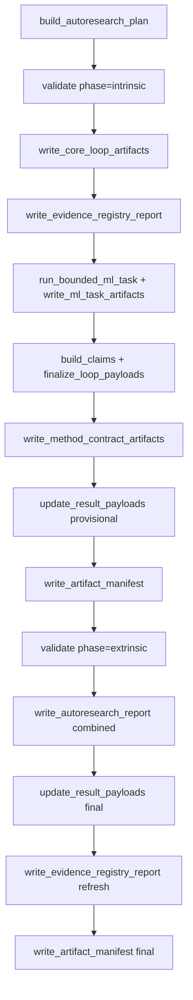

# template_autoresearch_project

Public exemplar for a deterministic bounded AutoResearch workflow over a tiny
local machine-learning task.

This project demonstrates a file-backed AutoResearch loop that runs inside the
normal template pipeline. The case study uses a local balanced MNIST subset, a
nearest-centroid baseline, and a bounded set of numpy-only neural-network
candidates: softmax regression, a small MLP, and a tiny patch-attention
classifier.

```bash
./run.sh --pipeline --project template_autoresearch_project --core-only --skip-infra
```

The analysis stage runs two thin scripts:

- `scripts/run_autoresearch_loop.py` builds the ML-loop result, plan, claims,
  stage matrix, review packet, method ledgers, benchmark scores, evidence
  registry snapshot, artifact manifest, and readiness report through
  `src.loop.run_autoresearch_loop`.
- `scripts/z_generate_manuscript_variables.py` hydrates manuscript variables
  into `output/manuscript/` for rendering.

Reusable behavior lives under `src/` (`loop`, `ml_task`, `models`, `config`,
`writers`, `reports`, `figures`, `manuscript_variables`). No network calls, LLM
calls, runtime dataset downloads, generated-code execution, or autonomous
approval loops are used.

Loop stages are recorded as **declared** (configured intent). Claims are
**supported** only when their evidence file exists locally.
Accepted seed ideas require evidence links, candidate edits are bounded by
`edit_allowlist`, and configured review gates are recorded as human-review
inputs rather than self-approval. The generated review decisions are `deferred`
so a human reviewer still owns publication approval.

## Loop orchestration



Project-specific docs live in [`docs/`](docs/).

## Outputs

- `output/data/autoresearch_plan.json`
- `output/data/autoresearch_loop.json`
- `output/data/autoresearch_claims.json`
- `output/data/autoresearch_stage_matrix.csv`
- `output/data/autoresearch_review_packet.json`
- `output/data/research_program.json`
- `output/data/idea_ledger.json`
- `output/data/run_ledger.json`
- `output/data/review_decisions.json`
- `output/data/benchmark_scores.json`
- `output/data/mnist_task_config.json`
- `output/data/ml_task_results.json`
- `output/data/ml_candidate_ledger.json`
- `output/data/ml_confusion_matrix.csv`
- `output/data/manuscript_variables.json`
- `output/figures/autoresearch_stage_matrix.png`
- `output/figures/ml_candidate_scores.png`
- `output/figures/figure_registry.json`
- `output/reports/autoresearch_loop.json`
- `output/reports/autoresearch_loop.md`
- `output/reports/autoresearch_review_packet.md`
- `output/reports/autoresearch_summary.md`
- `output/reports/ml_experiment_report.md`
- `output/reports/ml_benchmark_score.json`
- `output/reports/autoresearch_readiness.json`
- `output/reports/autoresearch_readiness.md`
- `output/reports/benchmark_readiness_smoke.json`
- `output/reports/evidence_registry.json`
- `output/reports/artifact_manifest.json`

## Tests

```bash
uv run python scripts/01_run_tests.py --project template_autoresearch_project --project-only --quiet
```
