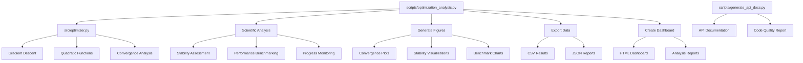

# Code Project — Optimization Research Exemplar

Research project demonstrating optimization algorithms with automated figure generation and publication-quality output. Sister exemplar to [`template_prose_project`](../template_prose_project) (prose-review pipeline) and [`template_search_project`](../template_search_project) (literature discovery).

## Quick Start

```bash
# Run the analysis pipeline
uv run python projects/template_code_project/scripts/optimization_analysis.py

# Run tests
uv run pytest projects/template_code_project/tests/ -v

# View final deliverables (after scripts/05_copy_outputs.py)
ls -la output/template_code_project/
```

## Dependencies

Run `uv sync` at the **repository root**; that environment is what CI and `./run.sh` use. [`pyproject.toml`](pyproject.toml) in this directory configures pytest/coverage for `projects/template_code_project/tests/` and records the same scientific stack for isolated runs. Root [`pyproject.toml`](../../pyproject.toml) has `[tool.uv.workspace]` with `members = []`, so this folder is not installed as a separate workspace package.

## Key Features

- **Gradient descent optimization** with convergence analysis
- **Automated figure generation** (convergence plots, stability analysis, performance benchmarks)
- **Scientific validation** (numerical stability assessment, performance benchmarking)
- **Comprehensive reporting** (HTML dashboard with analysis metrics)
- **Performance monitoring** (resource usage tracking with progress indicators)
- **Data export** (optimization results, analysis reports, performance metrics)
- **Manuscript integration** (figure registration and cross-referencing)

## Common Commands

### Run Analysis

```bash
uv run python projects/template_code_project/scripts/optimization_analysis.py
```

Generates convergence plots, performs scientific validation, creates dashboard, and saves all results.

### Run Tests

```bash
uv run pytest projects/template_code_project/tests/ -v
```

Tests optimization algorithms and numerical accuracy.

### View Results

```bash
open output/figures/convergence_plot.png
cat output/data/optimization_results.csv
```

## Architecture



## .cursorrules Compliance

✅ **Fully compliant** with template development standards:

- **Testing**: ~99.5% coverage on `src/` (96 tests across `test_optimizer.py`, `test_invariants.py`, `test_invariants_and_dashboard.py`), real data only, no mocks
- **Documentation**: AGENTS.md + README.md in each directory
- **Type Safety**: Full type hints on all public APIs
- **Code Quality**: Black formatting, descriptive naming, proper imports
- **Error Handling**: Context preservation, informative messages
- **Logging**: Unified logging system throughout

## Manuscript authoring

When editing manuscript markdown:

- [`manuscript/SYNTAX.md`](manuscript/SYNTAX.md) — citation, equation, figure, table, and section conventions specific to this project (label registries for all 6 figures and 8 equations).
- [`../../docs/guides/manuscript-semantics.md`](../../docs/guides/manuscript-semantics.md) — repository-wide canonical manuscript semantics shared by all three template exemplars.
- [`manuscript/AGENTS.md`](manuscript/AGENTS.md) — `{{TOKEN}}` substitution protocol and section-modification workflow.

## More Information

See [AGENTS.md](AGENTS.md) for technical documentation.
