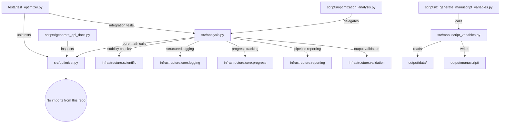

# Architecture: The Thin Orchestrator Flow

The `template_code_project` exemplar is designed around a strict separation of concerns across three operational layers. Understanding this architecture before modifying any file prevents the most common errors: math appearing in scripts, reusable project logic remaining trapped in CLI files, and mocks appearing in tests.

## Layer Reference

| Layer | Primary Files | Public API | Invariants | Testability |
|---|---|---|---|---|
| **`src/` — Project Logic** | `src/optimizer.py`, `src/invariants.py`, `src/analysis.py`, `src/dashboard.py`, `src/manuscript_variables.py` | Optimizer primitives plus importable analysis/dashboard builders | Mathematical primitives stay pure; analysis/dashboard I/O is explicit and path-based | Direct unit tests for pure logic; integration tests for generated artifacts |
| **`scripts/` — Orchestrators** | `scripts/optimization_analysis.py`, `scripts/build_dashboard.py`, `scripts/generate_api_docs.py`, `scripts/z_generate_manuscript_variables.py` | CLI compatibility wrappers and script entry points | No experiment, plotting, dashboard, or manuscript-variable logic lives only in scripts | Subprocess/integration tests exercise real commands |
| **`infrastructure/` — Cross-Cutting** | `infrastructure/scientific/`, `infrastructure/reporting/`, `infrastructure/rendering/`, `infrastructure/core/`, `infrastructure/validation/` | Stability checks, benchmarking, PDF rendering, structured logging, progress bars | Generic reusable behavior only; no project-specific assumptions | Covered by separate `tests/infra_tests/` suite |

## Strict Dependency Direction

```
scripts/ ──→ src/            (imports and calls project behavior)
src/optimizer.py ──→ [stdlib + numpy only]
src/analysis.py ──→ infrastructure/ (project-specific generation via reusable services)
tests/   ──→ src/            (direct testing of importable project behavior)
tests/   ──→ scripts/        (CLI compatibility smoke tests)
```

No arrows go upward. Core mathematical code stays independent; project analysis modules may call infrastructure because they are the importable implementation behind the thin script wrappers.



## Infrastructure Modules Used by This Project

| Module | Imported From | Used For |
|---|---|---|
| `infrastructure.scientific.stability` | `src/analysis.py` | `check_numerical_stability()` across starting-point / step-size grid |
| `infrastructure.scientific.benchmarking` | `src/analysis.py` | `benchmark_function()` across problem dimensions |
| `infrastructure.core.logging.utils` | `scripts/*.py` | `get_logger(__name__)` for structured log output |
| `infrastructure.core.progress` | `src/analysis.py` | `PipelineProgress` progress bars for long-running loops |
| `infrastructure.reporting` | `src/analysis.py`, `src/dashboard.py` | HTML dashboard generation, pipeline metrics |
| `infrastructure.validation` | `src/analysis.py` | Output integrity checks on generated figures and CSV |

## Forbidden Patterns

| Pattern | Why It Is Forbidden | Correct Alternative |
|---|---|---|
| Math inside `scripts/` (e.g., gradient update step) | Cannot be unit-tested without running the full script | Move to `src/`, add a test in `TestGradientDescent` |
| `from infrastructure import ...` in `src/optimizer.py` | Breaks mathematical-layer purity | Keep optimizer primitives pure; call infrastructure from `src/analysis.py` or `src/dashboard.py` |
| `print()` inside `scripts/` | Bypasses structured logging; lost in CI output | Use `get_logger(__name__).info(...)` |
| Hardcoded absolute output paths in pure math modules | Makes copied projects brittle | Keep paths relative to the project root and isolated to analysis/dashboard/manuscript-variable modules |
| `unittest.mock`, `MagicMock`, `@patch` in `tests/` | Zero-mock policy | Compute real results with real numpy arrays |
| Hardcoded step-size constants in `scripts/` | Configuration drift vs `manuscript/config.yaml` | Read from config; `config.yaml` is the single source of truth for experiment parameters |

## How to Add a New Algorithm

Follow these five steps in order:

1. **Add the function to `src/optimizer.py`** — Pure math only; no I/O; add type hints and a Google-style docstring; export from `__init__.py`.

2. **Write a test class in `tests/test_optimizer.py`** — Follow the zero-mock pattern; use fixed numpy arrays; assert mathematical properties; run `uv run pytest projects/template_code_project/tests/ --cov=projects/template_code_project/src --cov-fail-under=90`.

3. **Add the analysis call in `src/analysis.py`** — Import the new function from `src/optimizer.py`; run it inside the existing experiment loop or add a new loop; write results to `projects/template_code_project/output/data/` or `output/figures/`.

4. **Update output conventions** — Document the new output file in `docs/output_conventions.md`; generated `output/` files stay untracked.

5. **Update manuscript section** — Edit `manuscript/02_methodology.md` with the algorithm description using concrete file paths (e.g., `projects/template_code_project/src/optimizer.py::new_function()`); add any result variables to `src/manuscript_variables.py::generate_variables()`; reference figures with `\ref{fig:label}`.
