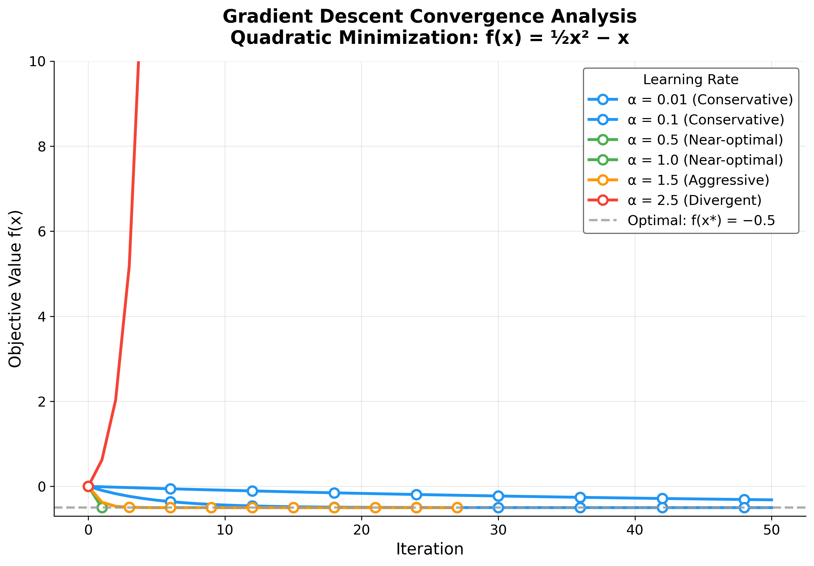

# Troubleshooting

Symptom-driven recipes for the most common breakage modes when running this project.

## Literal `{{TOKEN_NAME}}` appears in the rendered PDF

**Cause.** A placeholder in `manuscript/*.md` was not substituted because
`scripts/z_generate_manuscript_variables.py` was not (re)run after the
analysis stage, or the token is not defined in `generate_variables()`.

**Fix.**

1. Run the variable-hydration stage:
   ```bash
   uv run python projects/template_code_project/scripts/z_generate_manuscript_variables.py
   ```
2. Inspect the resolved values:
   ```bash
   cat projects/template_code_project/output/data/manuscript_variables.json | jq .
   ```
3. Re-render:
   ```bash
   uv run python scripts/03_render_pdf.py --project template_code_project
   ```
4. If the token is still literal, add it to `generate_variables()` in
   `scripts/z_generate_manuscript_variables.py`.

## Edited `manuscript/config.yaml` but the figures or PDF didn't change

**Cause.** Stages 4-5 (analysis → render) were skipped or only the render
stage ran (it does not re-execute `optimization_analysis.py`).

**Fix.** Run the analysis stage first, then variables, then render:

```bash
uv run python projects/template_code_project/scripts/optimization_analysis.py
uv run python projects/template_code_project/scripts/z_generate_manuscript_variables.py
uv run python scripts/03_render_pdf.py --project template_code_project
```

Or just re-run the full pipeline:

```bash
uv run python scripts/execute_pipeline.py --project template_code_project --core-only
```

## `Figure ???` in the rendered PDF

**Cause.** The Pandoc-crossref `[@fig:label]` reference does not match
any `{#fig:label}` anchor, or the figure inclusion was not resolved
before compilation.

**Fix.**

1. Verify `manuscript/03_results.md` contains the image with the
   correct anchor:
   ```markdown
   {#fig:convergence}
   ```
2. Verify the prose reference uses the same label:
   ```markdown
   See [@fig:convergence] for the trajectories.
   ```
3. Re-run the analysis and render stages.

## BibTeX / citation errors during PDF rendering

**Symptom.** `xelatex` reports `Citation 'foo' on page X undefined` or
`bibtex` flags a malformed entry.

**Fix.**

1. Look at the LaTeX log for the exact line:
   ```bash
   grep -nE "Citation|undefined|Error" \
     projects/template_code_project/output/pdf/_combined_manuscript.log
   ```
2. Check the entry exists in `manuscript/references.bib` and is well-formed.
3. Ensure all required BibTeX fields are present (`author`, `title`,
   `year`, plus type-specific fields).

## Analysis script aborts with a Python error

**Fix.**

1. Re-run with the full traceback visible:
   ```bash
   uv run python projects/template_code_project/scripts/optimization_analysis.py 2>&1 | tee /tmp/analysis.log
   ```
2. Check the output directory exists and is writable.
3. Validate `manuscript/config.yaml`:
   ```bash
   uv run python -c "import yaml; yaml.safe_load(open('projects/template_code_project/manuscript/config.yaml'))"
   ```

## `uv` command not found

**Fix.** Install `uv`:

```bash
# macOS / Linux
curl -LsSf https://astral.sh/uv/install.sh | sh
# or
pip install uv
```

Make sure `~/.local/bin` (or the install location) is on your `PATH`.

## Coverage gate fails (under 90%)

**Fix.**

1. Find which lines are uncovered:
   ```bash
   uv run pytest projects/template_code_project/tests/ \
       --cov=projects/template_code_project/src \
       --cov-report=term-missing -v
   ```
2. Add tests covering the missing branches.
3. Re-run until coverage ≥ 90% and all tests pass.

## `optimization_analysis.py` fails to import `optimizer`

**Symptom.** `ModuleNotFoundError: No module named 'optimizer'`.

**Fix.** Run from the repository root and let the workspace handle paths:

```bash
uv run python projects/template_code_project/scripts/optimization_analysis.py
```

## Sluggish test execution

**Cause.** Performance benchmarks use real timing with multiple
repetitions; on a slow machine they can dominate the suite.

**Fix.** Skip them for fast iteration:

```bash
uv run pytest projects/template_code_project/tests/ -k "not Performance"
```

Or run the suite in parallel:

```bash
uv run pytest projects/template_code_project/tests/ -n auto
```

## YAML parse error in `manuscript/config.yaml`

**Common mistakes.**

- Indentation uses tabs instead of spaces.
- Trailing commas (JSON style) are invalid in YAML.
- Unclosed quotes or brackets.

**Fix.** Validate the file before running:

```bash
uv run python -c "import yaml; yaml.safe_load(open('projects/template_code_project/manuscript/config.yaml'))"
```

## See also

- [`output_conventions.md`](output_conventions.md) — output directory layout and regeneration rules.
- [`rendering_pipeline.md`](rendering_pipeline.md) — the four phases and their config controls.
- [`syntax_guide.md`](syntax_guide.md) — manuscript token and cross-reference syntax.
- [`quickstart.md`](quickstart.md) — basic run commands.
- [`faq.md`](faq.md) — frequently asked questions.
