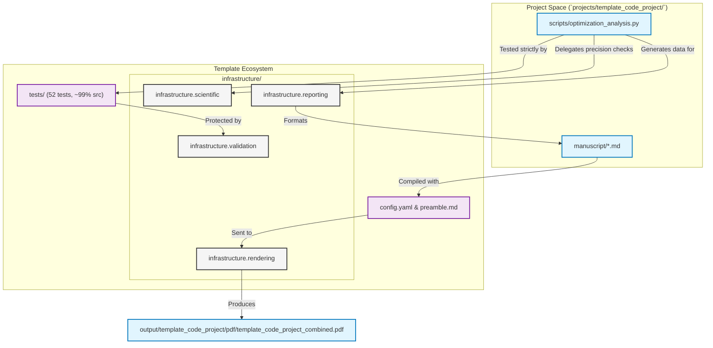

# `template_code_project` - The Repository Exemplar

This is the **master exemplar** for the Generalized Research Template. It is a fully-tested numerical optimization implementation securely bracketed by rigorous infrastructure, hermetic testing, and extensive documentation architectures.

It demonstrates the complete research pipeline from algorithm implementation through strict validation to multi-format result visualization.

## Template Architecture

This project is explicitly designed to showcase the repository's three foundational pillars:

1. **`infrastructure/` Layer**: The code delegates all tracking, performance benchmarking, stability validation, and PDF rendering to the 16-module infrastructure cluster (located at the repository root).
2. **`tests/` Integrity**: A zero-mock suite (`projects/template_code_project/tests/`, **52** collected tests) with **≥90%** coverage on `projects/template_code_project/src/` (typically ~99% line/branch with the current tests).
3. **`docs/` Orchestration**: Adherence to the Rigorous Agentic Scientific Protocol (RASP) ensuring total documentation-to-code parity (`projects/template_code_project/docs/`).

## Manuscript Structure

The `manuscript/` directory contains the raw markdown files that the renderer (`infrastructure/rendering/pdf_renderer.py`) transforms into the final academic PDF. These files are designed as a meta-narrative to demonstrate exactly how the repository executes:

- `00_abstract.md`: Abstract; build variables and CSV-backed prose via `scripts/z_generate_manuscript_variables.py`.
- `01_introduction.md`: Introduction of the infrastructure pillars bridging to CI/CD files.
- `02_methodology.md`: Mathematical methods mapping to specific python script execution lines.
- `03_results.md`: Convergence analysis built via `infrastructure.reporting`, pointing back at itself.
- `04_conclusion.md`: Summary of the seamless template automation asserting the PDF itself as final proof.

## Architecture

The project acts as a bridge between custom mathematical logic and the repository's core:



## Quick Start

Experience the automated pipeline directly:

```bash
# From repository root
uv run python projects/template_code_project/scripts/optimization_analysis.py

uv run python scripts/03_render_pdf.py --project template_code_project

open output/template_code_project/pdf/template_code_project_combined.pdf
```

## AI Agent Directives

If you are an AI agent operating in this repository, you **MUST** read [`AGENTS.md`](AGENTS.md) before executing any code modifications. It defines the zero-mock testing constraints and infrastructure coupling rules.

## See also

- [`SYNTAX.md`](SYNTAX.md) — Pandoc citation / cross-reference conventions for this manuscript.
- [`../../../docs/guides/manuscript-semantics.md`](../../../docs/guides/manuscript-semantics.md) — Repository-wide canonical manuscript semantics shared by all three template exemplars (`template_code_project`, `template_prose_project`, `template_search_project`).
