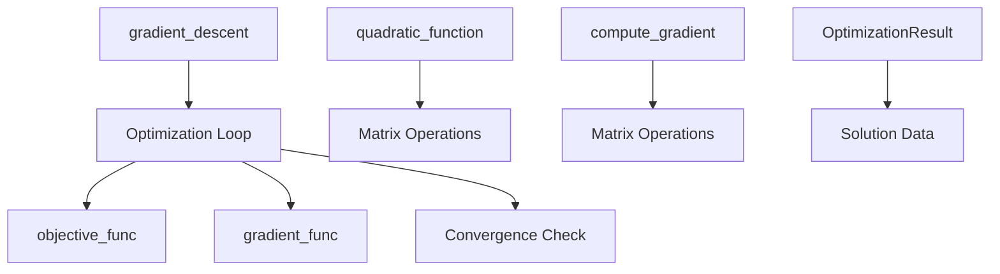

# src/ - Project Logic

Core optimization algorithms, analysis builders, dashboard payloads, and manuscript-variable extraction for the code exemplar. Mathematical primitives stay pure; generated-output workflows live in importable modules so scripts can remain thin wrappers.

## Quick Start

```python
import logging
from optimizer import gradient_descent, quadratic_function

logger = logging.getLogger(__name__)

# Simple optimization example
result = gradient_descent(
    initial_point=np.array([0.0]),
    objective_func=lambda x: quadratic_function(x),
    gradient_func=lambda x: x - 1,  # Gradient of f(x) = 0.5*x^2 - x
    step_size=0.1
)

logger.info(f"Optimal solution: {result.solution}")
```

## Key Features

- **Gradient descent** optimization algorithm
- **Quadratic function** evaluation and gradients
- **Importable analysis pipeline** in `analysis.py`
- **Importable dashboard builder** in `dashboard.py`
- **Reproducible results** with deterministic behavior
- **Type-safe** with type hints

## Common Commands

### Import and Use

```python
from optimizer import (
    gradient_descent,
    quadratic_function,
    compute_gradient,
    OptimizationResult
)
```

### Run Tests

```python
pytest ../tests/ -v
```

## Architecture



## More Information

See [AGENTS.md](AGENTS.md) for technical documentation.
