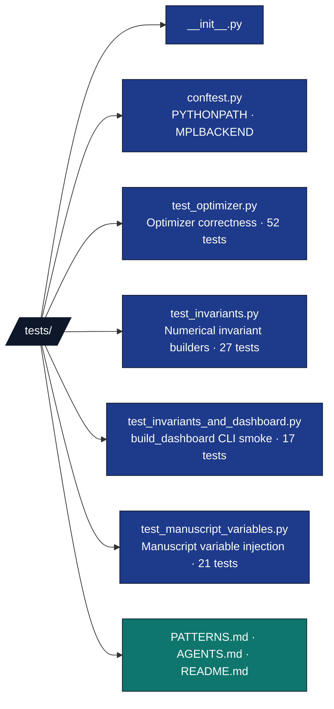

# tests/ - Test Suite

## Overview

The `tests/` directory contains tests for the optimization algorithms in `src/`. These tests validate correctness, numerical accuracy, and edge case handling without using mocks - all tests use computations.

## Key Concepts

- **Real data testing**: No mocks, all tests use actual mathematical computations
- **Numerical accuracy**: Tests verify mathematical correctness and convergence
- **Edge case coverage**: Tests handle boundary conditions and error cases
- **Deterministic results**: Prefer fixed inputs; document or bound any random draws (see Best Practices)

## Directory Structure



## Installation/Setup

Tests require the same dependencies as the main code:

- `numpy` - Numerical computations
- `pytest` - Test framework
- `scipy` - Additional scientific functions (if used)

## Usage Examples

### Run All Tests

```bash
# From tests directory
uv run pytest .

# From project root
uv run pytest tests/

# With verbose output
uv run pytest tests/ -v

# With coverage (local HTML exploration)
uv run pytest tests/ --cov=../src --cov-report=html

# Canonical enforced gate (from repo root — the real per-project gate, CI parity).
# A green exit with 0 collected tests is NOT a pass: confirm collected > 0 AND coverage >= 90%.
uv run pytest projects/template_code_project/tests/ \
  --cov=projects/template_code_project/src --cov-fail-under=90
```

### Run Specific Test Classes

```bash
# Test quadratic function evaluation
uv run pytest tests/ -k "TestQuadraticFunction"

# Test gradient computation
uv run pytest tests/ -k "TestComputeGradient"

# Test optimization algorithm
uv run pytest tests/ -k "TestGradientDescent"
```

### Debug Individual Tests

```bash
# Run single test with debug output
uv run pytest tests/test_optimizer.py::TestGradientDescent::test_convergence_to_optimum -v -s
```

## Configuration

Tests use hardcoded parameters for consistency:

- **Numerical tolerances**: `atol=1e-4`, `rtol=1e-6` for floating-point comparisons
- **Optimization parameters**: Fixed step sizes, iteration limits, convergence tolerances
- **Random draws**: Rare; where used (e.g. timing on large random vectors), keep assertions tolerant and avoid relying on exact RNG streams unless seeded explicitly
- **Test data**: Simple, well-conditioned matrices and vectors

## Testing Philosophy

### Zero-Mock Policy

As a core tenet of the Generalized Research Template, all tests in this exemplar enforce a strict **Zero-Mock Policy**. Validation uses real algorithms and data paths—no mocked objects or faked side-effects. Coverage expectations are enforced via `pyproject.toml`.

- ✅ **Mathematical correctness**: Tests verify actual mathematical results
- ✅ **Integration validation**: Tests validate function pipelines
- ✅ **Numerical accuracy**: Tests check convergence and precision
- ❌ **No mock objects**: Every test exercises real algorithms

### Test Categories

#### Unit Tests (`test_optimizer.py`)

1. **TestQuadraticFunction**
   - Basic function evaluation
   - Multi-dimensional cases
   - Default parameter handling
   - Dimension mismatch error handling

2. **TestComputeGradient**
   - Gradient computation accuracy
   - Multi-dimensional gradients
   - Default parameter behavior

3. **TestGradientDescent**
   - Convergence to known optima
   - Maximum iteration handling
   - Already-converged starting points
   - Multi-dimensional optimization

4. **TestOptimizationResult**
   - Data structure validation
   - Attribute correctness

## API Reference

### Test Classes and Methods

#### TestQuadraticFunction

```python
class TestQuadraticFunction:
    """Test quadratic function evaluation."""

    def test_simple_quadratic(self):
        """Test basic quadratic function evaluation."""

    def test_multidimensional_quadratic(self):
        """Test quadratic function in higher dimensions."""

    def test_default_parameters(self):
        """Test with default A and b parameters."""

    def test_dimension_mismatch_A(self):
        """Test error handling for mismatched A dimensions."""

    def test_dimension_mismatch_b(self):
        """Test error handling for mismatched b dimensions."""
```

#### TestComputeGradient

```python
class TestComputeGradient:
    """Test gradient computation."""

    def test_simple_gradient(self):
        """Test gradient computation for simple case."""

    def test_multidimensional_gradient(self):
        """Test gradient in higher dimensions."""

    def test_default_gradient(self):
        """Test gradient with default parameters."""
```

#### TestGradientDescent

```python
class TestGradientDescent:
    """Test gradient descent optimization."""

    def test_convergence_to_optimum(self):
        """Test that gradient descent converges to known optimum."""

    def test_max_iterations_reached(self):
        """Test behavior when max iterations reached without convergence."""

    def test_already_converged(self):
        """Test when starting point is already at optimum."""

    def test_multidimensional_convergence(self):
        """Test convergence in higher dimensions."""
```

#### TestOptimizationResult

```python
class TestOptimizationResult:
    """Test OptimizationResult dataclass."""

    def test_result_creation(self):
        """Test creating optimization result."""
```

## Troubleshooting

### Common Issues

- **Test failures**: Check numerical tolerances may need adjustment for different platforms
- **Import errors**: Ensure pytest is run from correct directory
- **Coverage issues**: Verify all code paths are exercised

### Debug Tips

Enable detailed test output:

```bash
uv run pytest tests/ -v -s --tb=long
```

Check test coverage:

```bash
uv run pytest tests/ --cov=../src --cov-report=term-missing
```

## Best Practices

- **Deterministic tests**: Prefer fixed inputs; if random arrays are used for scale/timing checks, do not assert exact bitwise results
- **Numerical stability**: Use appropriate tolerances for floating-point comparisons
- **Comprehensive coverage**: Test all code paths including error conditions
- **Clear assertions**: Use descriptive assertion messages
- **Independent tests**: Each test should be runnable in isolation

## Performance Testing

Tests validate performance characteristics:

- **Convergence speed**: Tests verify algorithms converge within reasonable iterations
- **Numerical accuracy**: Tests check solution accuracy against known optima
- **Stability**: Tests ensure algorithms handle edge cases gracefully

## See Also

- [README.md](README.md) - Quick reference
- [../src/optimizer.py](../src/optimizer.py) - Code under test
- [../scripts/optimization_analysis.py](../scripts/optimization_analysis.py) - Integration examples
