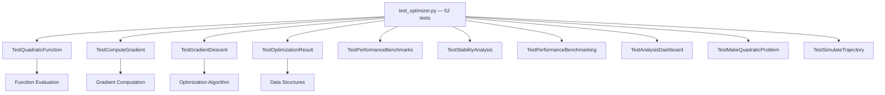

# tests/ - Zero-Mock Test Suite

An uncompromising validation layer for the mathematical algorithms. Enforces a strict Zero-Mock policy.

## Quick Start

```bash
# Run all tests
pytest .

# Run with coverage
pytest . --cov=../src --cov-report=term

# Run specific tests
pytest -k "TestGradientDescent" -v
```

## Key Features

- **Real data testing** (no mocks)
- **Numerical accuracy validation**
- **Edge case coverage**
- **Deterministic results**

## Common Commands

### Run Tests

```bash
pytest . -v              # Verbose output
pytest . -k "gradient"   # Filter by name
pytest . --tb=short      # Shorter tracebacks
```

### Coverage

Local exploration (HTML report):

```bash
pytest . --cov=../src --cov-report=html
open htmlcov/index.html
```

**Canonical enforced gate** (run from the repo root — this is the real
per-project quality gate and what CI enforces project-by-project):

```bash
uv run pytest projects/template_code_project/tests/ \
  --cov=projects/template_code_project/src --cov-fail-under=90
# exemplar baseline: 117 passed, ~99% coverage
```

A green exit code alone is **not** proof — confirm tests **collected > 0**
and **coverage ≥ 90%**. See
[`../docs/testing_philosophy.md`](../docs/testing_philosophy.md#running-the-gate-collection-and-threshold-not-just-exit-code).

## Architecture



> **Zero-Mock Policy**: Tests use real `OptimizationResult` instances and real computations. No `unittest.mock`, `MagicMock`, `@patch`, or synthetic `type()` objects.

## More Information

See [AGENTS.md](AGENTS.md) for technical documentation.
