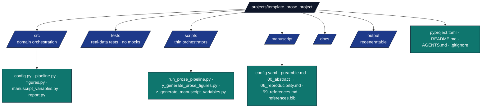

# template_prose_project — Agent Guide

## Purpose

Prose-focused exemplar demonstrating end-to-end use of
`infrastructure/prose/` and `infrastructure/reference/`. Mirrors the
structure of the permanent `template_code_project` exemplar and the
optional `projects_archive/template_search_project` add-on, while staying
fast and offline by default.

## Layout



## Key contracts

* `src/config.py::ProjectConfig` — every knob is here. Add a new check
  by adding a field to `ProseAnalysisConfig`, parsing it in
  `from_dict`, and wiring it into `pipeline.run_prose_pipeline`.
* `src/pipeline.py::run_prose_pipeline` — the only function that
  touches `infrastructure.prose.*` or
  `infrastructure.reference.citation.*`. Returns a
  :class:`ProseRunArtifacts` so the script knows where every artefact
  landed.
* `src/figures.py` — pure matplotlib; takes a `ManuscriptReport` and a
  `Path`, returns the saved file paths.
* `src/manuscript_variables.py` — derives substitution variables from
  the JSON report; no project-specific knowledge embedded.
* `src/report.py::write_review_report` — single function that takes a
  `ManuscriptReport` + `CheckResult`s and writes markdown.

## Run modes

| Command | Behaviour |
|---|---|
| `python scripts/run_prose_pipeline.py` | Default config; reads `manuscript/`, writes everything. |
| `… --strict` | Exit non-zero if any configured check fails. |
| `… --config other.yaml` | Use an alternative config file. |
| `… --project-root path` | Run against an isolated project root. |

## Testing

```bash
uv run pytest projects/template_prose_project/tests/ -v
```

All tests run offline. Real prose inputs, real BibTeX files, real
`tmp_path` directories, real subprocess invocation of the scripts. No
mocks.

## How this project differs from its siblings

* `template_code_project` — has its own algorithm (`src/optimizer.py`)
  and generates figures from numerical experiments.
* Optional `template_search_project` add-on — runs literature search and *populates*
  `manuscript/references.bib` from a query.
* `template_prose_project` — runs no algorithm and *validates* the
  hand-curated `manuscript/references.bib`. The "experiment" is the
  editorial-review pipeline.

## Extending

To add a new check:

1. Edit `src/config.py::ProseAnalysisConfig` to add the new field.
2. Add a `_check_<name>` function in `src/pipeline.py`.
3. Wire it into `run_prose_pipeline` so it appears in `artifacts.checks`.
4. Add a test in `tests/test_pipeline.py` covering both `passed=True`
   and `passed=False` outcomes (the existing `TestCheckUnits` class
   shows the pattern).
5. Optionally surface its result in `src/report.py::write_review_report`.

To add a new figure:

1. Add a `plot_<name>` function in `src/figures.py`.
2. Append it to `generate_all_figures`.
3. Reference the output PNG in `manuscript/03_results.md` if desired.

To target a different manuscript:

1. Edit `manuscript_dir` in `manuscript/config.yaml`.
2. Adjust `prose.target_grade_level_*` and `bibliography.fail_on_*` to
   match the target audience.
3. Re-run the pipeline.

## See also

* [`README.md`](README.md) — quick reference.
* [`docs/architecture.md`](docs/architecture.md) — module dependency graph.
* [`docs/quickstart.md`](docs/quickstart.md) — getting started.
* [`infrastructure/prose/AGENTS.md`](../../infrastructure/prose/AGENTS.md) —
  underlying module agent guide.
* [`infrastructure/reference/AGENTS.md`](../../infrastructure/reference/AGENTS.md) —
  bibliography agent guide.
