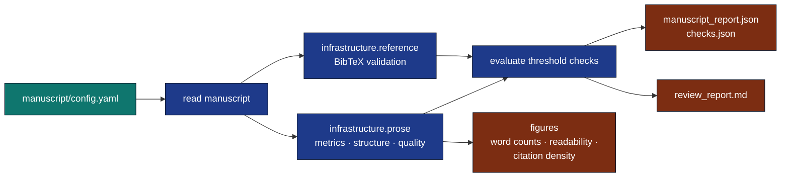

# template_prose_project

A configurable, reproducible **prose-review** pipeline built on
`infrastructure/prose/` (readability + structure + quality) and
`infrastructure/reference/` (BibTeX validation). Permanent sibling exemplar:
[`template_code_project`](../template_code_project) (numerical research).
Optional add-on exemplar: [`template_search_project`](../../projects_archive/template_search_project)
(literature discovery).

## What it does



## Quick start

```bash
# Run the full prose review (offline, no Ollama)
uv run python projects/template_prose_project/scripts/run_prose_pipeline.py

# Strict mode: exit non-zero if any check fails
uv run python projects/template_prose_project/scripts/run_prose_pipeline.py --strict

# Generate figures (after a pipeline run)
uv run python projects/template_prose_project/scripts/y_generate_prose_figures.py

# Hydrate manuscript variables for the abstract
uv run python projects/template_prose_project/scripts/z_generate_manuscript_variables.py
```

After the run, look in `output/`:

* `manuscript_report.json` — raw `ManuscriptReport`.
* `checks.json` — list of `CheckResult` (one per configured check).
* `review_report.md` — the human-readable review.
* `figures/{section_word_counts,readability_metrics,citation_density}.png`.
* `data/manuscript_variables.json` — substitution variables for the abstract.
* `run_summary.json` — one-line metadata.

## Prerequisites & verification

**Combined-PDF rendering needs headless Chrome.** This manuscript embeds
Mermaid diagrams (`manuscript/05_pipeline_internals.md`); the combined PDF is
built with `mmdc`, which requires a pinned `chrome-headless-shell`. Install
it once (CI provisions it automatically; a fresh clone does not):

```bash
npx --yes puppeteer browsers install chrome-headless-shell
```

Without it the **PDF Rendering** stage fails while per-section slides still
render — see [`docs/troubleshooting.md`](docs/troubleshooting.md#pdf-rendering-stage-fails-mmdc-could-not-find-chrome).

**Test/coverage gate (authoritative per-project command).** Exit code 0
alone is not proof; confirm tests collected > 0 and coverage ≥ 90%:

```bash
uv run pytest projects/template_prose_project/tests/ \
  --cov=projects/template_prose_project/src --cov-fail-under=90
# exemplar baseline: 67 passed, 100% coverage
```

Full end-to-end (tests → analysis → render → validate → copy):

```bash
uv run python scripts/execute_pipeline.py --project template_prose_project --core-only
```

## Configuration

Every knob lives in `manuscript/config.yaml`:

| Section | Key | Default | Meaning |
|---|---|---|---|
| `prose` | `target_grade_level_min` / `_max` | `10.0 / 18.0` | Acceptable Flesch-Kincaid Grade Level band. |
| `prose` | `long_sentence_threshold` | `35` | Words per sentence above which sentences are flagged. |
| `prose` | `citation_density_min_per_1000` | `0.0` | Minimum citations per 1000 words. |
| `prose` | `require_h1_per_section` | `true` | Every file must have an H1. |
| `prose` | `forbid_skipped_levels` | `true` | Heading levels must be contiguous. |
| `bibliography` | `references_path` | `manuscript/references.bib` | Path to BibTeX file. |
| `bibliography` | `fail_on_missing` | `true` | Fail if a cited `[@key]` is not in the bib. |
| `bibliography` | `fail_on_unused` | `false` | Fail if a bib entry is never cited. |

## Architecture

* `src/config.py` — typed YAML loader.
* `src/pipeline.py` — read manuscript → analyse → cross-check bibliography → evaluate checks. **Pure orchestration over `infrastructure/`.**
* `src/figures.py` — matplotlib renderers (no business logic).
* `src/manuscript_variables.py` — abstract substitution variables.
* `src/report.py` — markdown review-report assembly.
* `scripts/run_prose_pipeline.py` — thin orchestrator.
* `scripts/y_generate_prose_figures.py` — figure stage.
* `scripts/z_generate_manuscript_variables.py` — variable-hydration stage.

## Testing

```bash
uv run pytest projects/template_prose_project/tests/ -v
```

All tests are offline; no mocks. The test suite uses real prose, real
BibTeX files, real `tmp_path` directories, real subprocess invocation
of the orchestrator scripts.

## How this project differs from its siblings

* `template_code_project` has its own algorithm (`src/optimizer.py`)
  and runs numerical experiments.
* The optional `template_search_project` add-on runs literature search and *populates*
  `references.bib` from a query.
* `template_prose_project` runs no algorithm and *validates* an
  existing `references.bib`. Its "experiment" is the editorial-review
  pipeline itself.

## See also

* [`AGENTS.md`](AGENTS.md) — agent-oriented walkthrough.
* [`manuscript/SYNTAX.md`](manuscript/SYNTAX.md) — Pandoc citation / cross-reference conventions for this project.
* [`../../docs/guides/manuscript-semantics.md`](../../docs/guides/manuscript-semantics.md) — repository-wide canonical manuscript semantics.
* [`docs/architecture.md`](docs/architecture.md) — architectural diagram.
* [`docs/quickstart.md`](docs/quickstart.md) — getting started guide.
* [`infrastructure/prose/SKILL.md`](../../infrastructure/prose/SKILL.md) —
  underlying prose-analysis API.
