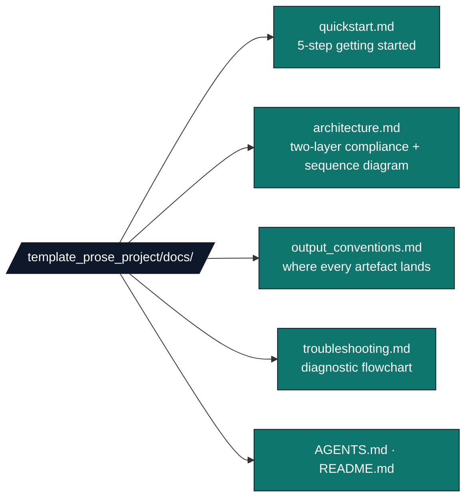

# `template_prose_project/docs/`

Documentation hub for the prose-review exemplar.

## Quick links

| File | Purpose |
|---|---|
| [`quickstart.md`](quickstart.md) | 5-step getting-started flow. |
| [`architecture.md`](architecture.md) | Two-layer compliance and data-flow diagrams. |
| [`output_conventions.md`](output_conventions.md) | Where every artefact lands on disk. |
| [`troubleshooting.md`](troubleshooting.md) | Diagnostic flowchart for common failures. |
| [`AGENTS.md`](AGENTS.md) | Agent-oriented walkthrough of this hub. |

## See also

* Project [`README.md`](../README.md) — top-level project overview.
* Project [`AGENTS.md`](../AGENTS.md) — agent walkthrough.
* [`infrastructure/prose/SKILL.md`](../../../infrastructure/prose/SKILL.md) — underlying API.
