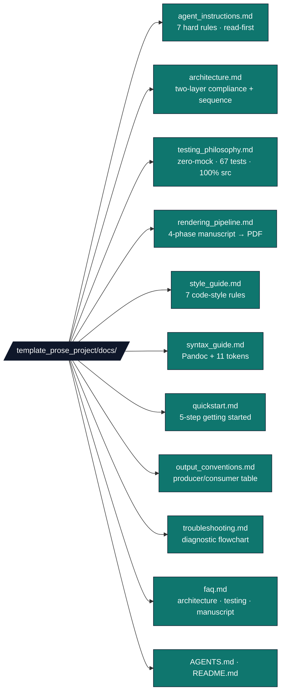

# `template_prose_project/docs/`

Documentation hub for the prose-review exemplar.

## Quick links

| File | Purpose |
|---|---|
| [`agent_instructions.md`](agent_instructions.md) | 7 hard rules for AI agents; verification checklist. |
| [`architecture.md`](architecture.md) | Two-layer compliance and data-flow diagrams. |
| [`testing_philosophy.md`](testing_philosophy.md) | Zero-mock standard; 67 tests; 100% `src/` coverage. |
| [`rendering_pipeline.md`](rendering_pipeline.md) | Four phases of the manuscript → PDF flow; `config.yaml` controls. |
| [`style_guide.md`](style_guide.md) | 7 code-style rules (Zero-Mock, Infrastructure Delegation, Thin Orchestrator, Show-Not-Tell, Explicit Paths, Type Hints, Error Messages). |
| [`syntax_guide.md`](syntax_guide.md) | Pandoc-crossref `[@sec:…]`, all eleven `{{TOKEN}}`s, code blocks. |
| [`quickstart.md`](quickstart.md) | 5-step getting-started flow. |
| [`output_conventions.md`](output_conventions.md) | Where every artefact lands on disk. |
| [`troubleshooting.md`](troubleshooting.md) | Diagnostic flowchart for common failures. |
| [`faq.md`](faq.md) | Recurring questions about architecture, testing, manuscript. |
| [`AGENTS.md`](AGENTS.md) | Agent-oriented walkthrough of this hub (read-first reference). |

## Audience-targeted entry points

* **First-time agent on this project** → start with
  [`agent_instructions.md`](agent_instructions.md), then
  [`architecture.md`](architecture.md).
* **Modifying `src/` or `tests/`** → [`style_guide.md`](style_guide.md)
  + [`testing_philosophy.md`](testing_philosophy.md).
* **Editing manuscript prose** → [`syntax_guide.md`](syntax_guide.md)
  + [`../manuscript/SYNTAX.md`](../manuscript/SYNTAX.md).
* **Running the full pipeline** → [`quickstart.md`](quickstart.md)
  + [`rendering_pipeline.md`](rendering_pipeline.md).
* **A check or stage failed** → [`troubleshooting.md`](troubleshooting.md)
  + [`faq.md`](faq.md).
* **Understanding what lands in `output/`** →
  [`output_conventions.md`](output_conventions.md).

## See also

* Project [`README.md`](../README.md) — top-level project overview.
* Project [`AGENTS.md`](../AGENTS.md) — agent walkthrough.
* [`../manuscript/SYNTAX.md`](../manuscript/SYNTAX.md) — Pandoc citation/cross-reference syntax.
* [`../../../infrastructure/prose/SKILL.md`](../../../infrastructure/prose/SKILL.md) — underlying analysis API.
* [`../../../infrastructure/reference/SKILL.md`](../../../infrastructure/reference/SKILL.md) — bibliography validation API.
