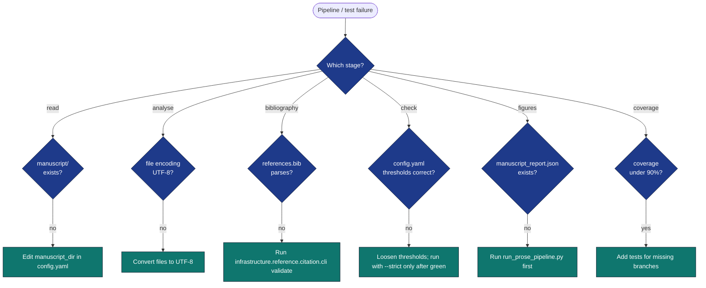

# Troubleshooting

## Diagnostic flow



## Common failures

### "Pipeline failed in `every_file_has_h1`"

**Symptom:** `output/checks.json` shows `every_file_has_h1` failed with
a list of files that do not start with `#`.

**Fixes:**

1. Each file under `manuscript/` must begin with a top-level heading
   (`# Title`). Add an H1 to the offending file.
2. If the file is intentionally H1-less (e.g. front-matter-only),
   exclude it via the `exclude_filenames` argument to
   `infrastructure.prose.read_manuscript_dir` — but typically the right
   fix is to add the H1.
3. Or set `prose.require_h1_per_section: false` in `manuscript/config.yaml`
   (loosens the policy globally).

### "Bibliography consistency failed: missing keys"

**Symptom:** `bibliography_consistency` failed; `details.missing` lists
`[@key]` references in the prose that do not appear in `references.bib`.

**Fixes:**

1. Add the missing entries to `manuscript/references.bib` (this project
   never writes to the bib — manual curation is intentional).
2. Or remove the offending `[@key]` from the prose if the citation was
   speculative.
3. Or set `bibliography.fail_on_missing: false` in `config.yaml` to
   warn rather than fail.

### "Grade level out of band"

**Symptom:** `grade_level_in_band` failed; FKGL is outside
`[target_grade_level_min, target_grade_level_max]`.

**Fixes:**

1. **Too high (dense prose):** shorten sentences, replace polysyllabic
   words with simpler synonyms, split paragraphs.
2. **Too low (over-simple):** verify `manuscript/` contains the actual
   prose, not placeholder text. The default min of 10.0 corresponds to
   roughly mid-secondary-school reading; below that suggests stub
   content.
3. Or widen the band in `config.yaml`.

### "Figures missing"

**Symptom:** `output/figures/` is empty after a run.

**Fixes:**

1. `output/manuscript_report.json` does not exist — the figure stage
   exits 2 when there's no input. Run `run_prose_pipeline.py` first.
2. Matplotlib backend issue — the figure module sets `MPLBACKEND=Agg`
   automatically; verify that environment variable is not being
   overridden by the shell.

### "Coverage below 90%"

**Symptom:** `pytest projects/template_prose_project/tests/` exits with
"coverage below 90".

**Fixes:**

* Add tests for branches reported in the coverage output.
* Untested code in `src/` is the most common cause; `scripts/` is *not*
  in the coverage source tree.

### "ImportPathMismatchError when running tests"

**Symptom:**
```
_pytest.pathlib.ImportPathMismatchError: ('tests.conftest', ...)
```
when running `pytest tests/ projects/template_prose_project/tests/` together.

**Cause:** Both directories are named `tests/` and pytest's import path
discovery confuses them.

**Fix:** Run them separately. The infrastructure pipeline always invokes
them in separate subprocess calls so this only affects ad-hoc usage.

## Where to look

* `output/checks.json` — every check's pass/fail with `details` payload.
* `output/manuscript_report.json` — full per-file metrics.
* `output/run_summary.json` — one-line summary.
* `output/review_report.md` — human-readable narrative of all the above.
