# `template_prose_project/manuscript/`

Manuscript directory — single source of truth for run policy and the
prose itself.

## Files

```mermaid
flowchart TB
    M[/template_prose_project/manuscript//]
    M --> CFG[config.yaml<br/>single source of truth · all knobs]
    M --> PRE[preamble.md<br/>LaTeX preamble for Pandoc]
    M --> S00[00_abstract.md<br/>Run-snapshot variables]
    M --> S01[01_introduction.md]
    M --> S02[02_methodology.md]
    M --> S03[03_results.md]
    M --> S04[04_conclusion.md]
    M --> S05[05_pipeline_internals.md<br/>classDiagram of types]
    M --> S06[06_reproducibility.md]
    M --> S99[99_references.md<br/>Pandoc citeproc bridge]
    M --> BIB[references.bib<br/>read-only · validated by pipeline]

    classDef d fill:#0f172a,stroke:#0f172a,color:#fff
    classDef cfg fill:#1e3a8a,stroke:#0f172a,color:#fff
    classDef sect fill:#0f766e,stroke:#0f172a,color:#fff
    classDef bib fill:#7c2d12,stroke:#0f172a,color:#fff
    class M d
    class CFG,PRE cfg
    class S00,S01,S02,S03,S04,S05,S06,S99 sect
    class BIB bib
```

## Policy

* **`config.yaml` is the only place run policy lives.** Editing
  thresholds, paths, or output toggles never requires a code change.
* **Section files are CommonMark Markdown** with optional Pandoc
  `[@key]` citations. The pipeline strips front-matter, fenced code,
  inline code, and link URLs before measuring readability.
* **`references.bib` is hand-curated and read-only.** This project
  *validates* citations against it but never writes to it. (Contrast
  with the optional `projects_archive/template_search_project` add-on,
  which auto-populates the bib from a literature query.)
* **`preamble.md`** is injected into Pandoc before LaTeX compilation.
  Do not put prose here.

## Substitution markers

`scripts/z_generate_manuscript_variables.py` replaces
``{{UPPER_NAME}}`` markers in any file under this directory at render
time. Substitution is performed via
`infrastructure.rendering.manuscript_injection.write_resolved_manuscript_tree()`,
which writes resolved copies to `output/manuscript/` and excludes
documentation-only files (`AGENTS.md`, `README.md`, `SYNTAX.md`) from
the output tree so their literal `{{TOKEN}}` examples are never substituted.
Current markers (defined in
[`src/manuscript_variables.py`](../src/manuscript_variables.py)):

| Marker | Source |
|---|---|
| `{{CONFIG_TITLE}}` | `config.yaml` `paper.title` |
| `{{TOTAL_WORDS}}` | sum of `metrics.word_count` |
| `{{TOTAL_SENTENCES}}` | sum of `metrics.sentence_count` |
| `{{TOTAL_PARAGRAPHS}}` | sum of `metrics.paragraph_count` |
| `{{AVG_GRADE_LEVEL}}` | weighted average FKGL |
| `{{AVG_READING_EASE}}` | weighted average FRE |
| `{{AVG_GUNNING_FOG}}` | weighted average Gunning Fog |
| `{{CITATION_COUNT}}` | unique cited keys |
| `{{FILES_ANALYSED}}` | count of files in `manuscript_report.files` |
| `{{LONGEST_SECTION_WORDS}}` | max per-file word count |
| `{{SHORTEST_SECTION_WORDS}}` | min per-file word count |

## Editing checklist

- [ ] Added a section → use `# Title` (H1) at the top to satisfy
  `every_file_has_h1`.
- [ ] Used heading levels contiguously (no skipping H1 → H3).
- [ ] Added a citation → ensure the key exists in `references.bib`.
- [ ] Tightened thresholds → re-run the pipeline; widen any band that
  fails legitimately.

## See also

* [`SYNTAX.md`](SYNTAX.md) — Pandoc citation/cross-reference syntax for this manuscript.
* [`../../../docs/guides/manuscript-semantics.md`](../../../docs/guides/manuscript-semantics.md) — Repository-wide canonical manuscript semantics (citations, equations, figures, tables, sections, tokens, preamble).
* [`README.md`](README.md) — quick reference.
* [`../docs/output_conventions.md`](../docs/output_conventions.md) —
  what lands in `output/`.
* [`../docs/troubleshooting.md`](../docs/troubleshooting.md) — when a
  check fails.
* [`../../../infrastructure/prose/SKILL.md`](../../../infrastructure/prose/SKILL.md) —
  underlying analysis API.
* [`../../../infrastructure/reference/SKILL.md`](../../../infrastructure/reference/SKILL.md) —
  bibliography validation API.
