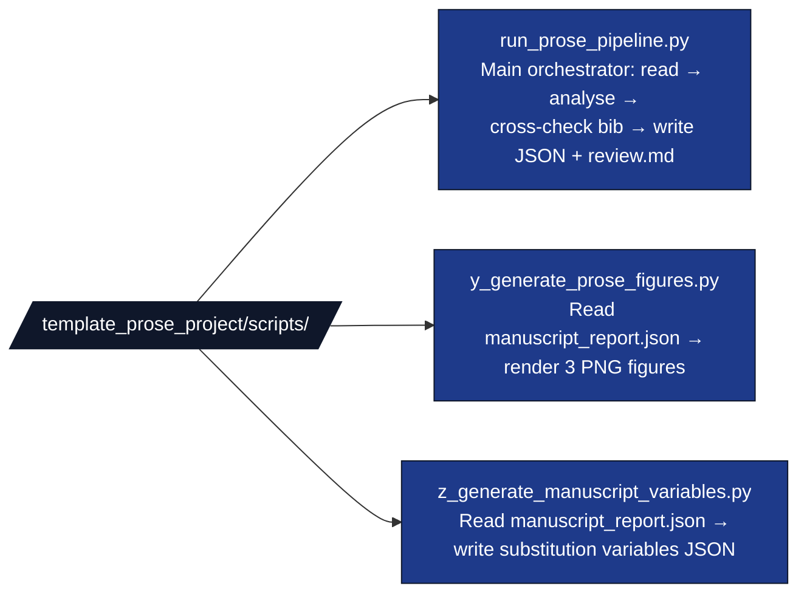

# `template_prose_project/scripts/`

Thin orchestrators. **No business logic.** Each script imports from
`src/` and `infrastructure/`, handles I/O, and exits.

## Files

## Naming convention

The infrastructure pipeline runner discovers and executes every
`*.py` script in `scripts/` (excluding `_`-prefixed) in **alphabetical
order**. We exploit this:

1. `run_prose_pipeline.py` — runs first; produces
   `output/manuscript_report.json`.
2. `y_generate_prose_figures.py` — runs second; consumes the JSON.
3. `z_generate_manuscript_variables.py` — runs last; same JSON →
   manuscript variables.

Adding a new analysis stage = drop in a new script with a name that
sorts at the right point. No edits to `pipeline.yaml` are required.

## Run modes

| Command | Behaviour |
|---|---|
| `python run_prose_pipeline.py` | Default config, writes everything. |
| `… --strict` | Exit non-zero if any check fails. |
| `… --config other.yaml` | Use an alternative config. |
| `… --project-root path` | Run against an isolated project root. |
| `python y_generate_prose_figures.py` | Reads `output/manuscript_report.json`; exits 2 if missing. |
| `python z_generate_manuscript_variables.py` | Reads `output/manuscript_report.json`; exits 2 if missing. |

## Editing checklist

- [ ] Touched a script → keep it thin: import from `src/` and
  `infrastructure/`, no inline business logic.
- [ ] Added a script → ensure name sorts in the right execution order
  relative to siblings.
- [ ] Print every output path on stdout for the manifest collector.
- [ ] Use `infrastructure.core.logging.utils.get_logger`, not `print`,
  for status messages.
- [ ] Add a test in `tests/test_scripts.py` (real subprocess).

## See also

* [`README.md`](README.md) — quick reference.
* [`../src/AGENTS.md`](../src/AGENTS.md) — the modules these scripts orchestrate.
* [`docs/rules/folder_structure.md`](../../../docs/rules/folder_structure.md) —
  the project-wide thin-orchestrator rule.
