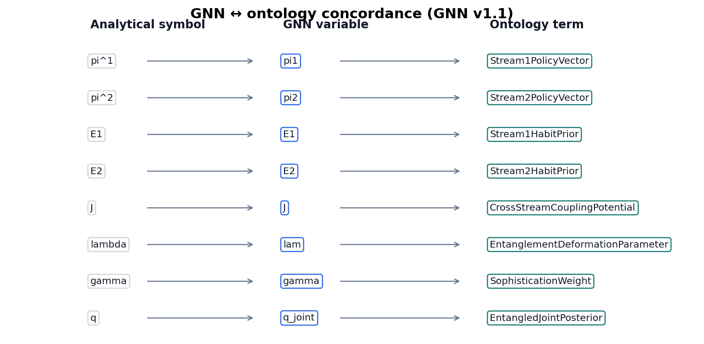

```{=latex}
\phantomsection
\addcontentsline{toc}{section}{Methods}
\section*{Methods}
```

# Bernoulli–Ising analytical model {#sec:methods_analytical}

<!-- sheaf-track:prose -->

We study a minimal **K={{bernoulli_state_count}} Bernoulli / Ising** coupling as the analytical companion to multi-track verification. The entangled joint [@eq:entangled_joint] yields closed-form mutual information $I(\lambda)$, which serves as an oracle for Monte Carlo checks and GNN round-trips in [@sec:results_mi_sweep] ([@fig:gnn_ontology_concordance]).

Measured sweep grid points: {{param_sweep_grid_points}}. Invariants passed: {{invariants_passed}} / {{invariants_total}}.

<!-- sheaf-track:formalism -->

The entangled joint over binary policies satisfies

$$
q_\lambda(\pi) \propto E(\pi)\,\exp(\lambda J(\pi)),
$$ {#eq:entangled_joint}

with symmetric Ising coupling $J$ and deformation parameter $\lambda$. Mutual information is $I(\lambda)=\log 2 - H_b(\sigma(\lambda))$.

<!-- sheaf-track:simulation -->

The analytical track writes a parameter sweep comparing closed-form and empirical mutual information across $\lambda \in [0, {{lambda_max}}]$ on {{param_sweep_grid_points}} grid points ([@sec:results_mi_sweep], [@fig:ising_mi_curve]).

<!-- sheaf-track:visualization -->

{#fig:ising_mi_curve width=90%}

*Figure 1 (methods). Closed-form and Monte Carlo mutual information I(λ) for the symmetric Bernoulli-Ising toy across {{param_sweep_grid_points}} grid points up to λ_max = {{lambda_max}}; grid maximum {{ising_mi_saturation}} nats on the measured sweep.*

{#fig:gnn_ontology_concordance width=90%}

*Figure 1b (methods). GNN ↔ ontology concordance for the Bernoulli–Ising toy ({{gnn_spec_version}}).*

<!-- sheaf-track:gnn -->

The Bernoulli toy is declared in `gnn/bernoulli_toy.gnn.md` ({{gnn_spec_version}}). [@fig:gnn_ontology_concordance] links GNN variables to Active Inference Ontology terms bound in the analytical ontology fragment; round-trip parity is checked before render.

Measured MI and sweep artifacts in [@sec:results_mi_sweep] ground the same symbol map used in the concordance diagram.

<!-- sheaf-track:ontology -->

### Ontology bindings

- `E1` → **Stream1HabitPrior**
- `E2` → **Stream2HabitPrior**
- `J` → **CrossStreamCouplingPotential**
- `gamma` → **SophisticationWeight**
- `lam` → **EntanglementDeformationParameter**
- `pi1` → **Stream1PolicyVector**
- `pi2` → **Stream2PolicyVector**
- `q_joint` → **EntangledJointPosterior**

