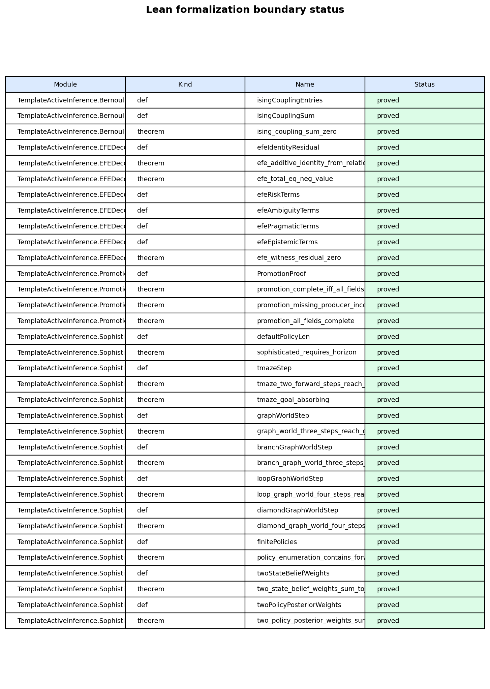

# Lean formalization boundary {#sec:methods_lean}

<!-- sheaf-track:prose -->

The Lean track provides minimal boundary witnesses checked by `lake build` under `lean/TemplateActiveInference/`. [@fig:lean_boundary_status] summarizes proved versus deferred statements; fragments cite theorem names without duplicating proof scripts in prose.

Horizon witnesses link back to the analytical toy ([@sec:methods_analytical]) and the pymdp planning depth ([@sec:methods_pymdp]).

<!-- sheaf-track:visualization -->

{#fig:lean_boundary_status width=90%}

*Figure M2 (methods). Lean formalization boundary: module witnesses checked by lake build.*

<!-- sheaf-track:lean -->

Lean module `TemplateActiveInference.SophisticatedInference` declares the planning-horizon parameter `defaultPolicyLen` and a placeholder arithmetic witness `sophisticated_requires_horizon : defaultPolicyLen > 1` (proved by `decide`). The witness pins the horizon invariant that sophisticated inference requires a policy length above one; it does *not* by itself formalize the inferential distinction between sophisticated and myopic agents — that distinction lives in the pymdp harness ([@sec:methods_pymdp]), not in the Lean term. Axioms are audited with `#print axioms` (the gate whitelists only `propext`, `Classical.choice`, `Quot.sound`); see the Lean track gate.

Build via `lake build` under `lean/`.
