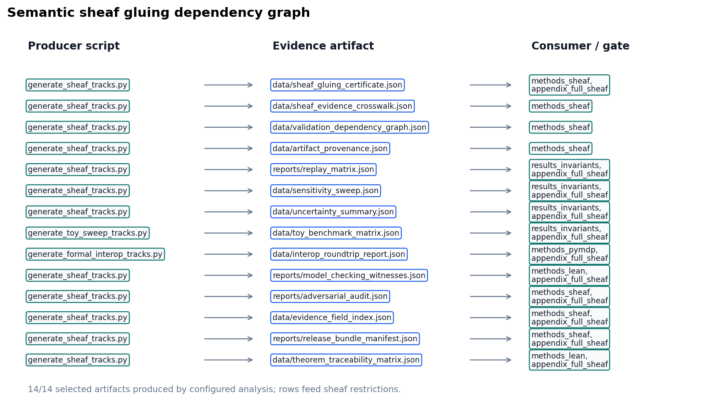

# Sheaf composition {#sec:methods_sheaf}

<!-- sheaf-track:prose -->

## Compose contract

Each manifest row in `manuscript/sheaf/manifest.yaml` binds fragment tracks from `manuscript/sheaf/tracks.yaml`. A track supplies a renderer, compose order, label, and optional flag; the composer flattens the binding set into one Markdown section for PDF and web output.

The operational claim is auditable binding: analytical, simulation, pymdp, visualization, Lean, GNN, ontology, and optional media fragments attach to each IMRAD row under [@eq:coverage_cell] (**P** present, **—** unbound, **M** missing).

## Coverage and figures

[@fig:sheaf_layers_overview] summarizes {{sheaf_track_count}} fragment types and their IMRAD bindings. Generated tables below list every track definition and section×track binding at compose time.

## Compose commands

```bash
uv run python scripts/compose_manuscript.py
uv run python scripts/compose_manuscript.py --validate-only --strict
```

Each run emits `output/data/sheaf_coverage_matrix.json` and regenerates coverage artifacts. Partial compose (`--section`) is draft-only; the matrix always reflects the full manifest. Coverage totals appear on [@sec:sheaf_coverage]; discussion scope is in [@sec:discussion_outlook].

## Law verification

`--validate-only --strict` runs the structural gate before any fragment is glued. Beyond per-cell coverage, it invokes the sheaf-law oracle (`verify_sheaf_laws`, `src/manuscript/sheaf/laws.py`), which checks {{sheaf_law_count}} axioms — poset, presheaf functoriality, separation, gluing, typing, and compositionality — and reports {{sheaf_laws_verified}}/{{sheaf_law_count}} satisfied for the current manifest. A violation is raised as an error-level issue and aborts the build, so a malformed manifest (a section colliding on an output file, an off-chain block, a mistyped fragment, a fragment shared between sections) can never compose. The formal statements are in the formalism block below; the negative-control suite (`tests/test_sheaf_laws.py`) proves each check is falsifiable.

The semantic layer is separate from those structural laws. `output/data/sheaf_gluing_certificate.json` records cross-track symbols, typed claim evidence, artifact sources, and manuscript-variable restrictions; validation fails when the analytical, pymdp, GNN, ontology, Lean, visualization, or manuscript tracks disagree about a shared symbol or measured claim. [@fig:semantic_gluing_graph] renders this gluing graph: the configured producers, the generated evidence artifacts, and the validation consumers that read each shared symbol.

<!-- sheaf-track:formalism -->

### Base poset and presheaf

The manuscript is modelled as a coverage sheaf over a finite base poset. Let the
**base** $P$ be the IMRAD blocks ordered as a chain,

$$
\mathsf{Introduction} \prec \mathsf{Methods} \prec \mathsf{Results} \prec \mathsf{Discussion} \prec \mathsf{Appendix},
$$ {#eq:imrad_chain}

with, in each block, a *group* node above its *section* nodes (written $G \sqsupseteq s$). $P$ is therefore a finite poset (equivalently a finite Alexandrov space). Let $\mathcal{T}$ be the registered fragment-track set from `manuscript/sheaf/tracks.yaml`; each track $t \in \mathcal{T}$ carries a renderer $R(t)$, label $L(t)$, optional flag $O(t)$, and a strict compose-order index $\pi(t)$.

The **presheaf** $\mathcal{F}$ is a contravariant functor on $P$ — $\mathcal{F}\colon P \to \mathbf{Set}$ with restriction maps along $\sqsupseteq$ — assigning to each composing section $s$ its bound fragment set $\mathcal{F}(s) = \{\,(t, F_s(t)) : t \text{ bound in } s\,\}$, where $F_s : \mathcal{T} \rightharpoonup \mathbf{Path}$ is the section's partial binding map. Restriction along $G \sqsupseteq s$ is projection onto a section's own bindings; group nodes carry the empty assignment and do not compose.

The coverage cell is

$$
B(s,t) \in \{\mathrm{P}, \mathrm{—}, \mathrm{M}\}
$$ {#eq:coverage_cell}

derived from $F_s(t)$ and filesystem existence at compose time: **P** when a bound fragment exists, **—** when the track is unbound for that row, and **M** when a bound path is missing. The current regenerated matrix reports {{coverage_present}} present / {{coverage_bound}} bound / {{coverage_missing}} missing cells. Registry size: $|\mathcal{T}| = {{sheaf_track_count}}$ types across {{imrad_manifest_rows}} IMRAD manifest rows ({{imrad_group_count}} group rows, {{composed_section_count}} composing sections).

### Verified sheaf laws

What makes this presheaf a *sheaf* — rather than a bare incidence table — is that the composer's structural axioms are machine-checked. The oracle `verify_sheaf_laws` (`src/manuscript/sheaf/laws.py`) verifies {{sheaf_law_count}} laws, and the regenerated build reports {{sheaf_laws_verified}}/{{sheaf_law_count}} satisfied:

1. **Poset.** The IMRAD blocks form the chain of [@eq:imrad_chain]; compose order is monotone in block rank and every composing section's block carries a group row.
2. **Presheaf (functoriality).** Every bound track lies in $\mathcal{T}$; $\pi$ is a strict total order; and each section's resolved track order is the monotone restriction of $\pi$ (an explicit `track_order` override must be a permutation of the section's bound tracks).
3. **Separation (locality).** The map $s \mapsto \mathrm{output\_name}(s)$ is injective over composing sections: distinct locals glue to distinct global positions, so the global section is unique.
4. **Gluing.** Compose order is a linear extension of $P$ — each block's rows are contiguous and strictly increasing in order — so the local fragments glue to a unique global manuscript in which every composing section appears exactly once.
5. **Typing.** Each binding $(t, F_s(t))$ is well-typed: $R(t)$ is a registered renderer and the fragment suffix lies in $R(t)$'s accepted suffix set. Generated renderers (`section_figures`, `layers_report`) synthesize their body and are explicitly type-exempt.
6. **Compositionality.** Every fragment file is private to one section (no path is bound twice), so global composition is the coproduct of the per-section bodies and is independent of inclusion order.

Each law is paired with a negative control in `tests/test_sheaf_laws.py` — a single mutation that breaks the law and is proven to be caught — so the gate binds the laws' *content*, not merely their shape. Under `--strict`, any violation is surfaced as an error-level manifest issue and aborts composition.

### Scope (what is and is not claimed)

These laws verify the sheaf *axioms* on a finite base poset. They do **not** compute sheaf *cohomology* ($H^0$/$H^1$, Čech complexes, derived functors); "sheaf" here names the verified separation-and-gluing structure of a multi-track coverage assignment, not a cohomological invariant. Formal track definitions and section×track bindings appear in the generated tables below.

Semantic gluing then checks agreement of the glued content: coverage counts, manuscript variables, typed claim predicates, pymdp mode/hash, Bernoulli GNN ontology, and SI T-maze GNN ontology. This certificate is a content-level audit over the same base, not an additional topological law.

<!-- sheaf-track:visualization -->

{#fig:sheaf_layers_overview width=98% fig-alt="Two-panel overview of sheaf fragment layers. Left panel shows {{sheaf_track_count}} composable track types in registry compose order with labels and renderer ids. Right panel shows the IMRAD section binding heatmap with black present, white absent, and gray missing cells across {{imrad_manifest_rows}} manifest rows and {{sheaf_track_count}} tracks."}

{#fig:semantic_gluing_graph width=95% fig-alt="Dependency diagram linking configured analysis scripts to generated evidence artifacts, manuscript consumers, and validation gates for the semantic sheaf gluing certificate."}

<!-- sheaf-track:provenance -->

The `provenance` fragment makes artifact lineage a live canonical sheaf track. The configured producer `generate_sheaf_tracks.py` writes `output/data/artifact_provenance.json`, which hashes {{validation_spine_artifact_count}} required toy artifacts and records producer scripts, source commit, deterministic seed fields, config digests, and {{provenance_bundle_count}} artifact bundles. Publication claims that depend on generated files must be traceable to this lineage table or to a narrower artifact-specific certificate.

The provenance claim is intentionally limited: every listed artifact exists, has a SHA-256 digest or an explicit cycle exclusion, is produced by a configured analysis script, and carries seed/config provenance (`{{provenance_seeded_count}}` seeded rows; all seeded flag `{{provenance_all_seeded}}`; bundle-complete flag `{{provenance_bundle_complete}}`). A changed file, missing producer, or stale saved digest is a validation failure, not a prose warning.

<!-- sheaf-track:counterexample -->

The `counterexample` fragment records expected-failure fixtures as first-class evidence. `output/reports/counterexample_matrix.json` lists {{counterexample_count}} negative controls that intentionally mutate ontology mappings, semantic certificates, graph-world trace agreement, typed claim evidence, replay rows, release parity, and provenance hashes.

The matrix is not an empirical result. It is a falsifiability ledger: each row names the gate that must fail and the test that proves the failure path remains live.

<!-- sheaf-track:adversarial_audit -->

The `adversarial_audit` fragment makes expected failures part of the sheaf rather than an informal test note. `output/reports/adversarial_audit.json` records {{adversarial_audit_count}} known-bad rows and {{adversarial_known_bad_passed}} known-bad rows passing; publication proceeds only when every row is documented as an expected failure and mapped to a gate.

The audit rows target the same failure modes as the semantic certificate: incomplete sweep cells, unnormalized uncertainty rows, interop field loss, stale certificate state, and empirical-scope leakage. The scope boundary remains toy-only: `{{scope_boundary_status}}`.

<!-- sheaf-track:evidence_fields -->

The `evidence_fields` fragment indexes the exact artifact fields that support typed claims and hydrated manuscript tokens. `output/data/evidence_field_index.json` records {{evidence_field_count}} field rows, and the track passes only when every referenced JSONPath or dotted field is present (`{{evidence_fields_mapped}}`).

<!-- sheaf-track:release_bundle -->

The `release_bundle` fragment records whether the canonical deliverables exist before copying and whether copied root outputs match or are explicitly deferred until the copy stage. `output/reports/release_bundle_manifest.json` tracks {{release_bundle_artifact_count}} required deliverables with source-present flag `{{release_bundle_sources_present}}`.

<!-- sheaf-track:gate_ergonomics -->

The `gate_ergonomics` fragment turns validation commands into evidence rows. `output/data/validation_gate_index.json` records {{validation_gate_index_count}} gate rows, each naming required inputs and the negative-control surface that should fail closed.

<!-- sheaf-track:artifact_diffoscope -->

### Artifact diffoscope track

The `artifact_diffoscope` track compares saved provenance hashes against live
artifact hashes at the artifact root JSONPath. Its proof artifact is
`output/reports/artifact_diffoscope.json`: it currently records
{{artifact_diffoscope_row_count}} comparison rows, with equality status
`{{artifact_diffoscope_all_equal}}`.

<!-- sheaf-track:artifact_license -->

### Artifact license track

The `artifact_license` track classifies generated and project-source artifacts
under the public project license boundary. Its audit artifact is
`output/reports/artifact_license_audit.json`: it currently records
{{artifact_license_row_count}} rows, with license-safe status
`{{artifact_license_all_safe}}`.

<!-- sheaf-track:manuscript_staleness -->

The `manuscript_staleness` fragment closes the hydration loop. `output/reports/manuscript_staleness_report.json` checks {{manuscript_staleness_row_count}} manuscript token bindings against the current generated variables after resolved markdown is written; the pass flag is `{{manuscript_staleness_all_fresh}}`.

This is a publication-systems claim, not a domain result. A stale hydrated value, unresolved token, or missing resolved section becomes a validation failure before PDF or web outputs are accepted.

<!-- sheaf-track:layers -->

<!-- sheaf-layers:registry -->
## Sheaf fragment track registry

Compose order and renderer bindings from `manuscript/sheaf/tracks.yaml`.

| Order | Track id | Label | Renderer | Optional |
| ---: | --- | --- | --- | --- |
| 10 | `prose` | Narrative prose | `markdown` | No |
| 20 | `formalism` | Mathematical formalism | `markdown` | No |
| 30 | `simulation` | Analytical simulation notes | `markdown` | No |
| 32 | `assumption_index` | Analytical assumption index | `markdown` | No |
| 35 | `layers` | Sheaf layers tables | `layers_report` | Yes |
| 40 | `pymdp` | pymdp harness artifacts | `markdown` | No |
| 41 | `interop` | GNN/ontology/JSON interop checks | `markdown` | No |
| 42 | `provenance` | Artifact provenance and bundle lineage spine | `markdown` | No |
| 45 | `replay_matrix` | Deterministic replay matrix | `markdown` | No |
| 48 | `counterexample` | Expected-failure counterexamples | `markdown` | No |
| 50 | `adversarial_audit` | Adversarial audit matrix | `markdown` | No |
| 52 | `evidence_fields` | Evidence field index | `markdown` | No |
| 53 | `release_bundle` | Release bundle parity manifest | `markdown` | No |
| 54 | `gate_ergonomics` | Validation gate ergonomics | `markdown` | No |
| 55 | `artifact_diffoscope` | Artifact diffoscope | `markdown` | No |
| 56 | `artifact_license` | Artifact license audit | `markdown` | No |
| 60 | `sensitivity` | Toy sensitivity sweep | `markdown` | No |
| 62 | `uncertainty` | Toy uncertainty summaries | `markdown` | No |
| 65 | `benchmark` | Compact toy benchmark matrix | `markdown` | No |
| 66 | `manuscript_staleness` | Hydrated manuscript staleness report | `markdown` | No |
| 67 | `visualization` | Figure references | `section_figures` | No |
| 70 | `lean` | Lean boundary fragment | `markdown` | No |
| 75 | `model_checking` | Finite-state model checking witnesses | `markdown` | No |
| 76 | `theorem_traceability` | Lean theorem traceability matrix | `markdown` | No |
| 77 | `proof_extraction` | Lean proof extraction index | `markdown` | No |
| 78 | `state_space_catalog` | Finite state-space catalog | `markdown` | No |
| 79 | `causal_ablation` | Deterministic causal ablation matrix | `markdown` | No |
| 80 | `gnn` | GNN notation fragment | `markdown` | No |
| 90 | `ontology` | Active Inference Ontology bindings | `ontology_yaml` | No |
| 100 | `animation` | Animation fragment | `markdown` | Yes |
| 102 | `animation_delta` | Animation frame-delta manifest | `markdown` | No |
| 110 | `release_notes` | Release notes evidence | `markdown` | No |

**Track count:** {{sheaf_track_count}} registered fragment types.

<!-- sheaf-layers:binding-matrix -->
## IMRAD binding matrix

Section rows versus fragment track columns. **P** = present (bound and file exists); **—** = absent (not bound); **M** = missing (bound, file absent).

| Section | prose | formalism | simulation | assumption_index | layers | pymdp | interop | provenance | replay_matrix | counterexample | adversarial_audit | evidence_fields | release_bundle | gate_ergonomics | artifact_diffoscope | artifact_license | sensitivity | uncertainty | benchmark | manuscript_staleness | visualization | lean | model_checking | theorem_traceability | proof_extraction | state_space_catalog | causal_ablation | gnn | ontology | animation | animation_delta | release_notes |
| --- | --- | --- | --- | --- | --- | --- | --- | --- | --- | --- | --- | --- | --- | --- | --- | --- | --- | --- | --- | --- | --- | --- | --- | --- | --- | --- | --- | --- | --- | --- | --- | --- |
| Introduction (group) | — | — | — | — | — | — | — | — | — | — | — | — | — | — | — | — | — | — | — | — | — | — | — | — | — | — | — | — | — | — | — | — |
|   Motivation and scope | P | — | — | — | — | — | — | — | — | — | — | — | — | — | — | — | — | — | — | — | — | — | — | — | — | — | — | — | — | — | — | — |
|   Contributions | P | — | — | — | — | — | — | — | — | — | — | — | — | — | — | — | — | — | — | — | P | — | — | — | — | — | — | — | P | — | — | — |
| Methods (group) | — | — | — | — | — | — | — | — | — | — | — | — | — | — | — | — | — | — | — | — | — | — | — | — | — | — | — | — | — | — | — | — |
|   Bernoulli–Ising analytical model | P | P | P | P | — | — | — | — | — | — | — | — | — | — | — | — | — | — | — | — | P | — | — | — | — | — | — | P | P | — | — | — |
|   pymdp simulation harness | P | P | — | — | — | P | P | — | — | — | — | — | — | — | — | — | — | — | — | — | P | — | — | — | — | — | — | P | P | — | — | — |
|   Lean formalization boundary | P | — | — | — | — | — | — | — | — | — | — | — | — | — | — | — | — | — | — | — | P | P | P | P | P | — | — | — | — | — | — | — |
|   Sheaf composition | P | P | — | — | P | — | — | P | — | P | P | P | P | P | P | P | — | — | — | P | P | — | — | — | — | — | — | — | — | — | — | — |
| Results (group) | — | — | — | — | — | — | — | — | — | — | — | — | — | — | — | — | — | — | — | — | — | — | — | — | — | — | — | — | — | — | — | — |
|   Mutual-information parameter sweep | P | P | P | — | — | — | — | — | — | — | — | — | — | — | — | — | — | — | — | — | P | — | — | — | — | — | — | — | — | — | — | — |
|   Free-energy decomposition | P | — | — | — | — | — | — | — | — | — | — | — | — | — | — | — | — | — | — | — | P | — | — | — | — | — | — | — | — | — | — | — |
|   T-maze active-inference rollout | P | — | — | — | — | P | — | — | — | — | — | — | — | — | — | — | — | — | — | — | P | — | — | — | — | — | — | — | — | — | — | — |
|   Validation invariants | P | — | P | — | — | — | — | — | P | — | — | — | — | — | — | — | P | P | P | — | P | — | — | — | — | P | P | — | — | — | — | — |
| Discussion (group) | — | — | — | — | — | — | — | — | — | — | — | — | — | — | — | — | — | — | — | — | — | — | — | — | — | — | — | — | — | — | — | — |
|   Limitations and outlook | P | — | P | — | — | — | — | — | — | — | — | — | — | — | — | — | — | — | — | — | — | — | — | — | — | — | — | — | P | — | — | P |
| Appendix (group) | — | — | — | — | — | — | — | — | — | — | — | — | — | — | — | — | — | — | — | — | — | — | — | — | — | — | — | — | — | — | — | — |
|   Appendix: full track coverage | P | P | P | P | — | P | P | P | P | P | P | P | P | P | P | P | P | P | P | P | P | P | P | P | P | P | P | P | P | P | P | P |

**Totals:** {{coverage_present}} present / {{coverage_bound}} bound / {{coverage_missing}} missing.

<!-- sheaf-layers:legend -->
| Symbol | Coverage color | Meaning |
| --- | --- | --- |
| P | Black | Track **present** (bound and fragment exists) |
| — | White | **Absent** (not bound for this section) |
| M | Gray | **Missing** (bound but fragment file absent) |

<!-- sheaf-layers:section-status -->
## Section-track status

Generated status for the current manuscript sheaf, summarized per composable section.

| Section | IMRAD | Bound | Present | Missing | Status |
| --- | --- | ---: | ---: | ---: | --- |
| Motivation and scope | introduction | 1 | 1 | 0 | `fully_sheafed` |
| Contributions | introduction | 3 | 3 | 0 | `fully_sheafed` |
| Bernoulli–Ising analytical model | methods | 7 | 7 | 0 | `fully_sheafed` |
| pymdp simulation harness | methods | 7 | 7 | 0 | `fully_sheafed` |
| Lean formalization boundary | methods | 6 | 6 | 0 | `fully_sheafed` |
| Sheaf composition | methods | 13 | 13 | 0 | `fully_sheafed` |
| Mutual-information parameter sweep | results | 4 | 4 | 0 | `fully_sheafed` |
| Free-energy decomposition | results | 2 | 2 | 0 | `fully_sheafed` |
| T-maze active-inference rollout | results | 3 | 3 | 0 | `fully_sheafed` |
| Validation invariants | results | 9 | 9 | 0 | `fully_sheafed` |
| Limitations and outlook | discussion | 4 | 4 | 0 | `fully_sheafed` |
| Appendix: full track coverage | appendix | 31 | 31 | 0 | `fully_sheafed` |

**Section status:** 12 / 12 composable sections fully sheafed; 0 required bound fragments missing.

<!-- sheaf-layers:track-status -->
## Track status

| Track | Renderer | Bound sections | Present | Missing | Claims | Status |
| --- | --- | ---: | ---: | ---: | ---: | --- |
| `prose` | `markdown` | 12 | 12 | 0 | 0 | `complete` |
| `formalism` | `markdown` | 5 | 5 | 0 | 0 | `complete` |
| `simulation` | `markdown` | 5 | 5 | 0 | 9 | `complete` |
| `assumption_index` | `markdown` | 2 | 2 | 0 | 1 | `complete` |
| `layers` | `layers_report` | 1 | 1 | 0 | 1 | `complete` |
| `pymdp` | `markdown` | 3 | 3 | 0 | 15 | `complete` |
| `interop` | `markdown` | 2 | 2 | 0 | 3 | `complete` |
| `provenance` | `markdown` | 2 | 2 | 0 | 12 | `complete` |
| `replay_matrix` | `markdown` | 2 | 2 | 0 | 3 | `complete` |
| `counterexample` | `markdown` | 2 | 2 | 0 | 2 | `complete` |
| `adversarial_audit` | `markdown` | 2 | 2 | 0 | 9 | `complete` |
| `evidence_fields` | `markdown` | 2 | 2 | 0 | 1 | `complete` |
| `release_bundle` | `markdown` | 2 | 2 | 0 | 5 | `complete` |
| `gate_ergonomics` | `markdown` | 2 | 2 | 0 | 5 | `complete` |
| `artifact_diffoscope` | `markdown` | 2 | 2 | 0 | 1 | `complete` |
| `artifact_license` | `markdown` | 2 | 2 | 0 | 1 | `complete` |
| `sensitivity` | `markdown` | 2 | 2 | 0 | 9 | `complete` |
| `uncertainty` | `markdown` | 2 | 2 | 0 | 4 | `complete` |
| `benchmark` | `markdown` | 2 | 2 | 0 | 3 | `complete` |
| `manuscript_staleness` | `markdown` | 2 | 2 | 0 | 1 | `complete` |
| `visualization` | `section_figures` | 10 | 10 | 0 | 10 | `complete` |
| `lean` | `markdown` | 2 | 2 | 0 | 8 | `complete` |
| `model_checking` | `markdown` | 2 | 2 | 0 | 7 | `complete` |
| `theorem_traceability` | `markdown` | 2 | 2 | 0 | 3 | `complete` |
| `proof_extraction` | `markdown` | 2 | 2 | 0 | 2 | `complete` |
| `state_space_catalog` | `markdown` | 2 | 2 | 0 | 2 | `complete` |
| `causal_ablation` | `markdown` | 2 | 2 | 0 | 2 | `complete` |
| `gnn` | `markdown` | 3 | 3 | 0 | 4 | `complete` |
| `ontology` | `ontology_yaml` | 5 | 5 | 0 | 5 | `complete` |
| `animation` | `markdown` | 1 | 1 | 0 | 2 | `complete` |
| `animation_delta` | `markdown` | 1 | 1 | 0 | 1 | `complete` |
| `release_notes` | `markdown` | 2 | 2 | 0 | 2 | `complete` |

**Status cells:** 544 section-track cells.

<!-- sheaf-layers:render-log -->
## Render and logging summary

| Event | Component | Output | Status | Detail |
| --- | --- | --- | --- | --- |
| `registry_loaded` | `sheaf.registry` | `registered_tracks` | `ok` | 32 tracks |
| `manifest_loaded` | `sheaf.manifest` | `manifest_sections` | `ok` | 17 sections |
| `coverage_matrix_built` | `sheaf.coverage` | `output/data/sheaf_coverage_matrix.json` | `ok` | 90 present cells |
| `section_status_matrix_built` | `sheaf.status` | `output/data/sheaf_section_status_matrix.json` | `ok` | 544 section-track cells |
| `layers_renderer_bound` | `sheaf.layers_report` | `manuscript/08_methods_sheaf.md` | `ok` | methods sheaf layer tables |
| `semantic_artifacts_indexed` | `sheaf.semantic` | `output/data/validation_dependency_graph.json` | `ok` | 76 artifact producer rows |
| `validation_gates_indexed` | `gates` | `output/data/validation_gate_index.json` | `ok` | 3 gate groups |
| `manuscript_sections_composed` | `sheaf.compose` | `manuscript/*.md` | `ok` | 16 composed markdown files |

**Render events:** 8.

<!-- sheaf-layers:evidence-crosswalk -->
## Evidence crosswalk

| Claim | Artifact | Producer | Gates |
| --- | --- | --- | --- |
| `sheaf_registry` | `manuscript/sheaf/tracks.yaml` | `manual` | validate_outputs |
| `sheaf_manifest` | `manuscript/sheaf/manifest.yaml` | `manual` | validate_outputs |
| `sheaf_coverage_config` | `manuscript/sheaf/coverage.yaml` | `manual` | validate_outputs |
| `sheaf_coverage_matrix` | `output/data/sheaf_coverage_matrix.json` | `generate_figures.py` | validate_outputs, validate_manuscript |
| `sheaf_gluing_certificate` | `output/data/sheaf_gluing_certificate.json` | `generate_sheaf_tracks.py` | validate_manuscript, validate_outputs |
| `sheaf_evidence_crosswalk` | `output/data/sheaf_evidence_crosswalk.json` | `generate_sheaf_tracks.py` | validate_manuscript, validate_outputs |
| `evidence_fields_mapped` | `output/data/evidence_field_index.json` | `generate_sheaf_tracks.py` | validate_outputs, validate_manuscript |
| `validation_dependency_graph` | `output/data/validation_dependency_graph.json` | `generate_sheaf_tracks.py` | validate_manuscript, validate_outputs |

**Claim rows:** 85 typed evidence claims.

<!-- sheaf-layers:artifact-producers -->
## Artifact producer graph

| Artifact | Producer | Configured | Consumers |
| --- | --- | --- | --- |
| `output/data/analysis_statistics.json` | `compute_statistics.py` | Yes | results_si_tmaze, results_invariants |
| `output/data/analytical_assumption_index.json` | `generate_toy_sweep_tracks.py` | Yes | methods_analytical, appendix_full_sheaf |
| `output/data/analytical_observable_sweep.json` | `generate_toy_sweep_tracks.py` | Yes | results_invariants, appendix_full_sheaf |
| `output/data/animation_frame_deltas.json` | `render_animation.py` | Yes | appendix_full_sheaf |
| `output/data/artifact_provenance.json` | `generate_sheaf_tracks.py` | Yes | methods_sheaf |
| `output/data/causal_ablation_matrix.json` | `generate_toy_sweep_tracks.py` | Yes | results_invariants, appendix_full_sheaf |
| `output/data/cross_track_symbol_table.json` | `generate_integration_audit.py` | Yes | methods_sheaf, appendix_full_sheaf |
| `output/data/evidence_field_index.json` | `generate_sheaf_tracks.py` | Yes | methods_sheaf, appendix_full_sheaf |
| `output/data/figure_source_map.json` | `generate_integration_audit.py` | Yes | methods_sheaf, appendix_full_sheaf |
| `output/data/gnn_roundtrip_report.json` | `generate_formal_interop_tracks.py` | Yes | methods_pymdp, appendix_full_sheaf |
| `output/data/interop_roundtrip_report.json` | `generate_sheaf_tracks.py` | Yes | methods_pymdp, appendix_full_sheaf |
| `output/data/manuscript_evidence_tables.json` | `generate_integration_audit.py` | Yes | methods_sheaf, appendix_full_sheaf |
| `output/data/manuscript_token_provenance.json` | `generate_integration_audit.py` | Yes | methods_sheaf, appendix_full_sheaf |
| `output/data/manuscript_variables.json` | `z_generate_manuscript_variables.py` | Yes | methods_sheaf, appendix_full_sheaf |
| `output/data/ontology_alias_index.json` | `generate_formal_interop_tracks.py` | Yes | methods_pymdp, appendix_full_sheaf |
| `output/data/ontology_profile_matrix.json` | `generate_formal_interop_tracks.py` | Yes | methods_pymdp, appendix_full_sheaf |
| `output/data/parameter_sweep.csv` | `run_analytical_sweep.py` | Yes | methods_analytical, results_mi_sweep |
| `output/data/proof_dependency_graph.json` | `generate_sheaf_tracks.py` | Yes | methods_lean, appendix_full_sheaf |
| `output/data/proof_extraction_index.json` | `generate_formal_interop_tracks.py` | Yes | methods_lean, appendix_full_sheaf |
| `output/data/pymdp_policy_posterior_grid.json` | `simulate_si_tmaze.py` | Yes | methods_pymdp, appendix_full_sheaf |
| `output/data/sensitivity_sweep.json` | `generate_sheaf_tracks.py` | Yes | results_invariants, appendix_full_sheaf |
| `output/data/sheaf_coverage_matrix.json` | `generate_figures.py` | Yes | methods_sheaf, appendix_full_sheaf |
| `output/data/sheaf_evidence_crosswalk.json` | `generate_sheaf_tracks.py` | Yes | methods_sheaf |
| `output/data/sheaf_gluing_certificate.json` | `generate_sheaf_tracks.py` | Yes | methods_sheaf, appendix_full_sheaf |
| `output/data/sheaf_section_status_matrix.json` | `generate_sheaf_tracks.py` | Yes | methods_sheaf, appendix_full_sheaf |
| `output/data/si_efe_terms.json` | `generate_toy_sweep_tracks.py` | Yes | results_invariants, appendix_full_sheaf |
| `output/data/si_graph_world_summary.json` | `simulate_si_graph_world.py` | Yes | methods_pymdp, results_si_tmaze |
| `output/data/si_graph_world_topology_sweep.json` | `generate_toy_sweep_tracks.py` | Yes | results_invariants, appendix_full_sheaf |
| `output/data/si_graph_world_topology_traces.json` | `generate_toy_sweep_tracks.py` | Yes | results_invariants, appendix_full_sheaf |
| `output/data/si_graph_world_trace.json` | `simulate_si_graph_world.py` | Yes | methods_pymdp, results_si_tmaze, appendix_full_sheaf |
| `output/data/si_policy_comparison.json` | `simulate_si_tmaze.py` | Yes | methods_pymdp, results_si_tmaze |
| `output/data/si_policy_grid.json` | `generate_toy_sweep_tracks.py` | Yes | results_invariants, appendix_full_sheaf |
| `output/data/si_tmaze_summary.json` | `simulate_si_tmaze.py` | Yes | methods_pymdp, results_si_tmaze |
| `output/data/si_tmaze_trace.json` | `simulate_si_tmaze.py` | Yes | methods_pymdp, results_si_tmaze |
| `output/data/state_space_catalog.json` | `generate_toy_sweep_tracks.py` | Yes | results_invariants, appendix_full_sheaf |
| `output/data/state_transition_table.json` | `generate_sheaf_tracks.py` | Yes | results_invariants, appendix_full_sheaf |
| `output/data/theorem_traceability_matrix.json` | `generate_sheaf_tracks.py` | Yes | methods_lean, appendix_full_sheaf |
| `output/data/toy_benchmark_matrix.json` | `generate_toy_sweep_tracks.py` | Yes | results_invariants, appendix_full_sheaf |
| `output/data/track_improvement_scope.json` | `generate_sheaf_tracks.py` | Yes | methods_sheaf, appendix_full_sheaf |
| `output/data/uncertainty_summary.json` | `generate_sheaf_tracks.py` | Yes | results_invariants, appendix_full_sheaf |
| `output/data/validation_dependency_graph.json` | `generate_sheaf_tracks.py` | Yes | methods_sheaf |
| `output/data/validation_gate_index.json` | `generate_integration_audit.py` | Yes | methods_sheaf, appendix_full_sheaf |
| `output/figures/si_belief_trajectory.gif` | `render_animation.py` | Yes | appendix_full_sheaf |
| `output/reports/ablation_sensitivity_report.json` | `generate_sheaf_tracks.py` | Yes | results_invariants, appendix_full_sheaf |
| `output/reports/adversarial_audit.json` | `generate_sheaf_tracks.py` | Yes | methods_sheaf, appendix_full_sheaf |
| `output/reports/artifact_diffoscope.json` | `generate_integration_audit.py` | Yes | methods_sheaf, appendix_full_sheaf |
| `output/reports/artifact_license_audit.json` | `generate_integration_audit.py` | Yes | methods_sheaf, appendix_full_sheaf |
| `output/reports/blocked_scope_manifest.json` | `generate_sheaf_tracks.py` | Yes | methods_sheaf, discussion_outlook, appendix_full_sheaf |
| `output/reports/claim_evidence_audit.json` | `generate_integration_audit.py` | Yes | methods_sheaf, appendix_full_sheaf |
| `output/reports/counterexample_matrix.json` | `generate_sheaf_tracks.py` | Yes | methods_sheaf |
| `output/reports/figure_hash_manifest.json` | `generate_integration_audit.py` | Yes | methods_sheaf, appendix_full_sheaf |
| `output/reports/gnn_lint_report.json` | `generate_formal_interop_tracks.py` | Yes | methods_pymdp, appendix_full_sheaf |
| `output/reports/graph_world_invariants.json` | `generate_toy_sweep_tracks.py` | Yes | results_invariants, appendix_full_sheaf |
| `output/reports/invariants.json` | `run_analytical_sweep.py` | Yes | results_invariants |
| `output/reports/lean_graph_world_inventory.json` | `generate_formal_interop_tracks.py` | Yes | methods_lean, appendix_full_sheaf |
| `output/reports/lean_theorem_inventory.json` | `generate_formal_interop_tracks.py` | Yes | methods_lean, appendix_full_sheaf |
| `output/reports/manuscript_staleness_report.json` | `z_generate_manuscript_variables.py` | Yes | methods_sheaf, appendix_full_sheaf |
| `output/reports/model_checking_witnesses.json` | `generate_sheaf_tracks.py` | Yes | methods_lean, appendix_full_sheaf |
| `output/reports/producer_completeness.json` | `generate_integration_audit.py` | Yes | methods_sheaf, appendix_full_sheaf |
| `output/reports/pymdp_runtime_diagnostics.json` | `simulate_si_tmaze.py` | Yes | methods_pymdp, appendix_full_sheaf |
| `output/reports/release_attestation.json` | `generate_sheaf_tracks.py` | Yes | discussion_outlook, appendix_full_sheaf |
| `output/reports/release_bundle_manifest.json` | `generate_sheaf_tracks.py` | Yes | methods_sheaf, appendix_full_sheaf |
| `output/reports/release_notes_evidence.json` | `generate_integration_audit.py` | Yes | discussion_outlook, appendix_full_sheaf |
| `output/reports/replay_matrix.json` | `generate_sheaf_tracks.py` | Yes | results_invariants, appendix_full_sheaf |
| `output/reports/reproducibility_replay.json` | `generate_validation_spine.py` | Yes | results_invariants |
| `output/reports/scope_boundary_audit.json` | `generate_integration_audit.py` | Yes | methods_sheaf, appendix_full_sheaf |
| `output/reports/sheaf_render_log.json` | `generate_sheaf_tracks.py` | Yes | methods_sheaf, appendix_full_sheaf |
| `output/reports/si_invariants.json` | `simulate_si_tmaze.py` | Yes | results_si_tmaze |
| `output/reports/si_tmaze_run_report.json` | `simulate_si_tmaze.py` | Yes | results_si_tmaze |
| `output/reports/stale_artifact_report.json` | `generate_integration_audit.py` | Yes | methods_sheaf, appendix_full_sheaf |

**Producer issues:** 0.

<!-- sheaf-layers:semantic-restrictions -->
## Semantic gluing restrictions

| Restriction | Value |
| --- | --- |
| Coverage missing | `0` |
| Policy comparison rows | `4` |
| Policy grid complete | `True` |
| Policy posterior rows | `10` |
| Policy posterior normalized | `True` |
| Runtime unexpected warnings | `0` |
| Graph-world trace agrees | `True` |
| Animation frames | `4` |
| Lean all proved | `True` |
| GNN ontology ok | `True` |
| Configured producers ok | `True` |
| Semantic certificate ok | `None` |
| Dependency edges ok | `True` |
| Track scope complete | `True` |
| Empirical adapter blocked | `True` |
| Provenance bundles complete | `False` |
| Replay rows matched | `False` |
| Sensitivity complete | `True` |
| Uncertainty normalized | `True` |
| Evidence fields mapped | `True` |
| Release bundle sources present | `False` |
| Theorem traceability linked | `True` |
| Gate ergonomics indexed | `True` |
| Interop lossless | `True` |
| Scope toy-only | `True` |

<!-- sheaf-layers:track-improvement-scope -->
## Track improvement scope

| Track | Status | Current proof | Next artifact | Gate | Negative control |
| --- | --- | --- | --- | --- | --- |
| `adversarial_audit` | live | `output/reports/adversarial_audit.json` | `output/reports/adversarial_audit.json` | `validate_outputs, validate_manuscript` | adversarial_known_bad_passes |
| `animation` | optional | `output/figures/si_belief_trajectory.gif` | `output/figures/si_belief_trajectory.gif` | `validate_outputs` | missing_fragment_coverage |
| `animation_delta` | live | `output/data/animation_frame_deltas.json` | `output/data/animation_frame_deltas.json` | `validate_outputs, validate_manuscript` | missing_fragment_coverage |
| `artifact_diffoscope` | live | `output/reports/artifact_diffoscope.json` | `output/reports/artifact_diffoscope.json` | `validate_outputs, validate_manuscript` | artifact_diffoscope_missed_hash_drift |
| `artifact_license` | live | `output/reports/artifact_license_audit.json` | `output/reports/artifact_license_audit.json` | `validate_outputs, validate_manuscript` | artifact_license_unsafe_artifact |
| `assumption_index` | live | `output/data/analytical_assumption_index.json` | `output/data/analytical_assumption_index.json` | `validate_outputs, validate_manuscript` | missing_fragment_coverage |
| `benchmark` | live | `output/data/toy_benchmark_matrix.json` | `output/data/toy_benchmark_matrix.json` | `validate_outputs` | missing_fragment_coverage |
| `causal_ablation` | live | `output/data/causal_ablation_matrix.json` | `output/data/causal_ablation_matrix.json` | `validate_outputs, validate_manuscript` | causal_ablation_missing_cell |
| `counterexample` | live | `output/reports/counterexample_matrix.json` | `output/reports/counterexample_matrix.json` | `validate_outputs, validate_manuscript` | known_bad_counterexample_passed |
| `evidence_fields` | live | `output/data/evidence_field_index.json` | `output/data/evidence_field_index.json` | `validate_outputs, validate_manuscript` | missing_typed_claim |
| `formalism` | live | `manuscript/sheaf/manifest.yaml` | `manuscript/sheaf/manifest.yaml` | `validate_manuscript` | missing_fragment_coverage |
| `gate_ergonomics` | live | `output/data/validation_gate_index.json` | `output/data/validation_gate_index.json` | `validate_outputs, validate_manuscript` | gate_ergonomics_unindexed |

**Improvement rows:** 37.

