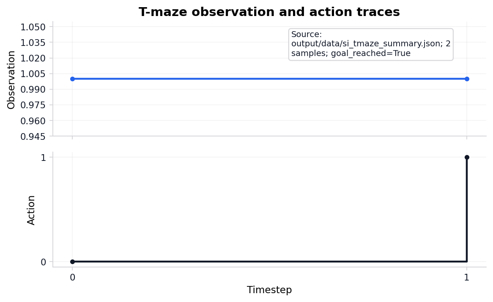

# T-maze active-inference rollout {#sec:results_si_tmaze}

<!-- sheaf-track:prose -->

The pymdp harness rolls out a T-maze active-inference agent in `{{pymdp_mode}}` mode with planning horizon {{si_tmaze_policy_len}}. The default `state_inference` mode is belief filtering with a goal-seeking action rule; sophisticated policy inference (an expected-free-energy policy posterior) is selectable via `mode: policy_inference` ([@sec:methods_pymdp]). Summary metrics land in `output/data/si_tmaze_summary.json`.

Steps recorded: {{si_tmaze_steps}}. Mean belief entropy: {{si_tmaze_mean_belief_entropy}}.

Policy-comparison rows: {{si_policy_comparison_run_count}} across state-inference and policy-inference modes; goal-reaching rows: {{si_policy_comparison_goal_reached_count}}. Graph-world extension rows: {{si_graph_world_steps}} over {{si_graph_world_node_count}} nodes, with goal-reached flag {{si_graph_world_goal_reached}}.

<!-- sheaf-track:pymdp -->

Rollout trace: `output/data/si_tmaze_trace.json`. JSONL run log: `output/logs/pymdp_runs.jsonl`.

<!-- sheaf-track:visualization -->

{#fig:si_belief_entropy_curve width=90%}

*Figure 3a (results). Belief entropy over time for the T-maze rollout (mean {{si_tmaze_mean_belief_entropy_formatted}} nats).*

{#fig:si_obs_action_trace width=90%}

*Figure 3b (results). Observation and action traces for the T-maze rollout (action diversity {{si_action_diversity}}).*

{#fig:si_tmaze_actions width=90%}

*Figure 3c (results). Discrete action index over time for the pymdp T-maze rollout (policy length {{si_tmaze_policy_len}}).*
