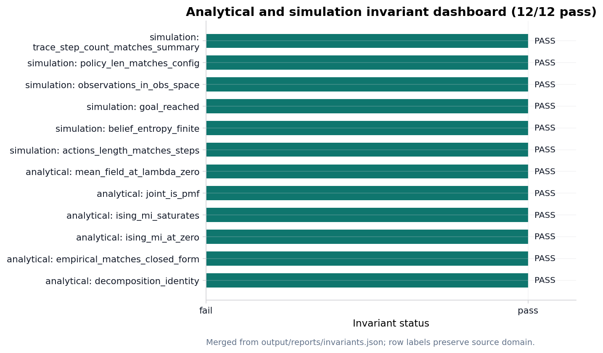

# Validation invariants {#sec:results_invariants}

<!-- sheaf-track:prose -->

The analytical invariant registry runs before PDF rendering ([@sec:methods_analytical]). On a clean checkout **{{invariants_passed}} / {{invariants_total}}** checks pass in the merged validation report, which records simulation invariants when the pymdp harness ran ([@sec:results_si_tmaze]).

[@fig:invariant_dashboard] lists each analytical and simulation gate; failures block publication artifacts. See [@sec:methods_sheaf] for how invariant counts hydrate manuscript tokens.

<!-- sheaf-track:simulation -->

Simulation invariants merge into the analytical report after the pymdp harness runs ([@sec:results_si_tmaze]). [@fig:invariant_dashboard] summarizes pass/fail status for both domains on the clean tree.

<!-- sheaf-track:reproducibility -->

The `reproducibility` fragment replays deterministic toy producers in a temporary project tree and compares regenerated outputs with the saved artifacts. The current replay report records {{reproducibility_check_count}} checks and an all-passed flag of {{reproducibility_all_passed}}.

The replay scope is deliberately narrow: analytical parameter sweeps, graph-world summary/trace artifacts, and the policy-comparison table. It does not claim platform-independent bitwise equivalence for PDF rendering, PNG rasterization, or external empirical data.

<!-- sheaf-track:visualization -->

{#fig:invariant_dashboard width=90%}

*Figure 5 (results). Invariant dashboard: {{invariants_passed}} / {{invariants_total}} merged analytical and simulation checks from the validation registry.*
