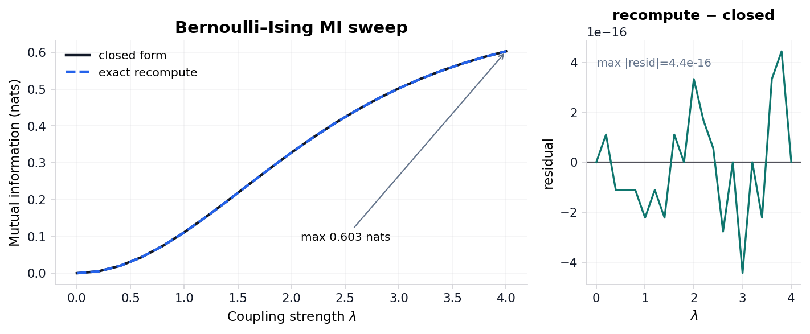

```{=latex}
\phantomsection
\addcontentsline{toc}{section}{Appendix}
\section*{Appendix}
```

# Appendix: full track coverage {#sec:appendix_full_sheaf}

<!-- sheaf-track:prose -->

This section is the **composability proof** for the manifest-indexed sheaf model: all {{appendix_sheaf_track_count}} appendix-bound fragment tracks render into one flat manuscript section without section-specific compose branches. The registry defines {{sheaf_track_count}} composable types; optional `layers` is methods-only and excluded from this row. The `animation` fragment is bound here as an optional registry type alongside the live proof, simulation, formal, notation, validation-spine, integration, audit, finite-catalog, ablation, license, release-evidence, assumption-index, delta, and staleness tracks.

The proof is a publication-systems check ([@eq:appendix_track_count]). It demonstrates that heterogeneous fragments share one registry, manifest, renderer dispatch path, coverage matrix, and hydration boundary; it does not assert that every track carries equal scientific weight.

<!-- sheaf-track:formalism -->

For each track $t \in \mathcal{T}_{\mathrm{Full}}$, the appendix row binds a fragment path $f(t)$ and the composer emits `<!-- sheaf-track:t -->` before the rendered body. Generated renderers such as `section_figures` and markdown renderers pass through the same `resolve_track_body()` dispatch, so the appendix exercises the common compose interface rather than a bespoke appendix path.

$$
|\mathcal{T}_{\mathrm{Full}}| = {{appendix_sheaf_track_count}}
$$ {#eq:appendix_track_count}

The fragment registry defines {{sheaf_track_count}} composable track types; optional `layers` is bound on the methods sheaf section only. Optional `animation` is bound in this appendix proof; the opt-in GIF extension in `tracks.yaml` `extension_tracks` is separate from this fragment slot.

Because this appendix binds every non-optional appendix track plus optional `animation`, it is the maximal publication stalk of the coverage presheaf and exercises every publication renderer through the common `resolve_track_body()` dispatch. The same compose path is gated by the {{sheaf_law_count}} sheaf laws verified in [@sec:methods_sheaf] ({{sheaf_laws_verified}}/{{sheaf_law_count}} satisfied): the appendix section glues to a unique output (separation), occupies the terminal position of the linear extension under its own `appendix` group row (poset and gluing), binds only well-typed fragments (typing), and owns every fragment path it references (compositionality). No count in this appendix is hand-written; all are injected from the registry-backed oracle.

<!-- sheaf-track:simulation -->

Analytical sweep artifacts feed [@sec:results_mi_sweep] and [@sec:results_invariants]; simulation invariants merge after [@sec:results_si_tmaze]. No additional path listing is required beyond those Results sections.

<!-- sheaf-track:assumption_index -->

The appendix `assumption_index` row points to `output/data/analytical_assumption_index.json`. It binds the finite Bernoulli-Ising assumptions to equation identifiers and generated artifacts so analytical signposting can be checked mechanically.

<!-- sheaf-track:pymdp -->

pymdp harness summary: `output/data/si_tmaze_summary.json` (mean belief entropy, action trace). Runtime diagnostics: `output/reports/pymdp_runtime_diagnostics.json` (known warnings {{pymdp_runtime_known_warning_count}}, unexpected warnings {{pymdp_runtime_unexpected_warning_count}}). Policy posterior grid: `output/data/pymdp_policy_posterior_grid.json` ({{pymdp_policy_posterior_row_count}} rows). Full log: `output/logs/pymdp_runs.jsonl`.

<!-- sheaf-track:interop -->

`sheaf-track:interop` binds `output/data/interop_roundtrip_report.json`, `output/data/gnn_roundtrip_report.json`, `output/reports/gnn_lint_report.json`, and ontology profile artifacts into the appendix proof row. The appendix claim is exactly {{interop_check_count}} checks with lossless status `{{interop_all_lossless}}`.

<!-- sheaf-track:provenance -->

The appendix provenance fragment points to `output/data/artifact_provenance.json`, the canonical artifact that records required toy artifact hashes, producer scripts, source commit, deterministic seeds, config digests, and {{provenance_bundle_count}} bundle rows.

<!-- sheaf-track:replay_matrix -->

`replay_matrix.json` provides the appendix proof for deterministic replay: {{replay_matrix_row_count}} producer replay/fingerprint rows with matched status `{{replay_matrix_all_matched}}`.

<!-- sheaf-track:counterexample -->

The appendix counterexample fragment points to `output/reports/counterexample_matrix.json`, the expected-failure matrix that keeps promoted validation gates falsifiable.

<!-- sheaf-track:adversarial_audit -->

`sheaf-track:adversarial_audit` binds `output/reports/adversarial_audit.json`, `output/reports/scope_boundary_audit.json`, and claim-audit outputs. The appendix claim is exactly {{adversarial_audit_count}} expected-failure rows with documented status `{{adversarial_audit_all_documented}}` and known-bad-passing count {{adversarial_known_bad_passed}}.

<!-- sheaf-track:evidence_fields -->

`evidence_field_index.json` provides the appendix proof for field-level claim evidence: {{evidence_field_count}} mapped fields with status `{{evidence_fields_mapped}}`.

<!-- sheaf-track:release_bundle -->

`release_bundle_manifest.json` provides the appendix proof for required deliverables: {{release_bundle_artifact_count}} artifacts with source-present status `{{release_bundle_sources_present}}`.

<!-- sheaf-track:gate_ergonomics -->

`validation_gate_index.json` provides the appendix proof for gate ergonomics: {{validation_gate_index_count}} indexed gates.

<!-- sheaf-track:artifact_diffoscope -->

### Appendix track: artifact diffoscope

`artifact_diffoscope` binds `output/reports/artifact_diffoscope.json` into the
full sheaf appendix. Rows: {{artifact_diffoscope_row_count}}. All equal:
`{{artifact_diffoscope_all_equal}}`.

<!-- sheaf-track:artifact_license -->

### Appendix track: artifact license

`artifact_license` binds `output/reports/artifact_license_audit.json` into the
full sheaf appendix. Rows: {{artifact_license_row_count}}. All safe:
`{{artifact_license_all_safe}}`.

<!-- sheaf-track:sensitivity -->

`sheaf-track:sensitivity` binds `output/data/sensitivity_sweep.json`, measured `output/data/si_policy_grid.json`, `output/data/si_efe_terms.json`, `output/data/analytical_observable_sweep.json`, and graph-world topology artifacts including `output/data/si_graph_world_topology_traces.json`. The appendix claim is exactly {{sensitivity_cell_count}} complete canonical grid cells.

<!-- sheaf-track:uncertainty -->

`sheaf-track:uncertainty` binds `output/data/uncertainty_summary.json`. The appendix claim is exactly {{uncertainty_row_count}} normalized rows across {{uncertainty_bin_count}} entropy bins with status `{{uncertainty_all_normalized}}`.

<!-- sheaf-track:benchmark -->

`sheaf-track:benchmark` binds `output/data/toy_benchmark_matrix.json`. The appendix claim is exactly {{benchmark_model_count}} complete toy-model rows with status `{{benchmark_all_models_complete}}`.

<!-- sheaf-track:manuscript_staleness -->

The appendix `manuscript_staleness` row points to `output/reports/manuscript_staleness_report.json`. It checks that generated variables and resolved manuscript markdown agree after hydration, including late audit variables.

<!-- sheaf-track:visualization -->

{width=90%}

*Reproduced from [@fig:ising_mi_curve]. Closed-form $I(\lambda)$ and an independent exact recomputation via total correlation for the symmetric Bernoulli-Ising toy across {{param_sweep_grid_points}} grid points up to $\lambda_{\max}$ = {{lambda_max}}; grid maximum {{ising_mi_saturation}} nats. Both estimators are deterministic (no sampling), so the right panel is a cross-implementation agreement check (max residual {{sweep_max_residual}} nats), not a sampling residual.*

{width=90%}

*Reproduced from [@fig:si_tmaze_actions]. Discrete action index over time for the pymdp T-maze rollout (policy length {{si_tmaze_policy_len}}).*

{width=95%}

*Reproduced from [@fig:sheaf_coverage_heatmap]. Sheaf track coverage matrix: {{imrad_manifest_rows}} IMRAD rows × {{sheaf_track_count}} fragment columns. Black = present (P), white = absent (—), gray = missing (M). Counts: {{coverage_present}} present / {{coverage_bound}} bound / {{coverage_missing}} missing.*

<!-- sheaf-track:lean -->

Lean modules under `lean/TemplateActiveInference/` declare horizon and coupling witnesses. Build with `lake build` in `lean/`; [@fig:lean_boundary_status] summarizes proved versus deferred statements for this boundary fragment.

<!-- sheaf-track:model_checking -->

`sheaf-track:model_checking` binds `output/reports/model_checking_witnesses.json` and the Lean theorem inventories. The appendix claim is exactly {{model_checking_witness_count}} finite exhaustive witnesses with pass status `{{model_checking_all_passed}}`; Lean graph-world topology coverage is {{lean_graph_world_topology_witness_count}} generated topology ids with all-witnessed flag `{{lean_graph_world_all_topologies_witnessed}}`.

<!-- sheaf-track:theorem_traceability -->

`theorem_traceability_matrix.json` provides the appendix proof for theorem traceability: {{theorem_traceability_row_count}} linked rows with status `{{theorem_traceability_linked}}`.

<!-- sheaf-track:proof_extraction -->

### Appendix track: proof extraction

`proof_extraction` binds `output/data/proof_extraction_index.json` into the full
sheaf appendix. Extracted theorems: {{proof_extraction_theorem_count}}.
Constructive status: `{{proof_extraction_all_constructive}}`.

<!-- sheaf-track:state_space_catalog -->

### Appendix track: state-space catalog

`state_space_catalog` binds `output/data/state_space_catalog.json` into the full
sheaf appendix. Rows: {{state_space_catalog_row_count}}. All finite:
`{{state_space_catalog_all_finite}}`.

<!-- sheaf-track:causal_ablation -->

### Appendix track: causal ablation

`causal_ablation` binds `output/data/causal_ablation_matrix.json` into the full
sheaf appendix. Cells: {{causal_ablation_row_count}}. Complete grid:
`{{causal_ablation_complete_grid}}`.

<!-- sheaf-track:gnn -->

GNN declarations: `gnn/bernoulli_toy.gnn.md` and `gnn/si_tmaze.gnn.md`. [@fig:gnn_ontology_concordance] and [@sec:methods_analytical] document ontology concordance for the Bernoulli toy; SI notation extends the same pattern under [@sec:methods_pymdp].

<!-- sheaf-track:ontology -->

### Ontology bindings

- `belief_entropy` → **BeliefEntropy**
- `expected_free_energy` → **ExpectedFreeEnergy**
- `location` → **HiddenState**
- `observation` → **ObservationLikelihood**
- `policy` → **PolicyPosterior**
- `sheaf_track` → **SheafFragment**


<!-- sheaf-track:animation -->

Animation is an **extension** sheaf track (optional GIF via `scripts/render_animation.py`). This appendix row documents the track binding only; default publication uses static SI figures ([@sec:results_si_tmaze], [@fig:si_tmaze_actions]) rather than embedding motion assets unless explicitly promoted.

<!-- sheaf-track:animation_delta -->

The appendix `animation_delta` row points to `output/data/animation_frame_deltas.json`. The manifest records {{animation_delta_count}} adjacent-frame deltas, with `{{animation_deltas_all_nonzero}}` as the hydrated evidence that the GIF is trace-derived rather than a duplicated static frame.

<!-- sheaf-track:release_notes -->

### Appendix track: release notes evidence

`release_notes` binds `output/reports/release_notes_evidence.json` into the full
sheaf appendix. Rows: {{release_notes_row_count}}. Source-backed:
`{{release_notes_source_backed}}`.
