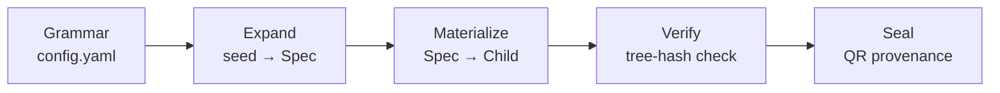

## Abstract

`template_autopoiesis` is a combinatoric grammar that **deterministically generates
whole runnable projects**.  Given a single integer seed and a grammar of orthogonal
slots, the system produces a fully-materialized child project — complete with kernel
source, tests, analysis entry-point, and a manuscript stub — whose every byte is
traceable to that seed.

### Generation pipeline



### Grammar product space

```mermaid
flowchart TB
    A[5 domains] --> P[Product space]
    B[2 dep modes] --> P
    C[3 reserved slots] --> R[Reserved — excluded from effective size]
    P --> EPS[Effective product: {{EFFECTIVE_PRODUCT_SIZE}} cells]
    P --> TPS[Total product: {{PRODUCT_SIZE}} cells]
```

- **Domain count**: {{DOMAIN_COUNT}}
- **Effective product size**: {{EFFECTIVE_PRODUCT_SIZE}}
- **Total product size**: {{PRODUCT_SIZE}}
- **Reserved slots**: {{RESERVED_SLOT_COUNT}} (`{{RESERVED_SLOT_NAMES}}`)
- **Grammar hash**: `{{GRAMMAR_HASH}}`
- **Tests**: {{TEST_COUNT}} · **Coverage**: {{COVERAGE_PCT}}%
