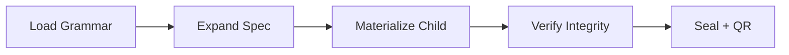

## Methods

### The A→E generation spine

Generation proceeds through five stages:

**Stage A — Grammar loading.**  
`load_grammar(project_root)` reads `manuscript/config.yaml` and validates
the `autopoiesis:` block via `parse_grammar()`.  Each slot must have a name
and at least one option; duplicate options raise `GrammarError`.

**Stage B — Spec expansion.**  
`expand(grammar, seed)` iterates over each slot in order, computing a
deterministic index via `_digest_index(seed, slot_name, ordinal, options)`.
The SHA-256 of the concatenated key selects the option.  The result is a
frozen `Spec` dataclass carrying the grammar hash, all selections, and a
`spec_hash` for identity.

**Stage C — Materialization.**  
`materialize(spec, out_root, template_root)` assembles the child file tree.
Kernel sources are copied from `src/primitives/{domain}.py`; import paths
are rewritten for standalone operation.  A `provenance.json` is written with
the schema version, full spec, and tree hash.

**Stage D — Verification.**  
`verify_child(child_root)` reloads `provenance.json`, re-reads every listed
file, recomputes the tree hash, and compares against the recorded value.
Any post-generation modification causes a `tree_hash_matches` failure.

**Stage E — Sealing.**  
`build_payload(spec_hash, tree_hash, seed)` serialises a JSON payload.
The optional `qr_image()` call encodes this payload into a QR PNG that can
be embedded in the cover page or transmitted alongside the child archive.
