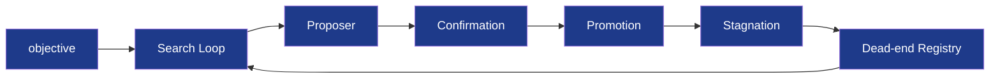

# Architecture — AutoScientists

## Coordination Loop

The five coordination mechanisms from Gao, Fang & Zitnik (arXiv:2605.28655),
implemented deterministically:

1. **Shared champion/experiment-log state** — `SharedState` in `src/state.py`
2. **Dead-end registry** — `DeadEndRegistry` in `src/dead_ends.py`
3. **Effect-size ranking** — `rank_axes` in `src/ranking.py`
4. **Noise-band confirmation** — `confirm_improvement` in `src/confirmation.py`
5. **Stagnation-driven reorganization** — `StagnationDetector` in `src/stagnation.py`

## Data flow

