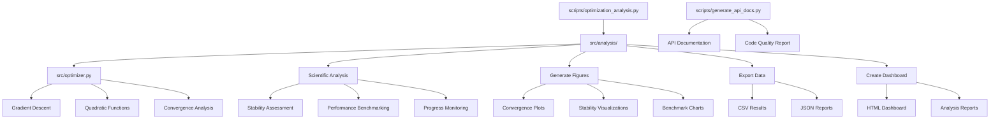

# Code Project — Optimization Research Exemplar

Research project demonstrating optimization algorithms with automated figure generation and publication-quality output. Exemplar roster: [`projects/AGENTS.md`](../../AGENTS.md#permanent-canonical-exemplars).

## When to use this template

Use this template for **code-driven computational research**: algorithms in
`src/`, numerical experiments with deterministic seeds, automated
publication-quality figures, and a manuscript that reports the computed
results. It demonstrates the thin-orchestrator pattern
(scripts coordinate; `src/` implements; tests enforce ≥90% coverage with no
mocks). If your project is primarily prose review, layout, or book-length
structure, see [`template_prose_project`](../template_prose_project/),
[`template_newspaper`](../template_newspaper/), or
[`template_textbook`](../template_textbook/) instead.

## Publication and rendering

The publishing metadata and per-platform status below are **compiled from
`manuscript/config.yaml`** by `infrastructure.publishing.status_report` — do not
hand-edit between the markers; update the config and regenerate (see the legend).

<!-- PUBLISHING-STATUS:START (generated by infrastructure.publishing.status_report) -->
**Convergence Analysis of Gradient Descent Optimization** · v2.5.2 · MIT · Daniel Ari Friedman

Concept DOI: [10.5281/zenodo.20417136](https://doi.org/10.5281/zenodo.20417136) | Version DOI: [10.5281/zenodo.20931934](https://zenodo.org/records/20931934) | Repository: —

Publishing surface — 20 platforms, 9 published:

| Platform | Tier | Status | Reference | Credentials |
| --- | --- | --- | --- | --- |
| zenodo | first-class | ✅ published | [10.5281/zenodo.20417136](https://doi.org/10.5281/zenodo.20417136) | `ZENODO_API_TOKEN` |
| github | first-class | ✅ published | [docxology/template_code_project](https://github.com/docxology/template_code_project) | `GITHUB_TOKEN` |
| arxiv | first-class | ⚪ available | — | — |
| pypi | first-class | ✅ published | [https://test.pypi.org/project/template-code-project/2.5.2/](https://test.pypi.org/project/template-code-project/2.5.2/) | `PYPI_TOKEN`, `TESTPYPI_TOKEN` |
| ipfs_pinata | first-class | ✅ published | [https://gateway.pinata.cloud/ipfs/QmSVZF1MisqWeX1C7vFUhcwCkYvZXBuq5TS9MzLFNJJykS](https://gateway.pinata.cloud/ipfs/QmSVZF1MisqWeX1C7vFUhcwCkYvZXBuq5TS9MzLFNJJykS) | `PINATA_JWT` |
| ipfs_web3storage | first-class | ⚪ available | — | `WEB3_STORAGE_TOKEN` |
| software_heritage | first-class | ✅ published | [https://archive.softwareheritage.org/browse/origin/?origin_url=https://github.com/docxology/template_code_project](https://archive.softwareheritage.org/browse/origin/?origin_url=https://github.com/docxology/template_code_project) | — |
| github_pages | first-class | ✅ published | [https://docxology.github.io/template_code_project/](https://docxology.github.io/template_code_project/) | `GITHUB_TOKEN` |
| cloudflare_pages | first-class | ⚪ available | — | `CLOUDFLARE_API_TOKEN` |
| netlify | first-class | ✅ published | [https://6a4440a789b44ad53f3af09b--tranquil-kleicha-0c9203.netlify.app](https://6a4440a789b44ad53f3af09b--tranquil-kleicha-0c9203.netlify.app) | `NETLIFY_AUTH_TOKEN` |
| huggingface_hub | first-class | ✅ published | [https://huggingface.co/datasets/ActiveInference/template_code_project](https://huggingface.co/datasets/ActiveInference/template_code_project) | `HUGGINGFACE_TOKEN`, `HF_TOKEN` |
| osf | first-class | ✅ published | [https://osf.io/mcv8j/](https://osf.io/mcv8j/) | `OSF_TOKEN` |
| amazon_kdp | documented | 🟡 planned | — | `AMAZON_KDP_EMAIL`, `AMAZON_KDP_PASSWORD` |
| google_play_books | documented | 🟡 planned | — | `GOOGLE_PLAY_BOOKS_SERVICE_ACCOUNT_JSON` |
| gumroad | documented | 🟡 planned | — | `GUMROAD_ACCESS_TOKEN` |
| leanpub | documented | 🟡 planned | — | `LEANPUB_API_KEY` |
| lulu | documented | 🟡 planned | — | `LULU_CLIENT_KEY`, `LULU_CLIENT_SECRET` |
| draft2digital | documented | 🟡 planned | — | `DRAFT2DIGITAL_API_TOKEN` |
| stripe | documented | 🟡 planned | — | `STRIPE_SECRET_KEY`, `STRIPE_PUBLISHABLE_KEY` |
| ingramspark | documented | 🟡 planned | — | `INGRAMSPARK_CLIENT_ID`, `INGRAMSPARK_CLIENT_SECRET` |

_Keywords: optimization algorithms, gradient descent, convergence analysis, numerical methods, mathematical programming, reproducible research, infrastructure automation._

_Status legend: ✅ published (durable identifier recorded in `config.yaml`) · 🔵 reserved (identifier reserved but not yet registered by final publication) · ⚪ available (adapter implemented and locally verifiable) · 🟡 planned. This block is generated — edit `manuscript/config.yaml`, then regenerate with `uv run python -m infrastructure.publishing.status_report --project <path> --write`._
<!-- PUBLISHING-STATUS:END -->

The 3 platforms still shown ⚪ available are not automatable to "published" with
current tooling/credentials, not an oversight: **arXiv** has no submission API
in this codebase (`infrastructure.publishing.arxiv` only prepares a local
tarball — a human must upload it via arxiv.org and the resulting `arxiv` URL
would then be added to `publication.published_artifacts`); **Cloudflare
Pages** needs a `CLOUDFLARE_ACCOUNT_ID` the configured API token cannot
auto-discover; **IPFS (Web3.Storage)** has no `WEB3_STORAGE_TOKEN` configured.

- Canonical renderer: [docxology/template](https://github.com/docxology/template) with `--project templates/template_code_project`
- Tracked outputs: [`output/`](output/) in this project and `output/templates/template_code_project/` in the monorepo; public output files above 50 MB stay out of git.

To regenerate this exemplar from the public monorepo:

```bash
git clone https://github.com/docxology/template
cd template
uv sync
./run.sh --project templates/template_code_project --pipeline --core-only
uv run python scripts/pipeline/stage_04_validate.py --project templates/template_code_project
uv run python scripts/pipeline/stage_05_copy.py --project templates/template_code_project
```

Standalone repositories are publication mirrors for source, DOI metadata, and
tracked rendered artifacts. Use the monorepo above when you need the full shared
infrastructure, pipeline stages, or cross-template validation.

## Quick Start

```bash
# Run the analysis pipeline
uv run python projects/templates/template_code_project/scripts/optimization_analysis.py

# Run tests
uv run pytest projects/templates/template_code_project/tests/ -v

# View final deliverables (after scripts/pipeline/stage_05_copy.py)
ls -la output/templates/template_code_project/
```

## Prerequisites & verification

**Test/coverage gate (authoritative per-project command).** Exit code 0
alone is not proof — confirm tests collected > 0 and coverage ≥ 90%:

```bash
uv run pytest projects/templates/template_code_project/tests/ \
  --cov=projects/templates/template_code_project/src --cov-fail-under=90
# live baseline: docs/_generated/COUNTS.md
```

**Combined-PDF rendering & Mermaid.** This project's convention is
Mermaid-for-all-diagrams. If a manuscript section embeds a ```mermaid```
block, the combined PDF is built with `mmdc`, which needs a pinned
`chrome-headless-shell` (CI provisions it; a fresh clone does not):

```bash
npx --yes puppeteer browsers install chrome-headless-shell
```

Without it the **PDF Rendering** stage fails while slides still render — see
[`docs/troubleshooting.md`](docs/troubleshooting.md#pdf-rendering-fails-mmdc-could-not-find-chrome).
Full end-to-end: `uv run python scripts/runner/execute_pipeline.py --project templates/template_code_project --core-only`.

## Dependencies

Run `uv sync` at the **repository root**; that environment is what CI and `./run.sh` use. [`pyproject.toml`](pyproject.toml) in this directory configures pytest/coverage for `projects/templates/template_code_project/tests/` and records the same scientific stack for isolated runs. Root [`pyproject.toml`](../../../pyproject.toml) has `[tool.uv.workspace]` with `members = []`, so this folder is not installed as a separate workspace package.

## Agentic research overlays

This exemplar includes two declarative overlays for advisory research controls:

- [`domain_profile.yaml`](domain_profile.yaml) declares the code-research domain,
  expected outputs, review gates, source policy, artifact expectations, and
  benchmark rubric weights.
- [`experiment_plan.yaml`](experiment_plan.yaml) declares the deterministic
  gradient-descent conditions, primary metric direction, expected figures and
  tables, baseline, and ablation condition.
- [`data/claim_ledger.yaml`](data/claim_ledger.yaml) registers manuscript
  numeric claims that are intentionally sourced from project code, captions, or
  generated artifacts rather than `{{TOKEN}}` variables.

These files are validation and benchmark inputs only. They do not fork project
trees, mutate prompts, or run autonomous experiment agents.

## Why this template — the transferable pattern

The genuinely transferable lesson is not gradient descent. It is
**reproducibility-by-construction**: every numeric in the manuscript prose
is a `{{TOKEN}}` registered in one Python function
(`src/manuscript_variables.py::generate_variables`) and cross-checked by
one test (`tests/test_manuscript_variables.py::test_all_manuscript_tokens_are_generated`),
which fails CI on any token used in prose that the generator does not emit.
The deliverable PDF is therefore *proof* that the repo's invariants held
during build: configuration drift, deleted result, or out-of-sync narrative
cannot reach a green PDF without the gate flipping red first. A forker who
internalizes "every prose number is a token, every token is a single Python
function, every drift is a CI failure" gets that discipline for free —
regardless of whether their domain is optimization.

## Key Features

- **Gradient descent optimization** with convergence analysis
- **Automated figure generation** (convergence plots, stability analysis, performance benchmarks)
- **Scientific validation** (numerical stability assessment, performance benchmarking)
- **Comprehensive reporting** (HTML dashboard with analysis metrics)
- **Performance monitoring** (resource usage tracking with progress indicators)
- **Data export** (optimization results, analysis reports, performance metrics)
- **Manuscript integration** (figure registration and cross-referencing)

## Common Commands

### Run Analysis

```bash
uv run python projects/templates/template_code_project/scripts/optimization_analysis.py
```

Generates convergence plots, performs scientific validation, creates dashboard, and saves all results.

### Run Tests

```bash
uv run pytest projects/templates/template_code_project/tests/ -v
```

Tests optimization algorithms and numerical accuracy.

### View Results

```bash
open projects/templates/template_code_project/output/figures/convergence_plot.png
cat projects/templates/template_code_project/output/data/optimization_results.csv
```

## Architecture



## .cursorrules Compliance

✅ **Fully compliant** with template development standards:

- **Testing**: `src/` coverage is gated at 90%; live test count + achieved coverage tracked in [`../../docs/_generated/COUNTS.md`](../../../docs/_generated/COUNTS.md)
- **Documentation**: AGENTS.md + README.md in each directory
- **Type Safety**: Full type hints on all public APIs
- **Code Quality**: Ruff format/check (CI parity), descriptive naming, proper imports
- **Error Handling**: Context preservation, informative messages
- **Logging**: Unified logging system throughout

## Manuscript authoring

When editing manuscript markdown:

- [`manuscript/SYNTAX.md`](manuscript/SYNTAX.md) — citation, equation, figure, table, and section conventions specific to this project (label registries for all 6 figures and 8 equations).
- [`../../docs/guides/manuscript-semantics.md`](../../../docs/guides/manuscript-semantics.md) — repository-wide manuscript semantics.
- [`manuscript/AGENTS.md`](manuscript/AGENTS.md) — `{{TOKEN}}` substitution protocol and section-modification workflow.

## More Information

See [AGENTS.md](AGENTS.md) for technical documentation.

## Template integrity

- Forward backlog: [`TODO.md`](TODO.md).
- Copy-and-customize config: [`manuscript/config.yaml.example`](manuscript/config.yaml.example).
- Project validation: `uv run pytest projects/templates/template_code_project/tests/ --cov=projects/templates/template_code_project/src --cov-fail-under=90`.
- Repo drift validation: `uv run python scripts/audit/check_template_drift.py --strict`.
