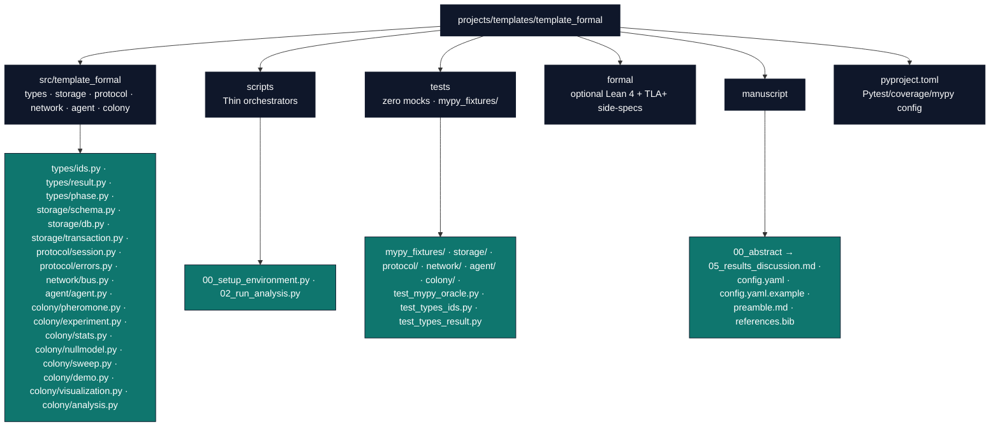

# Formal - Strongly-Typed Multiagent Ant-Robot Colony Exemplar

**This is an active project** in the `projects/` directory, discovered and
executed by infrastructure discovery functions. Public exemplar roster and
comparison: [`projects/AGENTS.md`](../../AGENTS.md#permanent-canonical-exemplars).
Manuscript semantics: [`docs/guides/manuscript-semantics.md`](../../../docs/guides/manuscript-semantics.md).

Decision memory and verifier hardening follow
[`docs/rules/memory_and_decision_records.md`](../../../docs/rules/memory_and_decision_records.md):
use nearby `WHY:` comments only for surprising local choices, keep volatile
counts generated, and add negative controls for verifier-like gates.

## Layer contract

| Surface | Rule |
| --- | --- |
| `src/template_formal/` (domain) | Pure typed domain code — ADTs, session types, affine handles, storage, network, agent, colony — **no** direct `infrastructure` imports |
| `scripts/` | Thin orchestrators; may import `infrastructure/` and `src/` |
| `formal/` | Optional Lean 4 + TLA+ side-specs, wired to `scripts/check_formal_specs.sh` only — never decorative |
| Live counts | Do not hardcode measured test totals or coverage % in this file |

## Overview

A research project demonstrating illegal-state-unrepresentable design
applied to a genuinely decentralized domain: an ant-robot colony where each
agent owns its own on-disk SQLite database and its own in-process,
fault-injectable network endpoint — no shared global state. The typed
surface is the research subject itself: algebraic data types (`Result`),
nominal `NewType` identifiers, a session-typed protocol state machine,
affine-discipline resource handles that are runtime-guarded (not
compiler-proved) against reuse, a storage layer framed as a functor
`Schema -> Set`, and a per-agent decision loop that minimizes a closed-form
expected-free-energy quantity (Friston 2005 framing).

## Key Features & Capabilities

### Type Architecture

- **ADTs**: `Result[T, E]` as `Ok`/`Err` frozen dataclasses with a
  `Literal` tag field; `match`-exhaustiveness is mypy-enforced via
  `assert_never` on the missing arm.
- **Nominal IDs**: `AgentId`/`MessageId`/`TxnId` as distinct `NewType`
  wrappers over `uuid.UUID` — a compile-time-only distinction; indistinguishable
  at runtime.
- **Session types**: `IdleSession → HandshakingSession → EstablishedSession →
  ClosedSession`, each a separate class; phase-specific methods do not exist
  on the wrong phase (an `AttributeError` under mypy --strict, not a caught
  exception).
- **Affine-discipline handles**: `TransactionHandle`/protocol-phase objects
  are frozen + `__slots__` with a private consumed flag, raising at runtime
  on reuse — Python has no linear/affine type system, so this is a
  *discipline*, never claimed as a compiler guarantee.

### Research Quality Assurance

- **mypy-as-oracle test suite**: `tests/test_mypy_oracle.py` runs
  `mypy --strict` as a real subprocess against every known-bad and
  known-good fixture under `tests/mypy_fixtures/` (non-zero/zero exit
  respectively) and against the real `src/` tree (zero exit expected) —
  proof-of-detection, not just a typed signature. See "Adding a mypy-oracle
  fixture" below for the auto-discovery convention.
- **Zero-mock testing**: real on-disk SQLite files via `tmp_path`, a real
  in-process message bus with seeded fault injection, real `mypy --strict`
  subprocess invocations.
- **Paired static+dynamic proofs**: every phase-transition/affine-reuse ISC
  has both a mypy negative-control fixture and a runtime-raise unit test.
- **Fault-injected negative controls**: every protocol happy-path test has a
  paired fault-injected test (drop/corrupt modes) asserting a typed
  `Result.Err`, never a crash or silent phase advance.

### Publication-Ready Output

- **Manuscript with explicit claim-scoping section**: "What mypy --strict
  proves vs. what is a runtime discipline," citing ISC numbers for every
  strong claim.
- **Active Inference framing**: Friston (2005) cited in the decision-loop
  docstring and manuscript, plus the Ehresmann & Vanbremeersch Memory
  Evolutive Systems bridge from category theory to collective biological
  organization.

## Directory Structure



## Installation/Setup

Install dependencies from the **repository root** with `uv sync` (see root
[`pyproject.toml`](../../../pyproject.toml)). `template_formal/pyproject.toml`
pins pytest/coverage/mypy settings and documents the project name for
isolated runs of this tree.

## Usage Examples

```bash
# From the repository root — run the demo colony pipeline
uv run python projects/templates/template_formal/scripts/pipeline/stage_02_analysis.py

# Run tests with coverage
uv run pytest projects/templates/template_formal/tests/ --cov=projects/templates/template_formal/src --cov-fail-under=90

# mypy --strict oracle
uv run mypy --strict projects/templates/template_formal/src
```

## Adding a mypy-oracle fixture

`tests/test_mypy_oracle.py` discovers fixtures by filename glob, not by a
hardcoded list — this is what "no test-file edit needed" actually means in
this codebase, precisely scoped:

- **Adding a `good_<invariant>.py` fixture** genuinely needs zero edits to
  `test_mypy_oracle.py`: drop the file under `tests/mypy_fixtures/`, and
  `_good_fixtures()`'s `FIXTURES_DIR.glob("good_*.py")` plus the
  `@pytest.mark.parametrize` above `test_known_good_fixture_is_accepted_by_mypy_strict`
  pick it up automatically on the next test run, asserting `mypy --strict`
  accepts it (exit 0).
- **Adding a `bad_<invariant>.py` fixture** is discovered the same way via
  `_bad_fixtures()`'s `glob("bad_*.py")`, but is **not** zero-edit: you
  must also add an entry to `_EXPECTED_BAD_FIXTURE_SUBSTRINGS` keyed by
  the exact filename, binding the fixture to the specific `mypy --strict`
  error substring it is supposed to trigger. This is deliberate, not an
  oversight — a generic `"error:" in result.stdout` check is a hollow gate
  (a fixture whose *intended* illegal state stopped triggering, but which
  still emits some unrelated error, would keep passing for the wrong
  reason). A new `bad_*.py` fixture with no dict entry fails loudly with a
  `KeyError` rather than silently passing under a substring-free fallback.

Either way, name the file `bad_<invariant>.py` or `good_<invariant>.py`
(snake_case, one file per invariant) — the prefix is what the two globs
key on.

## Protocol for AI Agents

**Critical Directive**: Before modifying this project, AI agents *must*:

- **Add new Ideal-State Criteria to `ISA.md` before writing code**, not
  after. This template's manuscript (@sec:type-architecture,
  @sec:results-discussion) cites specific ISC numbers for every strong
  claim it makes — a change that isn't backed by an ISC in `ISA.md` has no
  stable identifier for the manuscript, `tests/mypy_fixtures/`, or
  `TODO.md` to point at. Follow `ISA.md`'s existing numbering convention
  (`ISC-N`, grouped by module, anti-criteria called out explicitly) when
  appending — do not renumber existing ISCs, only append new ones or
  supersede one via a `## Decisions`/`## Changelog` entry, per this repo's
  `docs/rules/memory_and_decision_records.md`.
- Never add `Any` or unjustified `# type: ignore` to `src/template_formal/types/`
  (ISC-7) — every suppression needs an inline justification comment.
- Never claim compile-time linear or dependent type guarantees anywhere in
  source docstrings or manuscript prose (ISC-44) — Python has neither;
  affine handles are a runtime-guarded discipline only.
- Add a paired negative-control test (mypy fixture or runtime-raise unit
  test) for every new strong typing claim before considering it done.
- Keep `scripts/` thin — business logic belongs in `src/template_formal/`.
- Never use `MagicMock`/`unittest.mock`/`mocker.patch` anywhere in `tests/`.

## Testing

```bash
uv run pytest projects/templates/template_formal/tests/ -v
uv run pytest projects/templates/template_formal/tests/ --cov=projects/templates/template_formal/src --cov-report=html
```

## Optional formal side-spec

`formal/lean/` (Lean 4) and `formal/tla/` (TLA+) model the handshake
protocol. Both are wired to one real runnable check each via
`scripts/check_formal_specs.sh` — see [`TODO.md`](TODO.md) for the decision
record (ISC-35/36: shipped, not cut).

## Anti-patterns (do not do these)

- Do not add a compiler-level linearity/dependent-type claim anywhere —
  grep for `"dependent type"` and `"linear type"` outside an explicit
  limitations section must return zero matches (ISC-44).
- Do not let a fault-injection mode default to permanently disabled in a way
  that makes a fault-injected test vacuously pass on an all-happy-path run
  (ISC-68).
- Do not test coverage by asserting type annotations exist rather than
  exercising behavior (ISC-67) — every covered line needs a behavioral
  assertion reachable from it.
- Do not add a vestigial/unwired `.lean`/`.tla` file — every formal artifact
  under `formal/` must be reachable from `scripts/check_formal_specs.sh`.
- Do not use `:memory:`-only SQLite for any claim about durable per-agent
  state (ISC-66) — use a real `tmp_path` file.

## More Information

See [README.md](README.md) for the project overview and quick start.

## See Also

- [Root AGENTS.md](../../AGENTS.md) - Template documentation
- [`../../AGENTS.md`](../../AGENTS.md#permanent-canonical-exemplars) — public exemplar roster
- [`manuscript/references.bib`](manuscript/references.bib) — full bibliography
