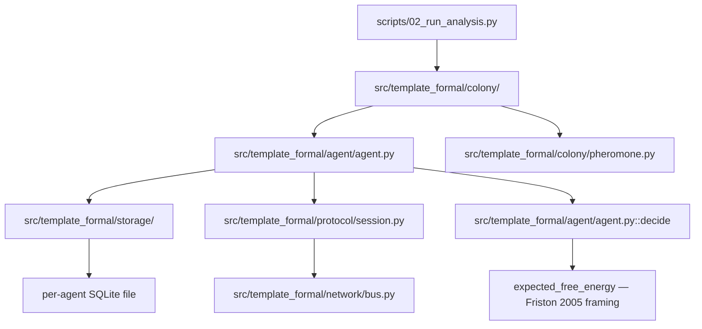

# Formal — Strongly-Typed Multiagent Ant-Robot Colony Exemplar

Research project demonstrating illegal-states-unrepresentable design — algebraic
data types, session-typed protocol state machines, and affine-discipline
resource handles — applied to a decentralized multiagent simulation. Exemplar
roster: [`projects/AGENTS.md`](../../AGENTS.md#permanent-canonical-exemplars).

## When to use this template

Use this template when the research subject *is* the type architecture itself:
illegal-state-unrepresentable design, session-typed protocols, affine/linear
resource-handle discipline, or a decentralized (no-shared-global-state)
multiagent simulation that needs its own local storage and local networking
per agent. It is the template that draws an explicit, test-backed line
between "mypy --strict proved this at edit-time/CI-time" and "this is a
runtime-guarded discipline, not a compiler guarantee" — the honesty scoping
is the point, not a caveat bolted on afterward. If your project is primarily
numerical experiments and figures, see
[`template_code_project`](../template_code_project/) instead; if it is
Active-Inference modeling without the type-theory framing, see
[`template_active_inference`](../template_active_inference/); if it needs an
actual Lean/mathlib proof development (not an optional side-spec), that is
outside this template's scope — see the repo's Lean skills.

## Publication and rendering

The publishing metadata and per-platform status below are **compiled from
`manuscript/config.yaml`** by `infrastructure.publishing.status_report` — do not
hand-edit between the markers; update the config and regenerate (see the legend).

<!-- PUBLISHING-STATUS:START (generated by infrastructure.publishing.status_report) -->
**Illegal States, Mostly Unrepresentable** · v0.1.0 · MIT · Daniel Ari Friedman

Publishing surface — 20 platforms, 0 published:

| Platform | Tier | Status | Reference | Credentials |
| --- | --- | --- | --- | --- |
| zenodo | first-class | ⚪ available | — | `ZENODO_API_TOKEN` |
| github | first-class | ⚪ available | — | `GITHUB_TOKEN` |
| arxiv | first-class | ⚪ available | — | — |
| pypi | first-class | ⚪ available | — | `PYPI_TOKEN`, `TESTPYPI_TOKEN` |
| ipfs_pinata | first-class | ⚪ available | — | `PINATA_JWT` |
| ipfs_web3storage | first-class | ⚪ available | — | `WEB3_STORAGE_TOKEN` |
| software_heritage | first-class | ⚪ available | — | — |
| github_pages | first-class | ⚪ available | — | `GITHUB_TOKEN` |
| cloudflare_pages | first-class | ⚪ available | — | `CLOUDFLARE_API_TOKEN` |
| netlify | first-class | ⚪ available | — | `NETLIFY_AUTH_TOKEN` |
| huggingface_hub | first-class | ⚪ available | — | `HUGGINGFACE_TOKEN`, `HF_TOKEN` |
| osf | first-class | ⚪ available | — | `OSF_TOKEN` |
| amazon_kdp | documented | 🟡 planned | — | `AMAZON_KDP_EMAIL`, `AMAZON_KDP_PASSWORD` |
| google_play_books | documented | 🟡 planned | — | `GOOGLE_PLAY_BOOKS_SERVICE_ACCOUNT_JSON` |
| gumroad | documented | 🟡 planned | — | `GUMROAD_ACCESS_TOKEN` |
| leanpub | documented | 🟡 planned | — | `LEANPUB_API_KEY` |
| lulu | documented | 🟡 planned | — | `LULU_CLIENT_KEY`, `LULU_CLIENT_SECRET` |
| draft2digital | documented | 🟡 planned | — | `DRAFT2DIGITAL_API_TOKEN` |
| stripe | documented | 🟡 planned | — | `STRIPE_SECRET_KEY`, `STRIPE_PUBLISHABLE_KEY` |
| ingramspark | documented | 🟡 planned | — | `INGRAMSPARK_CLIENT_ID`, `INGRAMSPARK_CLIENT_SECRET` |

_Keywords: strongly typed programming, session types, algebraic data types, category theory, active inference, multiagent systems, affine types, illegal state unrepresentable._

_Status legend: ✅ published (durable identifier recorded in `config.yaml`) · 🔵 reserved (identifier reserved but not yet registered by final publication) · ⚪ available (adapter implemented and locally verifiable) · 🟡 planned. This block is generated — edit `manuscript/config.yaml`, then regenerate with `uv run python -m infrastructure.publishing.status_report --project <path> --write`._
<!-- PUBLISHING-STATUS:END -->

## What this template demonstrates

A colony of ant-robots, each with **its own** SQLite database file and **its
own** in-process network endpoint (no shared global state — per-agent
isolation is enforced structurally, not just by convention). The typed
surface:

- **Algebraic data types**: `Result[T, E]` as a tagged `Ok`/`Err` union with
  mypy-enforced `match` exhaustiveness (`src/template_formal/types/result.py`).
- **Nominal identifier types**: `AgentId`/`MessageId`/`TxnId` as distinct
  `NewType` wrappers over `uuid.UUID` — indistinguishable at runtime,
  distinct to mypy (`src/template_formal/types/ids.py`).
- **Session-typed protocol state machine**: `Idle → Handshaking →
  Established → Closed`, each phase a separate class whose methods only
  exist on the phases where they are legal (`src/template_formal/protocol/session.py`).
- **Affine-discipline resource handles**: a `TransactionHandle` that raises
  `ConsumedHandleError` at runtime on reuse — a runtime-guarded discipline,
  explicitly *not* a compiler-enforced linear/affine type guarantee
  (`src/template_formal/storage/transaction.py`).
- **Storage-as-functor framing**: the per-agent schema is documented as a
  functor `Schema -> Set` in the Fong & Spivak sense — a design lens, not a
  machine-checked proof (`src/template_formal/storage/schema.py`).
- **Fault-injectable typed message bus**: seeded, reproducible drop/reorder/
  duplicate/corrupt fault injection so the protocol's negative-control tests
  exercise real malformed bytes, not mocks (`src/template_formal/network/bus.py`).
- **Active-Inference-flavored decision loop**: each agent's per-tick choice
  minimizes a closed-form expected-free-energy quantity over a small Gaussian
  belief state, cited to Friston (2005) with an explicit scoping of what is
  and is not a research-grade active-inference implementation
  (`src/template_formal/agent/agent.py`).
- **Optional formal side-specs**: a Lean 4 model and a TLA+ spec of the
  handshake protocol ship under `formal/`, wired to one real runnable check
  each (`scripts/check_formal_specs.sh` — requires `lake`/`elan` on `PATH`
  and a Java runtime for TLC) — see [`TODO.md`](TODO.md) for the
  ship-or-cut decision record (ISC-35/36).

## Honesty line: what mypy --strict proves vs. what is a runtime discipline

This is the manuscript's central methodological claim, and it is testable,
not asserted:

- **mypy --strict proves** — at edit-time/CI-time only, never at
  runtime — that an `AgentId` cannot be passed where a `MessageId` is
  expected, that a non-exhaustive `Result` match is rejected, that an
  `Established`-only method cannot be called on an `Idle`-phase handle, and
  that a bare `str`/`UUID` cannot construct an `Agent`. Each of these has a
  paired negative-control fixture under `tests/mypy_fixtures/` that
  `tests/test_mypy_oracle.py` runs as a real `mypy --strict` subprocess.
- **Runtime disciplines, not compiler guarantees** — reusing a consumed
  `TransactionHandle` or a consumed protocol-phase instance is *not* a type
  error (nothing about the second call is ill-typed); it is caught by an
  explicit `_consumed`/`_used` flag checked on every call, raising at
  runtime. Python has no linear or affine type system. No line in this
  template's source or manuscript claims otherwise — see the manuscript's
  "What mypy --strict proves vs. what is a runtime discipline" section for
  the full ISC-by-ISC scoping.

## Dependencies

Run `uv sync` at the **repository root** — step 0 before anything below;
that environment is what CI, `./run.sh`, and every command in Quick Start
use. [`pyproject.toml`](pyproject.toml) in this directory pins
pytest/coverage/mypy settings (plus `matplotlib` for the optional demo
figures) for isolated runs of this project's tests.

## Quick Start

```bash
# 0. Install dependencies (repository root, once)
uv sync

# Run the demo colony pipeline (writes a JSON summary + two demo figures
# under output/figures/ -- see "What this template demonstrates" above)
uv run python projects/templates/template_formal/scripts/02_run_analysis.py
```

Expected output (real paths this script prints, one per line):

```text
.../template_formal/output/data/colony_demo_summary.json
.../template_formal/output/data/agent_0.sqlite3
.../template_formal/output/data/agent_1.sqlite3
.../template_formal/output/data/agent_2.sqlite3
.../template_formal/output/figures/colony_demo_convergence.png
.../template_formal/output/data/colony_statistics_sweep_summary.json
.../template_formal/output/figures/colony_convergence_tick_distribution.png
```

```bash
# Run tests (zero mocks, real SQLite files, real mypy subprocess oracle)
uv run pytest projects/templates/template_formal/tests/ -v

# mypy --strict oracle (also run inside the test suite; MYPYPATH is required --
# see "Prerequisites & verification" below for why the bare form is insufficient)
MYPYPATH=projects/templates/template_formal/src \
  uv run mypy --strict --explicit-package-bases --namespace-packages \
  projects/templates/template_formal/src

# Manuscript-only render (skip analysis/tests; useful after editing manuscript/*.md)
uv run python scripts/pipeline/stage_03_render.py --project templates/template_formal

# Optional formal side-specs (Lean 4 + TLA+, non-default). Prerequisites:
#   - Lean/Lake via elan: export PATH="$HOME/.elan/bin:$PATH"
#   - A Java runtime for TLC (e.g. `brew install openjdk@17`); override the
#     binary with FORMAL_JAVA_BIN if it is not on PATH as `java`
projects/templates/template_formal/scripts/check_formal_specs.sh
```

**Isolated mypy-oracle run** (the fixture-based proof-of-detection suite
alone, useful when iterating on `tests/mypy_fixtures/`):

```bash
uv run pytest projects/templates/template_formal/tests/test_mypy_oracle.py -v
```

Real expected output (6 known-bad fixtures rejected, 3 known-good fixtures
and the real `src/` tree accepted):

```text
test_at_least_one_bad_fixture_exists PASSED
test_known_bad_fixture_is_rejected_by_mypy_strict[bad_agent_id_construction.py] PASSED
test_known_bad_fixture_is_rejected_by_mypy_strict[bad_id_mixing.py] PASSED
test_known_bad_fixture_is_rejected_by_mypy_strict[bad_isolation_level.py] PASSED
test_known_bad_fixture_is_rejected_by_mypy_strict[bad_phase_transition.py] PASSED
test_known_bad_fixture_is_rejected_by_mypy_strict[bad_pheromone_protocol_violation.py] PASSED
test_known_bad_fixture_is_rejected_by_mypy_strict[bad_result_nonexhaustive.py] PASSED
test_known_good_fixture_is_accepted_by_mypy_strict[good_agent_belief_instantiation.py] PASSED
test_known_good_fixture_is_accepted_by_mypy_strict[good_bus_wire_message_instantiation.py] PASSED
test_known_good_fixture_is_accepted_by_mypy_strict[good_pheromone_conformance.py] PASSED
test_real_src_tree_passes_mypy_strict_clean PASSED
============================== 11 passed in 3.09s ==============================
```

## Prerequisites & verification

**Test/coverage gate (authoritative per-project command).** Exit code 0
alone is not proof — confirm tests collected > 0 and coverage ≥ 90%:

```bash
uv run python scripts/pipeline/stage_01_test.py --project templates/template_formal --project-only
```

Real expected output (per ISA.md's own authoritative-invocation binding —
a bare root-venv `uv run pytest` is not equivalent, see `ISA.md` Changelog):

```text
Required test coverage of 90% reached. Total coverage: 95.93%
277 passed (timing is machine-dependent)
Project: ✓ PASSED (277/277 tests, 96.03% coverage)
```

**mypy --strict, the authoritative form.** The bare `uv run mypy --strict
projects/templates/template_formal/src` invocation from the repository
root is **not** sufficient on its own (it can spuriously fail with
`Free type variable expected in Generic[...]`-style errors caused by
namespace-package double-resolution — see `ISA.md` Changelog for the
full root-cause). The command that actually gates this template is:

```bash
MYPYPATH=projects/templates/template_formal/src \
  uv run mypy --strict --explicit-package-bases --namespace-packages \
  projects/templates/template_formal/src
```

Real expected output: `Success: no issues found in 26 source files`.

**Zero mocks.** `grep -rn "MagicMock\|mocker.patch\|unittest.mock" projects/templates/template_formal/tests/`
must return nothing — every test uses a real on-disk SQLite file (`tmp_path`),
a real in-process message bus, or a real `mypy --strict` subprocess.

Full end-to-end: `uv run python scripts/runner/execute_pipeline.py --project templates/template_formal --core-only`.

## Architecture



## Why this template — the transferable pattern

The genuinely transferable lesson is not ant colonies. It is: **pin every
strong typing claim to a falsifiable test, and separate "the type system
proved this" from "we runtime-guard this because the type system cannot."**
A forker who internalizes "every ADT/session-type/affine-handle claim gets a
`tests/mypy_fixtures/` negative control or a runtime-raise unit test, and the
manuscript cites the ISC number, not just the vibe" gets that discipline for
free — regardless of whether their domain is ant robots.

## Agent skill

A Hermes/agentskills.io-compatible skill for this exemplar lives at
[`.agents/skills/template-formal/SKILL.md`](.agents/skills/template-formal/SKILL.md).
Load it when working inside this template to get when-to-use guidance,
quick reference commands, and pitfalls.

## Template integrity

- Forward backlog: [`TODO.md`](TODO.md).
- Copy-and-customize config: [`manuscript/config.yaml.example`](manuscript/config.yaml.example).
- Project validation: `uv run pytest projects/templates/template_formal/tests/ --cov=projects/templates/template_formal/src --cov-fail-under=90`.
- Repo drift validation: `uv run python scripts/audit/check_template_drift.py --strict`.

## See Also

- [Root AGENTS.md](../../AGENTS.md) - Template documentation
- [`template_code_project`](../template_code_project/) — numerical-research sibling exemplar
- [`template_active_inference`](../template_active_inference/) — Active Inference sibling exemplar
- [`../../AGENTS.md`](../../AGENTS.md#permanent-canonical-exemplars) — public exemplar roster
