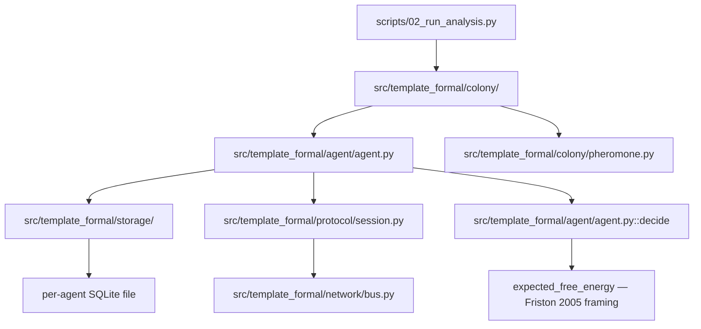

# Architecture

`template_formal` is one project in a two-layer research-template monorepo.
**Layer 1** is the generic, reusable `infrastructure/` at the repository
root (rendering, validation, the pipeline runner) — this project needs none
of it inside `src/`. **Layer 2** is everything domain-specific under
`projects/templates/template_formal/src/template_formal/`. The
thin-orchestrator rule is stricter here than in most sibling exemplars:
`src/template_formal/` may not import `infrastructure` at all (see the
[project `AGENTS.md`](../AGENTS.md)'s Layer contract table) — the typed
domain code is meant to be forkable standalone, with no dependency on this
repository's build machinery.

## The layer chain: `types → {storage, protocol, network} → agent → colony`

Each layer owns exactly one of the paper's typed-design concerns, and each
is exercised by the colony coordination loop at the bottom, never bypassed.
This is the real diagram from
[`manuscript/02_type_architecture.md`](../manuscript/02_type_architecture.md)
(reused here, not re-derived — the manuscript is the source of truth for
this graph):

- **`types/`** (`ids.py`, `result.py`, `phase.py`) — the vocabulary every
  other layer imports: `NewType` nominal IDs, the `Result[T, E]` ADT, and
  the four phantom phase markers. No layer below imports anything above it
  in this chain; `types/` imports nothing from this project at all.
- **`storage/`** (`schema.py`, `db.py`, `transaction.py`) — one agent's
  on-disk SQLite file, a typed schema/DDL layer, and the affine
  `TransactionHandle`. Imports only `types/`.
- **`protocol/`** (`session.py`, `errors.py`) — the session-typed handshake
  state machine and its real-bytes wire codec. Imports only `types/`.
- **`network/`** (`bus.py`) — the in-process, seeded, fault-injectable
  message bus that ferries `protocol/`'s `WireMessage` bytes between
  agents. Imports `types/` and `protocol/errors.py` (for
  `MalformedMessage`), not `protocol/session.py` itself — the bus is
  generic over any `MsgT`, and the protocol layer's codec is just the one
  concrete pairing this template uses.
- **`agent/agent.py`** — `Agent[StateT]` composes exactly one `storage/`
  session and one `protocol/` endpoint, plus the free-energy decision
  loop. This is the first layer that imports across the three foundational
  packages; nothing below it does.
- **`colony/`** — the multi-agent layer described below. Imports `agent/`
  and, for its statistics/nullmodel/sweep modules, sibling `colony/`
  modules.

Every arrow in the chain above is a real import relationship you can `grep`
for; there is no hidden coupling in the other direction (e.g. `types/`
never imports `storage/`).

## Inside `colony/`

`colony/` is the one subpackage with real internal structure, because it is
where the paper's *scientific* claims live, not just the type-architecture
demonstration. Read
[`src/template_formal/colony/__init__.py`](../src/template_formal/colony/__init__.py)
for the exported surface; the modules underneath split cleanly by
responsibility:

| Module | Responsibility |
| --- | --- |
| [`pheromone.py`](../src/template_formal/colony/pheromone.py) | The typed shared substrate — a narrow `PheromoneField` `Protocol` (`deposit`/`sense`/`evaporate`) plus `InMemoryPheromoneField`, the reference implementation. Agent code is written against the `Protocol`, never the concrete class. |
| [`experiment.py`](../src/template_formal/colony/experiment.py) | `ColonyTrialConfig`/`run_colony_trial` — the real, seeded trial harness: heterogeneous per-agent preferences plus sensing noise, drawn from one `random.Random(seed)` stream in a fixed order. Also owns `find_sustained_consensus_tick`, the "converged" definition every other colony module (including the null model) reuses. |
| `demo.py` | `run_demo_colony` (three identical agents, deterministic tie-break — the "guaranteed by construction" mechanism demo) and `run_statistics_sweep` (a thin wrapper repeating `run_colony_trial` at N seeds). Moved out of `scripts/` per the thin-orchestrator rule: this is business logic, not I/O. |
| [`nullmodel.py`](../src/template_formal/colony/nullmodel.py) | `run_null_model_trial` — a structurally-isolated random-choice baseline (no `Agent`, no `BeliefState`, no pheromone field) reusing only `find_sustained_consensus_tick`, so a rate comparison against the real mechanism is apples-to-apples. |
| [`sweep.py`](../src/template_formal/colony/sweep.py) | `run_parameter_sweep` — a generic runner that varies one real `ColonyTrialConfig` field across values, with a paired-seed design across sweep points (see the module's own docstring for why). |
| [`stats.py`](../src/template_formal/colony/stats.py) | Stdlib-only statistics: `wilson_score_interval`, `consensus_tick_summary`, `pearson_r`, `fisher_exact_test_two_sided`, `cochran_armitage_trend_test`. No numpy/scipy anywhere in this project. |
| `visualization.py` | Matplotlib figure writers (`write_demo_convergence_figure`, `write_convergence_tick_histogram`), also moved out of `scripts/`. They return `None` only for honestly unplottable data; `scripts/02_run_analysis.py` treats either missing required figure as a hard failure, so stale or absent publication visuals cannot pass the analysis stage. |
| [`cover_art.py`](../src/template_formal/colony/cover_art.py) | `generate_cover_art` — a deterministic, seeded (`random.Random`, never the process-global `random` module) procedural illustration for the manuscript's title page: an ant-robot silhouette with a cross-sectioned type-lattice abdomen over a faint database/network floor. Same optional-matplotlib-degrades-to-`None` convention as `visualization.py`. Not part of the analysis pipeline — it is committed static content under `manuscript/figures/`, regenerated by the standalone `scripts/zz_generate_cover_art.py`, not `02_run_analysis.py`. |

The dependency direction inside `colony/` is one-way:
`pheromone.py`/`experiment.py` have no colony-internal dependencies;
`demo.py`, `nullmodel.py`, `sweep.py`, and `visualization.py` all build on
`experiment.py` (directly or via `find_sustained_consensus_tick`); nothing
in `experiment.py` or `pheromone.py` imports back from those higher
modules. `nullmodel.py` is the one module actively *forbidden* from
importing `pheromone.py`/`agent.py` — proven, not just documented, by
`tests/colony/test_nullmodel.py`'s source-text grep and AST-import-allowlist
tests (see the [statistics methodology guide](statistics_methodology_guide.md)).
`cover_art.py` sits outside this chain entirely — it has no colony-internal
dependencies either (only `matplotlib`/`math`/`random`/`sys`/`pathlib`) and
nothing in the chain above depends on it; it is presentation content for
the manuscript cover, not part of the trial/statistics dependency graph.

## Manuscript / scripts / tests relationship

- **`manuscript/`** is prose, not generated output — `00_abstract.md`
  through `05_results_discussion.md` cite real ISC numbers, real file
  paths, and real numbers pulled from test output (see the
  [statistics methodology guide](statistics_methodology_guide.md) for how
  those numbers get from a test run into a `.md` file: by hand, checked
  against the pinned regression test, never regenerated by a script).
  `02_type_architecture.md` is the canonical source for the type-layer
  Mermaid diagram reused above.
- **`scripts/`** contains three thin orchestrators:
  [`00_setup_environment.py`](../scripts/00_setup_environment.py) (repo
  convention reuse),
  [`02_run_analysis.py`](../scripts/02_run_analysis.py), which wires real
  paths, calls `colony.demo`/`colony.visualization`, writes JSON summaries
  plus `figure_registry.json`, and prints output paths for manifest
  collection, and
  [`zz_generate_cover_art.py`](../scripts/zz_generate_cover_art.py), which
  calls `colony.cover_art.generate_cover_art` and writes the committed
  cover PNG directly under `manuscript/figures/` (not the disposable
  `output/` tree the other two write into) — nothing in any of the three
  computes a result. `check_formal_specs.sh` is a separate, non-Python thin
  orchestrator for the optional Lean/TLA+ checks (see the
  [formal methods guide](formal_methods_guide.md)).
- **`tests/`** mirrors `src/template_formal/`'s package layout 1:1
  (`tests/storage/`, `tests/protocol/`, `tests/network/`, `tests/agent/`,
  `tests/colony/`) plus two cross-cutting files at the top level
  (`test_mypy_oracle.py`, `test_types_ids.py`, `test_types_result.py`) and
  `tests/mypy_fixtures/` for the static-oracle fixtures. See the
  [testing guide](testing_guide.md) for the full breakdown.

## Guides

| Guide | Read it to learn |
| --- | --- |
| [`type_system_guide.md`](type_system_guide.md) | The concrete strong-typing vocabulary (ADTs, nominal IDs, session types, affine handles) and the honesty line between what mypy proves and what is a runtime discipline. |
| [`formal_methods_guide.md`](formal_methods_guide.md) | What the optional Lean 4 + TLA+ side-specs actually prove/check, how to run them, and the near-vacuity lesson this template learned twice. |
| [`statistics_methodology_guide.md`](statistics_methodology_guide.md) | The stdlib-only statistics in `colony/stats.py` and the pre-registered-hypothesis discipline the three real experiments follow. |
| [`security_guide.md`](security_guide.md) | The checksum-pinned jar fetch, construction-time SQL-identifier validation, and the numeric-boundary-consistency fixes — with real file:line citations. |
| [`testing_guide.md`](testing_guide.md) | Test suite structure, the no-mocks policy, the mypy-oracle harness, and `pytest-xdist` parallelization notes. |
